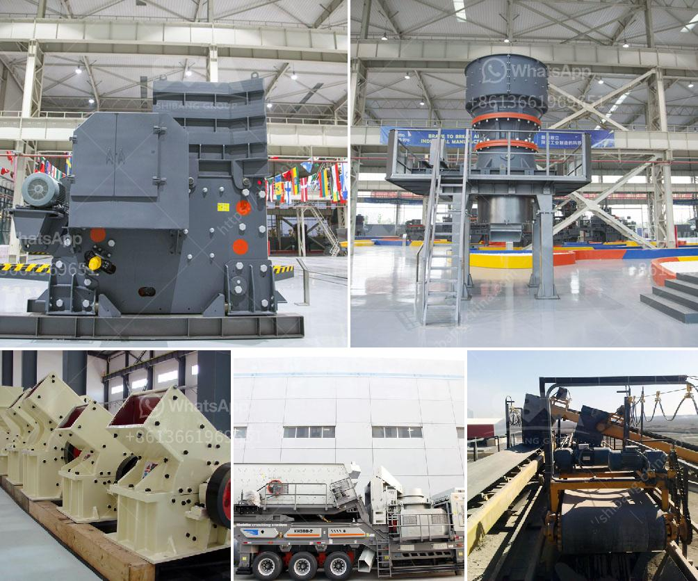

<h3>قطع غيار آلة المطحنة ووظيفتها</h3>
تعد آلة المطحنة أحد الأجهزة الأساسية المستخدمة في الصناعة والتصنيع، حيث تستخدم لطحن المواد الصلبة المختلفة إلى قطع صغيرة أو مسحوق. يتكون جزء رئيسي من آلة المطحنة من سطح دوار يحتوي على أسنان أو معامل للفصل وغرفة صغيرة داخلية تحتوي على اليافطة المتحركة للمواد.

بالنظر إلى نوعية المهام الشاقة التي تقوم بها آلة المطحنة، فإن قطع غيار آلة المطحنة تلعب دورًا حاسمًا في ضمان أداء الجهاز بكفاءة ودقة عالية. من بين القطع الأساسية التي يجب الاهتمام بها وتحديثها بشكل دوري في آلة المطحنة، يمكننا ذكر الأسنان والفاصل واليافطة المتحركة والمحرك المرتبط بها.

أحد القطع الرئيسية في آلة المطحنة هو الأسنان. يتم تركيب الأسنان على السطح الدوار، وتعمل عن طريق التلاقيم مع المواد الصلبة المطحونة. وظيفتها الرئيسية هي قطع وسحق المواد لتفتيتها إلى الأحجام الصغيرة المرغوب فيها. يحدث تآكل الأسنان بشكل طبيعي بمرور الوقت بسبب الاحتكاك والاستخدام المتكرر. لذلك، فإن استبدال الأسنان المتآكلة بقطع غيار جديدة يعزز أداء الآلة ويضمن عملية الطحن بكفاءة أعلى.

وبالإضافة إلى الأسنان، فإن الفاصل عبارة عن قطعة أخرى هامة في آلة المطحنة. يعمل الفاصل على فصل المواد المطحونة إلى أحجام مختلفة بناءً على المتطلبات المحددة. هذا الفاصل يحتوي على معامل أو فتحات تحدد حجم الجسيمات المراد تفتيتها. لذا، يهم استبدال الفواصل القديمة أو التالفة بقطع غيار جديدة لضمان حجم الجسيمات المرغوب فيه في المنتج النهائي.

علاوة على ذلك، تلعب اليافطة المتحركة دورًا حاسمًا في عملية الطحن. تتحرك اليافطة المتحركة بسرعة محكمة بداخل الغرفة الصغيرة في آلة المطحنة، وتساهم في طحن المواد بشكل فعال وسريع. من المهم التحقق من حالة اليافطة المتحركة واستبدالها عند الضرورة لضمان استمرارية العملية بكفاءة عالية.

أخيرًا، السلامة على الجهاز لا يمكن أن تكون ناجحة بدون محرك قوي وموثوق. يستخدم المحرك لتحريك اليافطة المتحركة وبذلك تنجح في طحن المواد. بالتالي، يجب الاهتمام بصيانة المحرك واستبداله عند الضرورة لتجنب أي خلل في عملية الطحن.

في النهاية، تعمل قطع غيار آلة المطحنة على تحسين أداء الجهاز وضمان استمرارية عملية الطحن بكفاءة عالية. يجب الاهتمام بتحديث هذه القطع بانتظام واستبدالها عند الضرورة لتحقيق أفضل النتائج والجودة في الصناعة والتصنيع.
<h3>Contact us</h3><ul><li><strong>Whatsapp:&nbsp;<a href="https://wa.me/8613661969651">+8613661969651</a></strong></li><li><a href="https://swt.shibang-china.com/?git&amp;zhl&amp;قطع غيار آلة المطحنة ووظيفتها"><strong>Online Service(chat now)</strong></a></li></ul><h3>Related</h3><ul><li><a href='تقدير لعمليات تكسير الحجر.md'>تقدير لعمليات تكسير الحجر</a></li><li><a href='صيانة مطحنة ريموند.md'>صيانة مطحنة ريموند</a></li><li><a href='كسارات البلارست في Alibaba.md'>كسارات البلارست في Alibaba</a></li><li><a href='كيماويات تعويم تحسين الفحم في الهند.md'>كيماويات تعويم تحسين الفحم في الهند</a></li><li><a href='آلة تعبئة مسحوق التلك.md'>آلة تعبئة مسحوق التلك</a></li></ul>