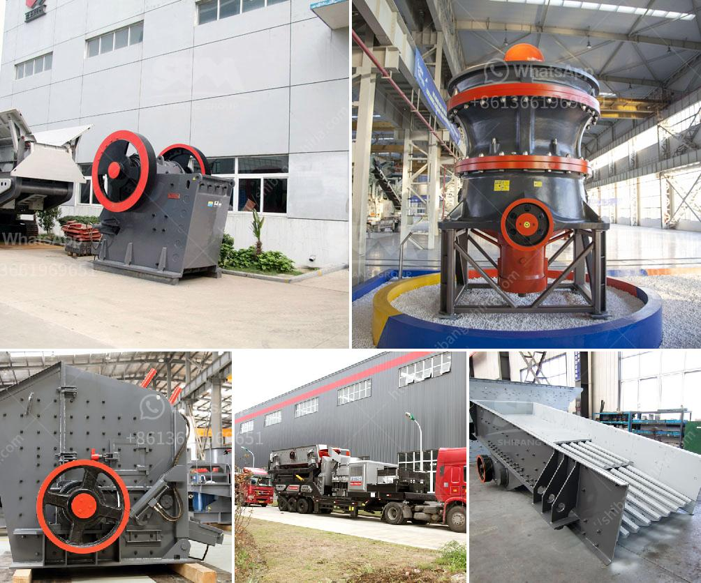

<h3>قطع غيار كسارة مخروطية hp 500</h3>
تعتبر قطع غيار كسارة مخروطية HP 500 من بين القطع الهامة والضرورية لضمان سلامة واستمرارية عملية الكسارة وتشغيلها بكفاءة عالية. تم تصميم هذه الكسارة بشكل خاص للعمل في ظروف قاسية ومتطلبات صناعة التعدين والبناء. وبما أنها تعمل بكفاءة عالية وتتحمل الأعباء العالية، فإن قطع الغيار الأصلية والمعتمدة من المصنع هي الخيار الأمثل لتحقيق الأداء الأمثل وتجنب الأعطال غير المتوقعة وتكاليف الإصلاح الباهظة.

الجزء الأهم من قطع الغيار لكسارة المخروطية HP 500 هو التاتور أو الجزء الدوار، حيث يتم تثبيت العتاد الخاص به على الجزء السفلي من المخروط ويوجد محرك لدفعه. ويعتبر التاتور الجزء الحاسم لتحقيق الأداء العالي للكسارة، حيث ينتج الحركة الدوارة اللازمة لسحق المواد الصلبة والصخرية. يجب مراقبة حالة التاتور بانتظام وتنظيفه من الأتربة والرواسب لضمان استدامة عمل الكسارة. وفي حالة تلف التاتور أو حدوث أي خلل به، يجب استبداله بسرعة لتجنب توقف الكسارة وتعطيل عملية الإنتاج.

بالإضافة إلى ذلك، تحتاج الكسارة المخروطية HP 500 أيضًا إلى قطع غيار أخرى مهمة مثل أكواب الاحتكاك، والبطانات، والمحامل، والأسطوانات الهيدروليكية. ويتعين استبدال هذه القطع الاستهلاكية بانتظام وفقًا لتوصيات المصنع وفحصها بدقة للتأكد من الحفاظ على جودة وأداء الكسارة.

إضافة إلى ذلك، يجب ضمان توافر قطع الغيار الأصلية المعتمدة من قبل المصنع لكسارة HP 500. ويجب اختيار مورد يوفر قطع الغيار الأصلية بجودة عالية وبأسعار تنافسية. يعتبر الاعتماد على قطع الغيار الأصلية ضمانًا للحصول على أداء عالي وعمر طويل للكسارة، بالإضافة إلى ضمان وجود الضمان المصنعي المناسب والدعم الفني اللازم. كما يساعد استخدام قطع الغيار الأصلية في تجنب التزوير والتقليل من تكاليف الصيانة والإصلاح.

بشكل عام، يمكن القول إن قطع غيار كسارة مخروطية HP 500 هي جزء ضروري ومهم لوظيفة الكسارة واستمرارية عملها بكفاءة عالية. يجب المحافظة على جودة قطع الغيار وتوافرها من مورد موثوق وتنفيذ الصيانة الدورية لتجنب توقف الكسارة غير المخطط له وللحفاظ على عملية الإنتاج بدون أعطال.
<h3>Contact us</h3><ul><li><strong>Whatsapp:&nbsp;<a href="https://wa.me/8613661969651">+8613661969651</a></strong></li><li><a href="https://swt.shibang-china.com/?git&amp;zhl&amp;قطع غيار كسارة مخروطية hp 500"><strong>Online Service(chat now)</strong></a></li></ul><h3>Related</h3><ul><li><a href='تأجير سحق وفرز الهاتف المحمول.md'>تأجير سحق وفرز الهاتف المحمول</a></li><li><a href='كسارة للبيع بسعر دبي.md'>كسارة للبيع بسعر دبي</a></li><li><a href='موردين محمولين لكسارة الحجر.md'>موردين محمولين لكسارة الحجر</a></li><li><a href='آلات مطاحن المطرقة في إندونيسيا.md'>آلات مطاحن المطرقة في إندونيسيا</a></li><li><a href='آلة كسارة الحجر في المملكة العربية السعودية.md'>آلة كسارة الحجر في المملكة العربية السعودية</a></li></ul>