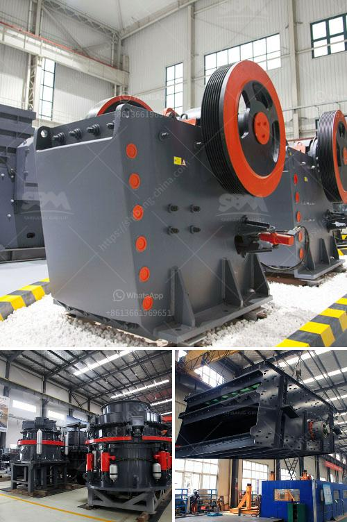

<h3>قطع غيار لكسارات الحجر</h3>
تعتبر كسارات الحجر من المعدات الهامة في صناعة التعدين والبناء. وبمرور الوقت واستخدامها المستمر، قد يحتاج المشغلون لتغيير بعض الأجزاء والقطع البالية التالفة للحفاظ على كفاءة وأداء الكسارة. وهنا تأتي أهمية قطع الغيار لكسارات الحجر.

تتكون قطع الغيار لكسارات الحجر من مجموعة واسعة من الأجزاء المختلفة، مثل الفكوك والبطانات والفلاتر والحزام الناقل والشاشات وغيرها. تعمل هذه القطع على تعدين الحجر وكسره وتكسيره وفرزه ونقله بسلاسة وفعالية. وباستخدام قطع الغيار المناسبة، يمكن تحسين كفاءة العملية وتقليل فترات التوقف والتكلفة.

واختيار القطع المناسبة يعتمد على نوع الكسارة واستخدامها ونوعية الحجر المعالج. بعض القطع الأكثر استخدامًا تشمل الفكوك، حيث تعمل على كسر الحجر وتكسيره إلى أجزاء صغيرة. وتحتاج هذه الفكوك إلى استبدال بشكل منتظم، خاصة إذا تعرضت للاحتكاك الشديد. كما تشمل البطانات، التي توضع على الفكوك للتقليل من الاحتكاك الذي يتعرض له المواد المعدنية أثناء الكسارة.

بالإضافة إلى ذلك، تلعب الشاشات دورًا حاسمًا في تحسين جودة المنتج النهائي، حيث تعمل على فصل المواد المكسورة وفقًا لأحجامها المختلفة. تحتاج الشاشات إلى تنظيف وصيانة منتظمة وقد تحتاج إلى استبدال بعض الأجزاء البالية بعد فترة زمنية. وأيضًا، الحزام الناقل يلعب دورًا هامًا في نقل الحجر الناتج من الكسارة إلى المكان المراد فيه، وبالتالي فإن قطع الغيار الملائمة للحزام الناقل مهمة لضمان استمرارية عملية التصنيع دون توقف.

عند شراء قطع الغيار لكسارات الحجر، ينبغي النظر في الجودة وملاءمة القطعة للكسارة المستخدمة. يجب أن تكون قطع الغيار مصنوعة من مواد عالية الجودة ومعالجة بطرق فريدة للاحتمالات الثقيلة والبيئات القاسية. كما يجب على الشركات الوثوقة في مجال صناعة قطع الغيار أن تقدم خدمات ما بعد البيع الممتازة، مثل الدعم الفني والتوجيه في استبدال قطع الغيار وتقديم تركيب وصيانة فعّالة.

في الختام، يمكن القول إن قطع الغيار لكسارات الحجر تعتبر جزءًا حاسمًا من عملية التشغيل والصيانة. واختيار القطع المناسبة والاستدامة في الصيانة يساهمان في ضمان أداء الكسارة بأقصى كفاءة وتحسين الإنتاجية.
<h3>Contact us</h3><ul><li><strong>Whatsapp:&nbsp;<a href="https://wa.me/8613661969651">+8613661969651</a></strong></li><li><a href="https://swt.shibang-china.com/?git&amp;zhl&amp;قطع غيار لكسارات الحجر"><strong>Online Service(chat now)</strong></a></li></ul><h3>Related</h3><ul><li><a href='كسارات الحجر في نيجيريا.md'>كسارات الحجر في نيجيريا</a></li><li><a href='مصانع معالجة الخام الصينية.md'>مصانع معالجة الخام الصينية</a></li><li><a href='مطحنة كرات للبيع في الهند.md'>مطحنة كرات للبيع في الهند</a></li><li><a href='كسارة الحجر بوزولانا 100 طن في الساعة.md'>كسارة الحجر بوزولانا 100 طن في الساعة</a></li><li><a href='كسارات الخرسانة المصغرة.md'>كسارات الخرسانة المصغرة</a></li></ul>