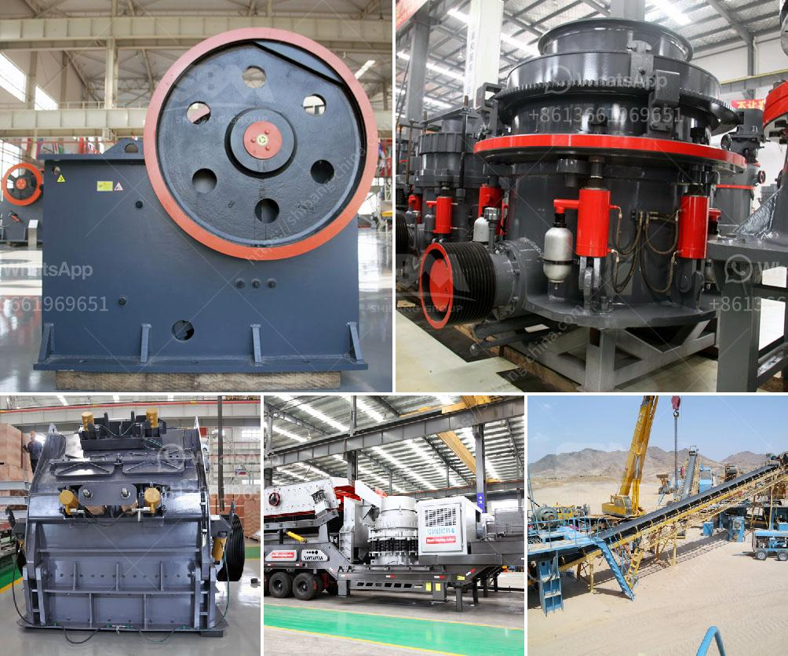

<h3>قمع التفريغ لمطحنة الكرة</h3>
تعتبر مطحنة الكرة واحدة من معدات الطحن الأكثر استخدامًا في صناعة التعدين والبناء. وتتكون هذه المطحنة من أسطوانة طويلة تحتوي على كرات فولاذية تقوم بطحن المواد الخام. وبينما تعتبر هذه المطاحن فعالةً في عملية الطحن، إلا أنها تواجه بعض المشاكل التي تؤثر سلبًا على أدائها، مثل قمع التفريغ.

قمع التفريغ هو العملية التي يتم فيها إخراج المواد المطحونة من المطحنة. ويتم ذلك بفضل منفذ تفريغ يوجد عند الجزء الأسفل من المطحنة. ولكن قد يحدث قمع التفريغ نتيجة لعدة أسباب، مثل عدم الحصول على فتحة تفريغ كافية، أو تكون الكرات الفولاذية في المطحنة أكبر من الحجم المطلوب، أو تراكم المواد المطحونة بشكل غير منتظم في المطحنة.

يؤدي قمع التفريغ إلى عدة تأثيرات سلبية على عملية الطحن وعلى أداء المطحنة بشكل عام. أحد هذه التأثيرات هو زيادة درجة حرارة المطحنة، حيث يؤدي تراكم المواد المطحونة في المطحنة إلى زيادة الاحتكاك وإعاقة حركة الكرات الفولاذية، مما يؤدي في النهاية إلى زيادة درجة الحرارة. كما يؤدي قمع التفريغ إلى ازدياد فقدان الطاقة وتراكم الجسيمات الناعمة، وبالتالي يقلل من كفاءة المطحنة.

هناك عدة طرق لحل مشكلة قمع التفريغ في مطحنة الكرة. أحد هذه الطرق هو تعديل حجم الفتحة في منفذ التفريغ، حيث يمكن زيادة حجم الفتحة لتسهيل خروج المواد المطحونة. يمكن أيضًا استخدام كرات فولاذية بحجم أصغر لتجنب تراكم المواد المطحونة وتحسين عملية التفريغ. كما يُفضل تنظيف المطحنة بانتظام لتجنب تراكم المواد والحفاظ على أداء المطحنة.

باختصار، قمع التفريغ هو مشكلة شائعة في مطحنة الكرة تؤثر على أدائها وكفاءتها. ومن المهم اتخاذ إجراءات لتجنب هذه المشكلة، مثل ضبط حجم الفتحة في منفذ التفريغ واستخدام كرات فولاذية بحجم أصغر. يجب أيضًا تنظيف المطحنة بانتظام لتجنب تراكم المواد المطحونة. بتنفيذ هذه الإجراءات، يمكن تحسين أداء المطحنة وزيادة كفاءتها في عملية الطحن.
<h3>Contact us</h3><ul><li><strong>Whatsapp:&nbsp;<a href="https://wa.me/8613661969651">+8613661969651</a></strong></li><li><a href="https://swt.shibang-china.com/?git&amp;zhl&amp;قمع التفريغ لمطحنة الكرة"><strong>Online Service(chat now)</strong></a></li></ul><h3>Related</h3><ul><li><a href='كم تكلفة مطحنة الكرة.md'>كم تكلفة مطحنة الكرة</a></li><li><a href='كسارة الحجر 100 طن للبيع.md'>كسارة الحجر 100 طن للبيع</a></li><li><a href='سعر مطحنة الكرة.md'>سعر مطحنة الكرة</a></li><li><a href='مخروط سحق 700 1000.md'>مخروط سحق 700 1000</a></li><li><a href='عملية صنع الكوارتز.md'>عملية صنع الكوارتز</a></li></ul>