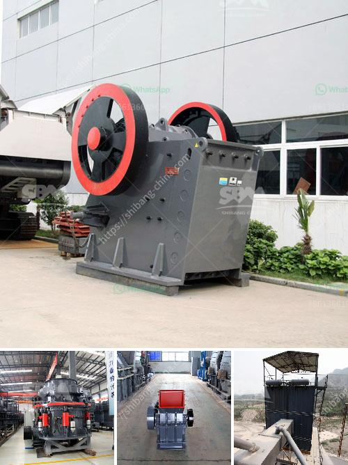

<h3>قولبة الكرة</h3>
تُعتبر قولبة الكرة عملية تصنيع هامة في صناعة الرياضة والألعاب، حيث توفر هذه العملية القدرة على إنتاج كرات ذات شكل متناسب ومتماثل وبخواص محددة. وتُستخدم كرات القدم والسلة والكرة الطائرة، وغيرها من الرياضات، لذلك فإن قدرة الإنتاج الجيدة والتحكم في عملية القولبة يعتبران أمرًا حاسمًا.

تتم عملية قولبة الكرة عن طريق القالب، حيث يتم وضع المادة المنصهرة في قالب يحتوي على تصميم الكرة المطلوبة. ثم يتم تبريدها وإزالتها من القالب للحصول على الكرة النهائية. تعتمد عملية القالب على الاهتزاز والضغط المرتفع لتصنيع الكرة. فعند تعريض المادة المنصهرة للاهتزاز، يتم ضغطها بشكل متساوٍ ومتناسق في جميع الاتجاهات، مما يتيح لها أن تأخذ شكل القالب بدقة وبدون أي عيوب.

تعد قوة القولبة ودرجة الحرارة المستخدمة في العملية عوامل حاسمة للنجاح. فباستخدام قوة قولبة مناسبة، يمكن الحصول على كرة ذات قوة ضرب عالية وقدرة تحمل جيدة. وبتحكم درجة حرارة القولبة، يمكن التحكم في صلابة الكرة ومرونتها، مما يؤثر في سلوك وأداء الكرة على الميدان.

يُعتبر توفير المواد الخام عالية الجودة أيضًا أمرًا أساسيًا في عملية قولبة الكرة. ينصح بتحديد خصائص المادة المنصهرة، مثل قوة الشد والمرونة والاستقرار الحراري، بدقة لضمان جودة عالية في الكرة النهائية.

بالإضافة إلى ذلك، تقنيات حديثة مثل الطباعة ثلاثية الأبعاد تساهم في تطوير عملية قولبة الكرة. فهذه التقنية تمكن من إنتاج قوالب معقدة ومتقنة، مع دقة في التفاصيل، مما يتيح إنتاج كرات ذات تصميمات متميزة وفريدة.

باختصار، يعد قولبة الكرة عملية استثمارية مهمة في صناعة الرياضة والألعاب، وتتطلب التحكم في العديد من العوامل المختلفة، مثل قوة القالب، ودرجة الحرارة، وخصائص المادة الخام، لضمان جودة الكرة النهائية.
<h3>Contact us</h3><ul><li><strong>Whatsapp:&nbsp;<a href="https://wa.me/8613661969651">+8613661969651</a></strong></li><li><a href="https://swt.shibang-china.com/?git&amp;zhl&amp;قولبة الكرة"><strong>Online Service(chat now)</strong></a></li></ul><h3>Related</h3><ul><li><a href='آلة كسارة الحجر للشراء السعر.md'>آلة كسارة الحجر للشراء السعر</a></li><li><a href='مطحنة البنتونيت المستعملة من اليد الثانية.md'>مطحنة البنتونيت المستعملة من اليد الثانية</a></li><li><a href='تقرير المشروع حول وحدة تكسير الحجر.md'>تقرير المشروع حول وحدة تكسير الحجر</a></li><li><a href='سعر مطحنة ريموند الفائقة الدقة.md'>سعر مطحنة ريموند الفائقة الدقة</a></li><li><a href='كسارة التعدين في تنزانيا.md'>كسارة التعدين في تنزانيا</a></li></ul>