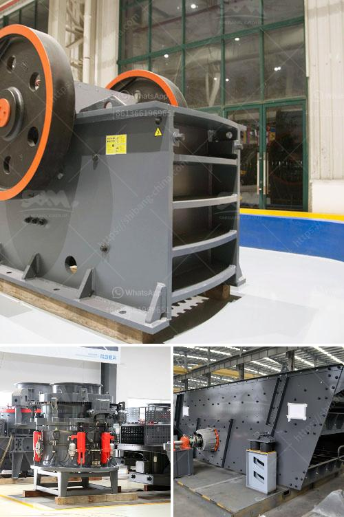

<h3>كتلة الآلات وكسارة في AutoCAD</h3>
تعتبر كتلة الآلات وكسارة من العناصر الهامة في برنامج AutoCAD. فالكتلة هي مجموعة من الكائنات التي تم تحويلها إلى وحدة واحدة وتستخدم بشكل متكرر في المخططات والرسومات لزيادة الكفاءة وتوفير الوقت. بالنسبة للآلات والكسارة، فإن استخدام كتلة مسبقة البرمجة يسهل من إنشاء التفاصيل الدقيقة والمتكررة بشكل متكامل.

تتم إنشاء كتلة الآلات والكسارة بواسطة رسم العنصر في الطراز الثلاثي الأبعاد باستخدام أنواع الرسم المختلفة المتاحة في AutoCAD. تشمل هذه الرسومات الخطوط، والأشكال الهندسية مثل المستطيلات والدوائر والأقواس والأشكال المعقدة الأخرى. بعد إنشاء العنصر، يتم حفظه ككائن مستقل واسمه باسم الكتلة.

تستخدم كتلة الآلات والكسارة لتسهيل تصميم المخططات وتحسين الدقة والاتساق في الرسومات. فعندما تحتاج إلى وضع آلة أو كسارة معينة في الرسمة، يمكنك ببساطة استدعاء الكتلة الخاصة بالعنصر وسحبها ووضعها في المكان المناسب. هذا يساهم في توفير الوقت والجهد بدلاً من إعادة رسم العنصر مرارًا وتكرارًا.

علاوة على ذلك، يمكنك تعديل الكائنات داخل الكتلة بسهولة تامة. فعندما تحتاج إلى تغيير المقياس أو زاوية الميل أو حتى موقع الكائن داخل الكتلة، يمكنك تحريره بسهولة دون التأثير على الكتلة الأصلية. يتم تحديث جميع النسخ الأخرى من الكائن تلقائيًا، مما يقلل من الأخطاء ويحسن دقة الرسم.

علاوة على ذلك، يمكنك أيضًا إنشاء مكتبة خاصة بكتل الآلات والكسارة للاستخدام المستقبلي. فعندما تقوم بإنشاء عنصر جديد، بإمكانك حفظه ككتلة وإضافته إلى المكتبة الخاصة بك. هذا يتيح لك استخدام وتطبيق العناصر المختلفة بسهولة في المشاريع اللاحقة.

باختصار، تُعَد كتلة الآلات والكسارة في AutoCAD أداة قوية وفعالة تسهل وتحسن عملية الرسم الهندسي وتصميم المخططات. تقلل من الجهد وتوفر الوقت، كما تساهم في رفع دقة الرسم. إن استخدامها يُعَد خيارًا مفيدًا وضروريًا للمهندسين والمصممين الذين يعملون في صناعة الآلات والكسارة.
<h3>Contact us</h3><ul><li><strong>Whatsapp:&nbsp;<a href="https://wa.me/8613661969651">+8613661969651</a></strong></li><li><a href="https://swt.shibang-china.com/?git&amp;zhl&amp;كتلة الآلات وكسارة في AutoCAD"><strong>Online Service(chat now)</strong></a></li></ul><h3>Related</h3><ul><li><a href='سعر كسارة الحجر.md'>سعر كسارة الحجر</a></li><li><a href='آلات سحق تعمل في بيرو.md'>آلات سحق تعمل في بيرو</a></li><li><a href='مورد كسارة في الصين.md'>مورد كسارة في الصين</a></li><li><a href='عملية صنع الإسمنت مع مطاحن الكرة.md'>عملية صنع الإسمنت مع مطاحن الكرة</a></li><li><a href='كسارات تأثير ثانوية.md'>كسارات تأثير ثانوية</a></li></ul>