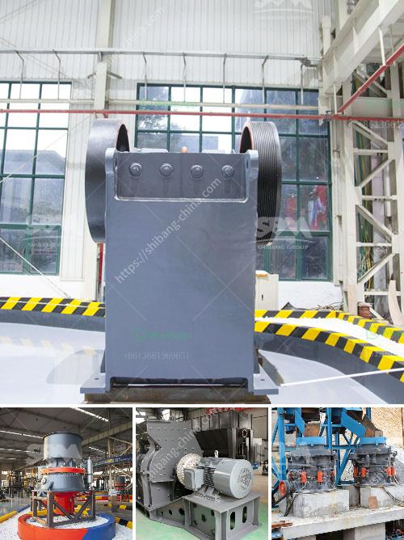

<h3>كثافة أحزمة الناقلات للتعدين</h3>
تعتبر أحزمة الناقلات من أهم الأدوات اللازمة في صناعة التعدين، حيث تستخدم لنقل المواد الخام من الأماكن التي تم استخراجها إلى مواقع المعالجة أو محطات التحميل. تتميز أحزمة الناقلات بكونها وسيلة فعالة واقتصادية لنقل المواد بكميات كبيرة على مسافات بعيدة.

تختلف كثافة أحزمة الناقلات المستخدمة في صناعة التعدين بحسب نوع المادة التي ستنقل ونوع العملية التعدينية. عادةً ما تتراوح الكثافة بين 200-400 كغ/م^3. يتم اختيار كثافة الحزام حسب طبيعة المواد التي سيتم نقلها؛ فقد يتم استخدام أحزمة ذات كثافة أعلى لنقل المواد الثقيلة مثل الخامات المعدنية، في حين يتم استخدام أحزمة ذات كثافة أقل لنقل المواد الخام الأخرى مثل الرمل والحصى.

تتكون أحزمة الناقلات عادةً من حزام مطاطي بالإضافة إلى هيكل تحميل وهيكل داعم يسمحان بنقل المواد بسلاسة ودقة. كذلك، تحتوي على أسطوانات مدعومة تعمل على توجيه الحزام ومنع تراكمه. بالإضافة إلى ذلك، تحتوي أحزمة الناقلات على نظام تشغيل وتحكم يتيح للمشغل ضبط سرعة النقل والتوقف وإعادة التشغيل بطريقة سهلة ومناسبة.

تعد أحزمة الناقلات ضرورة في عمليات التعدين، حيث تساهم في زيادة الإنتاجية وتحسين كفاءة العمليات. إن استخدام أحزمة الناقلات يتيح نقل الكميات الكبيرة من المواد بكفاءة عالية، مما يساعد في تقليل التكاليف وتوفير الوقت والجهد. علاوة على ذلك، يمكن أن تعمل أحزمة الناقلات لساعات طويلة مع الحد الأدنى من الصيانة، مما يجعلها حلاً مثاليًا لتلبية احتياجات صناعة التعدين الحديثة.

باختصار، يمكن القول إن أحزمة الناقلات للتعدين تعتبر ضرورة حيوية لنقل المواد الخام من وإلى مواقع المعالجة والتحميل بكفاءة عالية. تتميز بكونها وسيلة اقتصادية وفعالة لنقل الكميات الكبيرة من المواد بأمان وسلاسة. لذا، فإن استخدام أحزمة الناقلات يعد عنصراً أساسياً في صناعة التعدين الحديثة.
<h3>Contact us</h3><ul><li><strong>Whatsapp:&nbsp;<a href="https://wa.me/8613661969651">+8613661969651</a></strong></li><li><a href="https://swt.shibang-china.com/?git&amp;zhl&amp;كثافة أحزمة الناقلات للتعدين"><strong>Online Service(chat now)</strong></a></li></ul><h3>Related</h3><ul><li><a href='مطحنة قضيب الطحن الجاف.md'>مطحنة قضيب الطحن الجاف</a></li><li><a href='أصغر كسارة فك محمولة للبيع في جنوب أفريقيا.md'>أصغر كسارة فك محمولة للبيع في جنوب أفريقيا</a></li><li><a href='سعر النحاس.md'>سعر النحاس</a></li><li><a href='مطحنة الأسطوانة مطحنة السميكة.md'>مطحنة الأسطوانة مطحنة السميكة</a></li><li><a href='تكلفة آلات الحديد الاسفنجي 300 طن في اليوم.md'>تكلفة آلات الحديد الاسفنجي 300 طن في اليوم</a></li></ul>