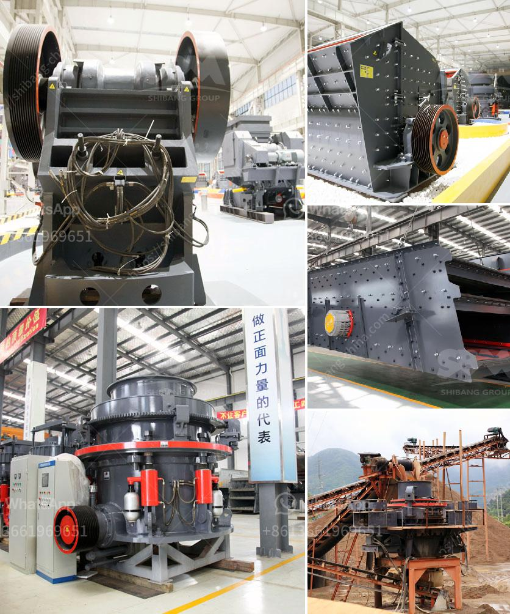

<h3>كرات المطحنة للتعدين</h3>
تعد كرات المطحنة جزءًا هامًا من عملية التعدين، فهي تستخدم في طحن المواد المعدنية الصلبة إلى حجم الجسيمات المطلوب. تتمتع كرات المطحنة بخصائص فريدة تجعلها مثالية لهذا الغرض.

تتكون كرات المطحنة عادةً من فولاذ قوي ومتين يمكنه تحمل عمليات الطحن الشاقة. يتم اختيار حجم الكرة المناسب وفقًا لطول المطحنة وشكلها وخواص المادة المراد طحنها. إذا كانت الكرة صغيرة الحجم، فستتحرك بشكل أسرع وستؤدي إلى طحن أكثر كفاءة، بينما تؤدي الكرات ذات الحجم الكبير إلى طحن أبطأ ولكنها تنتج نتائج دقيقة.

تتم بهدف زيادة كفاءة عملية التعدين، يتم تحميل المطحنة بكمية مناسبة من كرات الطحن والمادة المراد طحنها. يتم تحريك المطحنة في دوران سريع لدفع الكرات للتحرك وطحن المواد التي تم تحميلها. تتحرك الكرات بحرية وتستفيد من الاحتكاك بينها وبين المادة المراد طحنها لتتحطم وتصبح جزيئات أصغر.

تعتبر كرات المطحنة مهمة لعملية التعدين لعدة أسباب. أولاً، تضمن فرز الكرات الصغيرة جزيئات أصغر وبالتالي يمكن أن تزيد من كفاءة استخلاص المعادن من الخامات. ثانيًا، تساهم كرات المطحنة في تخفيض تكلفة طحن المعادن، حيث يمكن إعادة استخدامها بعد التعدين الأولي. وأخيرًا، فإن استخدام كرات المطحنة يقلل من استهلاك الطاقة المطلوبة لعملية التعدين وبالتالي يقلل من الأثر البيئي للممارسات التعدينية.

في النهاية، يجب أن نؤكد أن كرات المطحنة تلعب دورًا حاسمًا في عملية التعدين. فهي تزيد من كفاءة الطحن وتقلل من تكلفتها وتساهم في الاستدامة البيئية. لذلك، يجب الاهتمام بتحسين تصميم الكرات وتطويرها لتحقيق أقصى استفادة منها في مجال التعدين.
<h3>Contact us</h3><ul><li><strong>Whatsapp:&nbsp;<a href="https://wa.me/8613661969651">+8613661969651</a></strong></li><li><a href="https://swt.shibang-china.com/?git&amp;zhl&amp;كرات المطحنة للتعدين"><strong>Online Service(chat now)</strong></a></li></ul><h3>Related</h3><ul><li><a href='آلات كسارة المحجر.md'>آلات كسارة المحجر</a></li><li><a href='شركة كسارة الحجر.md'>شركة كسارة الحجر</a></li><li><a href='أسعار مطاحن الكرة في جنوب أفريقيا.md'>أسعار مطاحن الكرة في جنوب أفريقيا</a></li><li><a href='أسعار كسارات الفك في جنوب أفريقيا.md'>أسعار كسارات الفك في جنوب أفريقيا</a></li><li><a href='آلات ومعدات تعدين واستغلال المحاجر.md'>آلات ومعدات تعدين واستغلال المحاجر</a></li></ul>