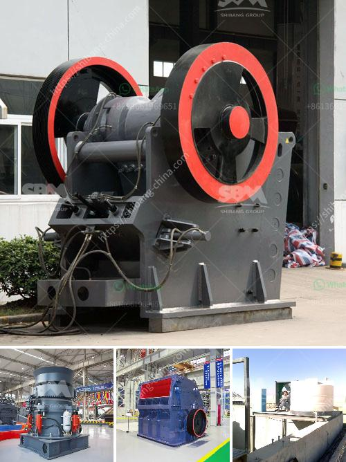

<h3>كرات كربونات الكالسيوم</h3>
كرات كربونات الكالسيوم هي تشكيلات صخرية طبيعية تتكون من كربونات الكالسيوم المترسبة في المياه الجوفية أو في بحيرات الملح. تأخذ هذه الكرات شكل كروي وقد تتراوح حجمها من عدة ميليمترات إلى عدة سنتيمترات.

تتكون كرات كربونات الكالسيوم بشكل أساسي من معادن الكالسيت والأراجونيت وهما نوعان من معادن كربونات الكالسيوم، بالإضافة إلى وجود اثنين من المعادن الفلزية: الحديد والمنغنيز. تتشكل هذه الكرات نتيجة ترسيب متكرر للمعادن في الماء. وفي اللحظة التي تترسب فيها الكرات، فإنها تبدأ في النمو بشكل كروي نتيجة لعوامل تأثير الطبيعة المحيطة بها، مثل تدفق الماء أو الرياح أو حركة المد والجزر.

تتنوع أحجام وألوان الكرات بناءً على عوامل الترسيب والنمو. فقد يحدث تشوه في شكل الكرة عندما تتعرض لتغيرات في ظروف البيئة. كما يؤثر التعرض للأكسجين والضغط في تكوين ألوان مختلفة. فمثلاً، إذا لم تكن الكرات تحتوي على الحديد، فإنها تظهر باللون الأبيض الصافي، وعند وجود الحديد، تتحول إلى اللون الأصفر البني أو البرتقالي.

تجتذب كرات كربونات الكالسيوم الكثير من الانتباه من الباحثين والعلماء بسبب تكوينها الغريب والجميل. تم العثور على هذه الكرات في العديد من أنحاء العالم، مثل نيوزيلندا وغانا والمملكة المتحدة والمكسيك. وقد تم تداولها كذلك في سوق الديكور والمجوهرات بسبب جمالها وتنوع أشكالها وألوانها المدهشة.

بالإضافة إلى جمالها البصري، فإن كرات كربونات الكالسيوم تلعب أيضًا دورًا هامًا في الدراسات الجيولوجية والجيوكيميائية. فهي تعكس الظروف المحيطة في الوقت الذي تم تكوينها به وتحمل معلومات قيمة عن المناخ والتغيرات البيئية على مر العصور.

لذا، فإن كرات كربونات الكالسيوم ليست مجرد صخور طبيعية بل هي مثال جميل على تكوينات الطبيعة الفريدة وتحمل تأثيرًا طبيعيًا هامًا على الأرض وعلى الفهم العلمي لتطورها.
<h3>Contact us</h3><ul><li><strong>Whatsapp:&nbsp;<a href="https://wa.me/8613661969651">+8613661969651</a></strong></li><li><a href="https://swt.shibang-china.com/?git&amp;zhl&amp;كرات كربونات الكالسيوم"><strong>Online Service(chat now)</strong></a></li></ul><h3>Related</h3><ul><li><a href='عملية تصنيع لوح الجبس.md'>عملية تصنيع لوح الجبس</a></li><li><a href='مصنع كسارة خام الحديد.md'>مصنع كسارة خام الحديد</a></li><li><a href='مصنع كسارة الحجر الجيري في الهند.md'>مصنع كسارة الحجر الجيري في الهند</a></li><li><a href='مصنع تكسير السلاغ في تاميل نادو.md'>مصنع تكسير السلاغ في تاميل نادو</a></li><li><a href='موردين خام الزنك في جنوب أفريقيا.md'>موردين خام الزنك في جنوب أفريقيا</a></li></ul>