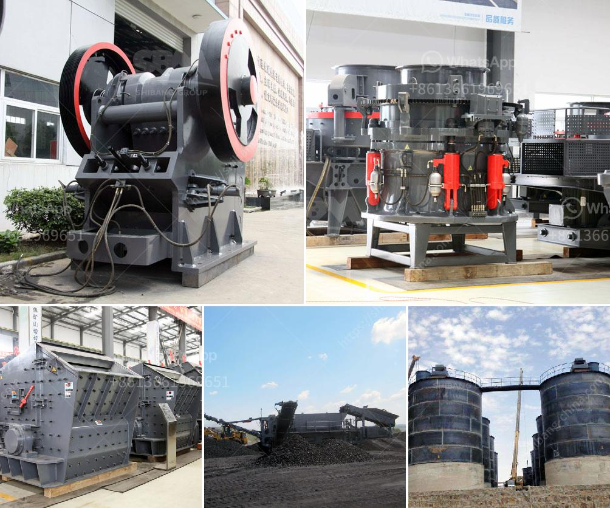

<h3>كرات لمطحنة الكرة</h3>
تعتبر مطحنة الكرة أحد أهم الأدوات المستخدمة في صناعة الطحن والتكسير في العديد من المجالات التجارية والصناعية. وتستخدم الكرات في مطاحن الكرة لطحن وتكسير المواد الخام من أجل نتائج دقيقة وفعالة.

يتم تصنيع الكرات المستخدمة في مطاحن الكرة من مواد مختلفة، مثل الفولاذ المقاوم للصدأ، الكروم، والسيراميك. ويتم اختيار المواد المناسبة وفقًا للتطبيق النهائي وخصائص المواد المراد طحنها. وتتوافر الكرات بأحجام مختلفة تتراوح بين بضعة مليمترات إلى عدة سنتيمترات، وذلك لتلبية متطلبات التكسير المحددة.

عندما يتم وضع المواد الخام في مطحنة الكرة، تبدأ الكرات في الدوران داخل الطاحونة. ويتم طحن المواد الخام بواسطة تأثير الكرات المستخدمة، حيث تصطدم الكرات بالمواد الخام وتحطمها بسبب قوة الصدمة التي تولدها.

تتنوع استخدامات مطاحن الكرة في العديد من الصناعات. ففي صناعة الأسمنت، تُستخدم مطاحن الكرة لطحن الكلنكر وإضافاته بواسطة الكرات المعدنية. وفي صناعة الألومنيوم، يتم استخدام كرات من السيراميك لطحن البودرة المعدنية، وذلك للحصول على حبيبات صغيرة لصناعة قطع الألمنيوم المركبة.

علاوة على ذلك، تُستخدم مطاحن الكرة أيضًا في صناعة الأصباغ والطلاء، حيث تستخدم الكرات السيراميكية لطحن الصبغات والمواد الكيميائية الأخرى. كما يُمكن استخدامها في صناعة المعادن والأدوات الكهربائية وصناعة الأدوية.

إن استخدام الكرات في مطاحن الكرة يسمح بطحن المواد بشكل أكثر فعالية، حيث توفر دوران الكرات حركة متساوية ومتوازنة للمواد الخام داخل الطاحونة. وبفضل قوة الصدمة التي تحدث عند تصادم الكرات بالمواد، يتم تحطيم المواد بسرعة وفعالية، وبالتالي يتم توفير وقت الطحن والكلفة المرتبطة به.

في النهاية، يعد استخدام الكرات في مطاحن الكرة ضروريًا لتحقيق أداء ممتاز في صناعة الطحن والتكسير. إن توافر الكرات بأحجام ومواد مختلفة يسمح بتلبية متطلبات التكسير المحددة لكل صناعة، مما يجعلها أداة أساسية في تحسين العمليات الصناعية وزيادة الإنتاجية.
<h3>Contact us</h3><ul><li><strong>Whatsapp:&nbsp;<a href="https://wa.me/8613661969651">+8613661969651</a></strong></li><li><a href="https://swt.shibang-china.com/?git&amp;zhl&amp;كرات لمطحنة الكرة"><strong>Online Service(chat now)</strong></a></li></ul><h3>Related</h3><ul><li><a href='مصانع تحسين الكوارتز في الهند.md'>مصانع تحسين الكوارتز في الهند</a></li><li><a href='طاقة إنتاج مسحوق الجبس 80 طن في الساعة.md'>طاقة إنتاج مسحوق الجبس 80 طن في الساعة</a></li><li><a href='مطاحن الكرة في ماليزيا.md'>مطاحن الكرة في ماليزيا</a></li><li><a href='سعر مطحنة الكرة في نيجيريا.md'>سعر مطحنة الكرة في نيجيريا</a></li><li><a href='مصنع تكسير الدولوميت في بهاروتش.md'>مصنع تكسير الدولوميت في بهاروتش</a></li></ul>