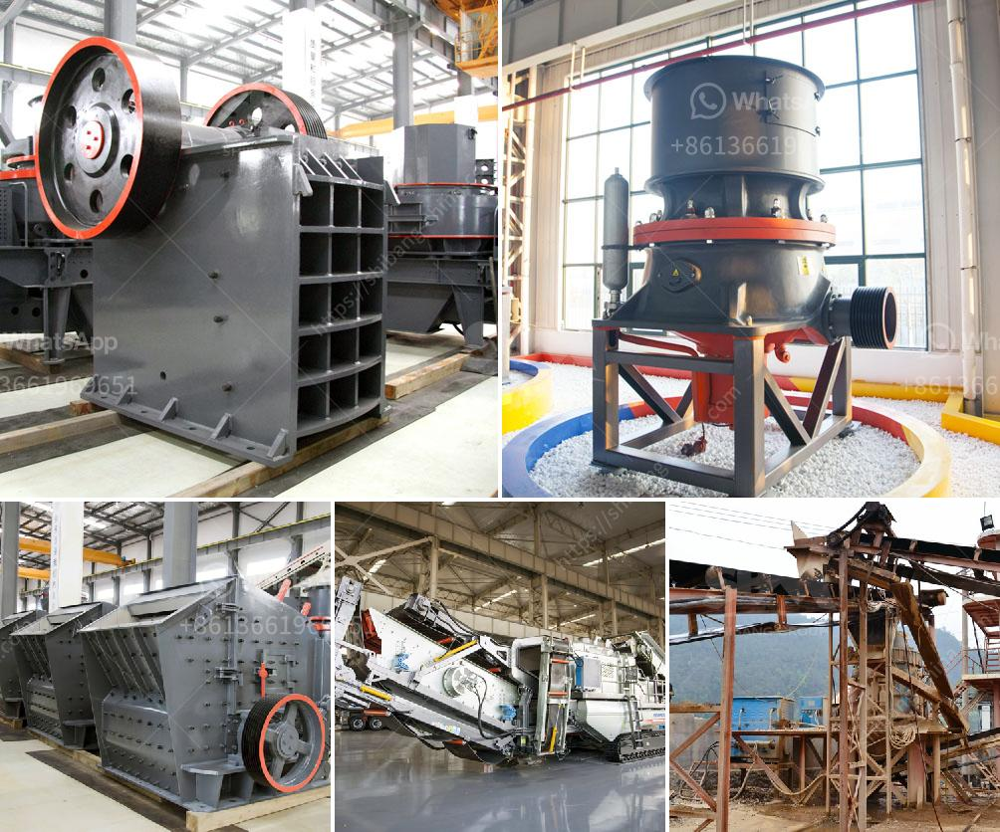

<h3>كسارات VSI بسعة 25 طن في الساعة</h3>
تعد كسارات VSI (المطحنة بالصدم) وسيلة شائعة لتكسير الصخور والأحجار الخام في صناعة التعدين والبناء. تتميز هذه الكسارات بفعاليتها العالية وقدرتها على إنتاج مواد ذات جودة عالية في وقت قصير. واحدة من أكثر الطرز شيوعًا هي الكسارة ذات السعة 25 طن في الساعة.

تعمل كسارات VSI بطريقة فريدة في تكسير المواد الصلبة. يتم تغذية المواد عبر آلية التغذية إلى الجزء العلوي من الكسارة حيث تتعرض للصدمات من شريط الصدمة. تتمزق المواد بفعل الصدمات وتندفع بسرعة عالية ، مما يساعد على تحطيمها. بعد ذلك ، تأخذ الدوارة الطاقة الميكانيكية من المحرك وتطبقها على المواد الصغيرة الحجم ، مما يزيد من سرعة الانتاج وتكسير المواد.

بفضل التقنية المتقدمة ، يمكن للكسارات VSI بسعة 25 طن في الساعة توليد مواد ذات جودة عالية وفقًا للاحتياجات المحددة. يمكن تعديل حجم وشكل المواد المنتجة بسهولة من خلال ضبط إعدادات الكسارة. يمكن أيضًا تغيير سرعة الدوارة ، مما يؤثر على أداء الكسارة وقدرتها على تكسير المواد الصخرية.

إحدى الفوائد الرئيسية للكسارات VSI هي تقليل تكاليف التشغيل والصيانة. تعتبر هذه الكسارات فعالة من حيث استهلاك الطاقة وتقليل تكاليف العمل ، مما يساهم في تحقيق أقصى استفادة منها. علاوة على ذلك ، فإنها تتطلب صيانة أقل بسبب بساطة تصميمها وفقدان أجزاء أقل.

تستخدم كسارات VSI على نطاق واسع في صناعة التعدين والبناء وصناعة مواد البناء ، مثل الخرسانة والركام والحصى. تعتبر هذه المعدات خيارًا مثاليًا لتكسير المواد البنائية ، نظرًا لقدرتها على توليد مواد ذات جودة عالية وشكل مطلوب.

وبصفة عامة ، فإن كسارات VSI بسعة 25 طن في الساعة توفر الكفاءة والقوة اللازمة لتحقيق الإنتاجية المطلوبة في صناعة التعدين والبناء. تلبي هذه الكسارات احتياجات التكسير في الوقت المحدد وتساهم في تعزيز الإنتاجية والربحية.
<h3>Contact us</h3><ul><li><strong>Whatsapp:&nbsp;<a href="https://wa.me/8613661969651">+8613661969651</a></strong></li><li><a href="https://swt.shibang-china.com/?git&amp;zhl&amp;كسارات VSI بسعة 25 طن في الساعة"><strong>Online Service(chat now)</strong></a></li></ul><h3>Related</h3><ul><li><a href='مصنع طحن الذهب في زيمبابوي.md'>مصنع طحن الذهب في زيمبابوي</a></li><li><a href='جميع نماذج كسارة البازلت.md'>جميع نماذج كسارة البازلت</a></li><li><a href='طحن خام بحجم يمر عبر الشبكة 200.md'>طحن خام بحجم يمر عبر الشبكة 200</a></li><li><a href='معدات التعدين في جنوب أفريقيا.md'>معدات التعدين في جنوب أفريقيا</a></li><li><a href='مورد لكسارة.md'>مورد لكسارة</a></li></ul>