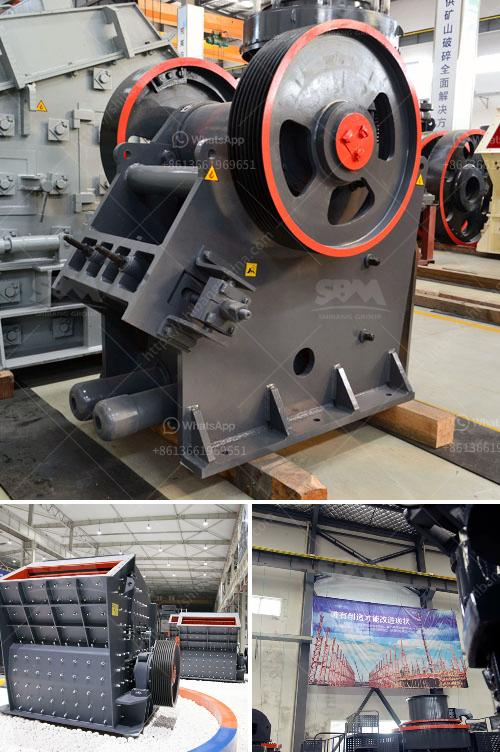

<h3>كسارات أسطوانية وشاشات محمولة مستعملة</h3>
الكسارات الأسطوانية والشاشات المحمولة المستعملة: أكثر كفاءة واقتصادية

تعد الكسارات الأسطوانية والشاشات المحمولة المستعملة من الأدوات الهامة في صناعة التعدين والبناء. تعتبر هذه المعدات مفيدة لأنها تمكن من الفصل الفعال بين المواد الخام المبعثرة وتقدم أداءً ممتازًا في هذا الصدد. بالإضافة إلى ذلك، فهي تُعتبر أيضًا بديلاً مقتصدًا عن المعدات الجديدة؛ إذ تسمح للشركات بتوفير التكاليف والحصول على معدات متينة وتعمل بكفاءة وبأسعار أقل.

تقدم الكسارات الأسطوانية المستعملة العديد من المزايا. فهي تتميز بقدرتها العالية على تجزئة المواد الخام بشكل فعال، مما يجعلها مثالية لتكسير الصخور والحجارة وإعادة تدوير الخرسانة والأسفلت والزجاج والرواسب الصناعية الأخرى. إن الأسطوانات المتواجدة في الكسارات تعمل على ضغط وتكسير المواد، وتساعد في الحصول على مواد نهائية ذات حجم موحد وجودة عالية.

من ناحية أخرى، تعتبر الشاشات المحمولة المستعملة أدوات مهمة لفصل وتصنيف المواد المختلفة وفقًا لحجمها وشكلها. تستخدم شاشات الهز المحمولة بشكل شائع في صناعة التعدين والبناء، حيث يتم تغذية المواد الخام إلى الشاشة وتهتز بشكل متكرر، مما يؤدي إلى فصل المواد وتصنيفها وفقًا لحجمها المطلوب. تتميز الشاشات المحمولة بقابليتها للاستخدام في مواقع العمل المختلفة بسهولة، وبالتالي فهي توفر الوقت والجهد والموارد اللازمة للانتقال بين المواقع.

إن طريقة الاستفادة من الكسارات الأسطوانية والشاشات المحمولة المستعملة توفر مزايا جمة. أولاً، تساهم في تقليل تكاليف الإنتاج بشكل كبير؛ إذ يكون ثمن الشراء أقل بكثير من الأجهزة الجديدة وتختصر الحاجة إلى الصيانة الدورية والتكاليف المرتبطة بالتشغيل. ثانياً، تعتبر هذه الأدوات صديقة للبيئة، حيث يتم إعادة تدويرها وتحويلها للاستخدام مرة أخرى، مما يقلل من النفايات والتلوث الناجم عن تصنيع المعدات الجديدة.

بالنظر إلى الجوانب الاقتصادية والبيئية، يمكن القول إن استخدام الكسارات الأسطوانية والشاشات المحمولة المستعملة يعتبر خيارًا مثاليًا في صناعة التعدين والبناء. تمنح هذه الأدوات الشركات المرونة والكفاءة في تكسير المواد الخام وفصلها، وتساهم في تحسين عمليات الإنتاج وتوفير التكاليف، مع الحد من التلوث البيئي وتأثيراته السلبية. لذا، يجب أن ينظر إلى الكسارات الأسطوانية والشاشات المحمولة المستعملة كأدوات ذات قيمة للصناعات المرتبطة بها.
<h3>Contact us</h3><ul><li><strong>Whatsapp:&nbsp;<a href="https://wa.me/8613661969651">+8613661969651</a></strong></li><li><a href="https://swt.shibang-china.com/?git&amp;zhl&amp;كسارات أسطوانية وشاشات محمولة مستعملة"><strong>Online Service(chat now)</strong></a></li></ul><h3>Related</h3><ul><li><a href='تجارة سحق الخرسانة للبيع.md'>تجارة سحق الخرسانة للبيع</a></li><li><a href='مطحنة الكرة القديمة للبيع في الهند.md'>مطحنة الكرة القديمة للبيع في الهند</a></li><li><a href='مصنع تكسير صغير من الصين.md'>مصنع تكسير صغير من الصين</a></li><li><a href='مطحنة طحن الحجر من ألمانيا.md'>مطحنة طحن الحجر من ألمانيا</a></li><li><a href='كسارة حجر البلاد في الهند.md'>كسارة حجر البلاد في الهند</a></li></ul>