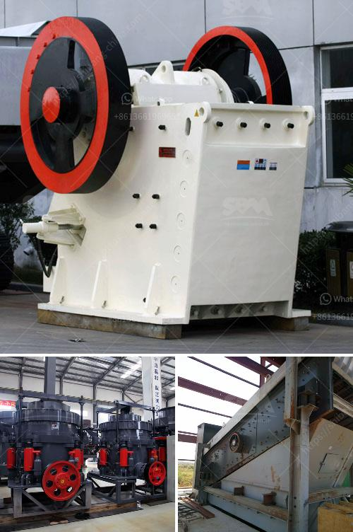

<h3>كسارات الأسمنت المستخدمة للبيع</h3>
تعد كسارات الأسمنت من أهم الآلات المستخدمة في صناعة البناء والإنشاءات. تستخدم هذه الكسارات لطحن الخامات اللازمة لإنتاج الأسمنت، وتعتبر جزءاً أساسياً في عملية تجهيز الخامات لطبخها في الأفران الدوارة.

يتم استخدام كسارات الأسمنت لسحق الخامات الحجرية والرملية والطينية بحجم معين لتحقيق حجم نهائي مطلوب. تعمل هذه الكسارات عن طريق وجود فكين ثابتين، يتحرك الفك الأسفل لأعلى والفك العلوي يبقى ثابتاً. وذلك يؤدي إلى ضغط الخام بين الفكين لتكوين جسيمات صغيرة ومنتظمة الحجم.

تتوفر كسارات الأسمنت المستخدمة للبيع بعدة أنواع وموديلات وقدرات مختلفة وفقاً لاحتياجات المشروع. يمكن العثور على كسارات الأسمنت بقدرات تتراوح بين 50 إلى 800 طن في الساعة. وتتألف هذه الكسارات من أجزاء مختلفة مثل المحور الرئيسي، والقاعدة، والأدوات الكسارة.

بشكل عام، تتكون كسارات الأسمنت من المحور الرئيسي الذي يحرك الفكين، وقاعدة تستقر على الأرض لدعم الكسارة، والأدوات الكسارة التي تتحرك لسحق الخام، والمحرك الذي يوفر القوة اللازمة للكسارة. بعض الكسارات تحتوي أيضاً على سيور ناقلة لنقل الخامات إلى الكسارة ونقل المنتج النهائي.

تعد الكسارات المستخدمة للبيع مناسبة للمشاريع الكبيرة والصغيرة على حد سواء. يتم استخدامها في مصانع الأسمنت ومقالع الحجر، وتوجد على مستوى عالمي في العديد من الدول.

تتوفر كسارات الأسمنت المستخدمة للبيع لدى العديد من الموردين ومصنعي المعدات الثقيلة. يمكن العثور على هذه الكسارات في الأماكن المتخصصة مثل السوق الثانوي للمعدات الثقيلة أو من خلال التعامل مباشرة مع الشركات المصنعة والموردين والمصدرين المختلفين.

بشكل عام، يمكن شراء كسارات الأسمنت المستخدمة بأسعار معقولة مقارنة بالكسارات الجديدة. ومع ذلك، يجب أن يتم التحقق من حالة الكسارة وجودتها قبل شرائها. يفضل اختبار الكسارة قبل الشراء للتأكد من أدائها وسلامتها.

باختصار، كسارات الأسمنت المستخدمة للبيع تعتبر خياراً جيداً للمشاريع التي تحتاج إلى كسارة ذات قدرة معينة بتكلفة أقل. يتوفر هذا النوع من الكسارات بشكل واسع ويمكن العثور عليها بسهولة من خلال التعامل مع الموردين المعتمدين والمصنعين الموثوق بهم.
<h3>Contact us</h3><ul><li><strong>Whatsapp:&nbsp;<a href="https://wa.me/8613661969651">+8613661969651</a></strong></li><li><a href="https://swt.shibang-china.com/?git&amp;zhl&amp;كسارات الأسمنت المستخدمة للبيع"><strong>Online Service(chat now)</strong></a></li></ul><h3>Related</h3><ul><li><a href='معدات كسارة الذهب.md'>معدات كسارة الذهب</a></li><li><a href='سعة مطحنة الكرة بالأطنان.md'>سعة مطحنة الكرة بالأطنان</a></li><li><a href='آلة عملية مطحنة الأسطوانة.md'>آلة عملية مطحنة الأسطوانة</a></li><li><a href='صناعة تكسير ومعالجة الرخام على نطاق صغير.md'>صناعة تكسير ومعالجة الرخام على نطاق صغير</a></li><li><a href='كسارة النحاس للبيع في ماليزيا.md'>كسارة النحاس للبيع في ماليزيا</a></li></ul>