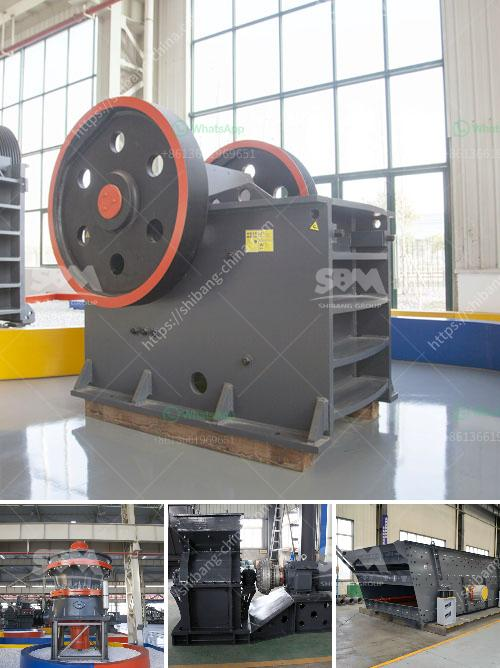

<h3>كسارات الثانية الفلبين</h3>
تعتبر كسارات الثانية في الفلبين من أهم الصناعات التعدينية في هذا البلد الآسيوي. تعود أصول هذه الصناعة إلى مئات السنين، حيث كانت تستخدم في استخراج المعادن والأحجار الكريمة من باطن الأرض.

تعد الفلبين من أكبر منتجي الثانية في العالم، حيث تضم العديد من المواقع الجيدة لاستخراج الصخور القيمة. ومن بين هذه المواقع المعروفة، تتميز كسارة الثانية بالكثير من الميزات التي تجعلها مميزة.

أولاً وقبل كل شيء، تتميز كسارات الثانية الفلبين بتقنيات ومعدات حديثة تساعد على زيادة كفاءة الإنتاج وتحسين الجودة. تستخدم معدات متطورة مثل الكسارات الفكية والكسارات المخروطية والغرابيل الاهتزازية لفصل الصخور عن الرواسب الطينية وتحويلها إلى منتجات نهائية قيمة.

ثانياً، تتمتع كسارات الثانية الفلبين بمجموعة متنوعة من الصخور القيمة المستخدمة في العديد من الصناعات. فهي تقدم الحصى والرمل والحجارة المكسرة التي تستخدم في بناء الطرق والمباني والجسور. كما توفر أحجارًا كريمة نادرة مثل الياقوت والزمرد والألماس التي يتم استخدامها في المجوهرات وصناعة الأدوات الطبية والإلكترونية.

ثالثاً، تسهم كسارات الثانية الفلبين في دعم الاقتصاد المحلي وتوفير فرص عمل للكثير من الأشخاص. يعد تشغيل كسارات الثانية مصدرًا هامًا للدخل للمزارعين والفلاحين في المناطق النائية، حيث يمكنهم بيع المنتجات الطبيعية التي يجدونها في أراضيهم.

وفي الختام، نستطيع القول أن كسارات الثانية في الفلبين تعتبر عنصرا أساسيا في صناعة التعدين وتعزز اقتصاد البلاد. توفر هذه الصناعة مواد قيمة للعديد من الصناعات المختلفة وتعزز فرص العمل في المناطق النائية. وباستخدام التكنولوجيا الحديثة، يمكن تحقيق مزيد من التحسينات في هذه الصناعة وزيادة إنتاجيتها وجودة منتجاتها في المستقبل.
<h3>Contact us</h3><ul><li><strong>Whatsapp:&nbsp;<a href="https://wa.me/8613661969651">+8613661969651</a></strong></li><li><a href="https://swt.shibang-china.com/?git&amp;zhl&amp;كسارات الثانية الفلبين"><strong>Online Service(chat now)</strong></a></li></ul><h3>Related</h3><ul><li><a href='مطاحن الكرة المستخدمة في بيرو.md'>مطاحن الكرة المستخدمة في بيرو</a></li><li><a href='تكلفة معدات سحق الجرانيت.md'>تكلفة معدات سحق الجرانيت</a></li><li><a href='عملية سحق التعدين لخام الحديد.md'>عملية سحق التعدين لخام الحديد</a></li><li><a href='كسارة حجرية بسعة 100 طن في الساعة استهلاك الديزل.md'>كسارة حجرية بسعة 100 طن في الساعة استهلاك الديزل</a></li><li><a href='سعر الكسارة من الصين.md'>سعر الكسارة من الصين</a></li></ul>