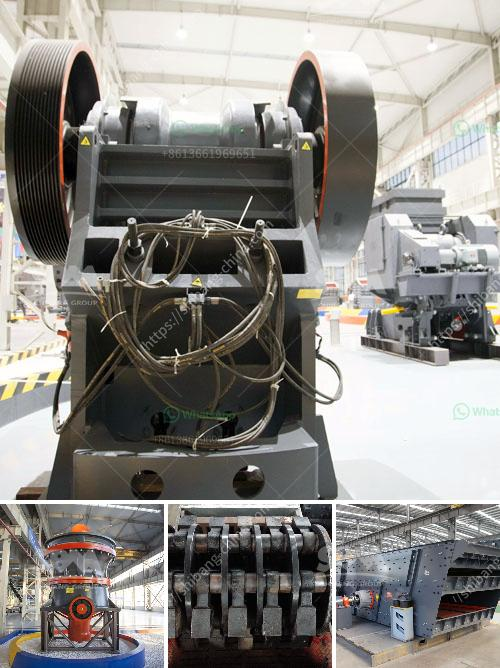

<h3>كسارات الجرانيت والطاحونات</h3>
تعتبر كسارات الجرانيت والطاحونات من أهم المرافق التي تلعب دورًا حيويًا في صناعة البناء والتشييد. فهي تستخدم لاستخراج وتكسير حجر الجرانيت وأنواع أخرى من الصخور لإنتاج مواد البناء الأساسية مثل الحصى والرمل والحجر المكسر. تقدم الكسارات والطاحونات إمداداً مستداماً للمواد الخام التي تحتاجها صناعة البناء وتلبي الطلب المتزايد على المنتجات المستخدمة في إنشاء المباني والمنشآت المختلفة.

تصنع الكسارات عادةً من الفولاذ عالي الجودة وتتكون من محرك قوي وسلسلة من الفكوك والمطارق الضخمة المتحركة. تعمل الكسارات على كسر الصخور الضخمة إلى قطع صغيرة يمكن استخدامها في البناء. يتم تكسير الصخور بواسطة الفكوك المتحركة الثابتة في الكسارة، حيث يتم تكسير الجرانيت والصخور الأخرى إلى أحجام صغيرة وثم يتم نقلها واستخدامها في إعداد الخرسانة أو كمواد أخرى.

أما الطاحونات، فهي تستخدم في عملية طحن الصخور الصلبة وتحويلها إلى مسحوق ناعم. تعمل الطاحونات على تفتيت الجرانيت والصخور الأخرى بواسطة حجارة طحن دوارة تدور بسرعة عالية، وذلك لإنتاج بودرة الجرانيت التي يتم استخدامها في العديد من التطبيقات الصناعية.

تعد كسارات الجرانيت والطاحونات ضرورية لصناعة البناء والتشييد لعدة أسباب. أولاً، تساهم في توفير مواد البناء الأساسية مثل الحصى والرمل والحجر المكسر، والتي تعتبر ضرورية في بناء المباني والطرق والجسور وغيرها من المنشآت. ثانياً، تساهم في تقليل تكاليف الإنتاج والنقل ، حيث يتم استخلاص المواد الخام محلياً بدلاً من استيرادها. وأخيراً، فإن استخدام الجرانيت والمنتجات المشتقة منه يعزز الاستدامة البيئية، حيث يمكن إعادة استخدام الجرانيت وتدويره بدلاً من رميه في المكبات النفايات.

باختصار، يعد استخدام كسارات الجرانيت والطاحونات من العوامل الأساسية التي تساهم في تلبية احتياجات صناعة البناء والتشييد. تلعب هذه المنشآت الحيوية دورًا حاسمًا في توفير المواد الأساسية وتخفيض التكاليف وتعزيز الاستدامة. لذلك، يجب الاهتمام بالحفاظ على هذه الكسارات وتحسينها وتطويرها بطرق مستدامة لتلبية الاحتياجات المستدامة للمجتمع.
<h3>Contact us</h3><ul><li><strong>Whatsapp:&nbsp;<a href="https://wa.me/8613661969651">+8613661969651</a></strong></li><li><a href="https://swt.shibang-china.com/?git&amp;zhl&amp;كسارات الجرانيت والطاحونات"><strong>Online Service(chat now)</strong></a></li></ul><h3>Related</h3><ul><li><a href='سعة آلة الكسارة 5 أطنان في الساعة.md'>سعة آلة الكسارة 5 أطنان في الساعة</a></li><li><a href='البحث عن شريك لكسارة الآلات.md'>البحث عن شريك لكسارة الآلات</a></li><li><a href='طحن مطحنة الكرة والجسيمات.md'>طحن مطحنة الكرة والجسيمات</a></li><li><a href='مصانع الأسمنت الحجر في أفريقيا.md'>مصانع الأسمنت الحجر في أفريقيا</a></li><li><a href='مطحنة الكرة القديمة للبيع في الهند.md'>مطحنة الكرة القديمة للبيع في الهند</a></li></ul>