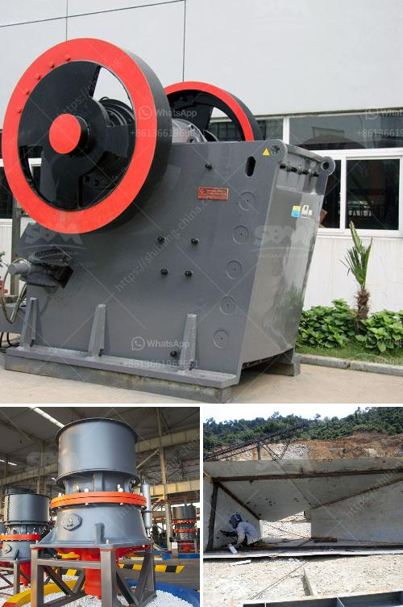

<h3>كسارات الحجر الجيري المستخدمة للبيع في تكساس</h3>
تعتبر كسارات الحجر الجيري من المعدات الأساسية في صناعة البناء والإنشاءات. تُستخدم لتفتيت الحجارة الكبيرة إلى قطع صغيرة من الحجر الجيري، وهو من الأحجار الطبيعية الهامة في عملية البناء.

في ولاية تكساس الأمريكية، تعتبر صناعة الحجر الجيري من أهم الصناعات، حيث يتم استخراج كميات كبيرة من الحجر الجيري في تلك المنطقة. ومن أجل تفتيت هذه الحجارة وتحويلها إلى حصى صغيرة، يتم استخدام الكسارات.

تستخدم كسارات الحجر الجيري للبيع في تكساس لتلبية احتياجات السوق في مجال البناء والإنشاءات. تتنوع حجمات تلك الكسارات بما يتناسب مع متطلبات العملاء. يتم معايرة حجم الكسارة وقدرتها بحجم الحجر المراد تفتيته وإنتاجه. عادةً ما تتراوح الكسارات المستخدمة في تكساس ما بين 200 إلى 400 طن في الساعة، وتختلف حسب ظروف العمل ونوع الحجر المراد تفتيته.

تتميز كسارات الحجر الجيري في تكساس بالكفاءة والدقة في العمل، حيث تتميز بالقدرة على تفتيت الحجر الجيري بشكل سريع وفعال. كما أنها تعتبر آليات ذات تقنيات حديثة تستخدم أحدث التقنيات في صناعة تفتيت الحجر وإنتاج الحصى الجيري.

بالإضافة إلى ذلك، فإن استخدام كسارات الحجر الجيري في تكساس يساهم في حماية البيئة والحد من تلوث الهواء والماء. فعملية تفتيت الحجر الجيري تتم بطرق آلية دقيقة تقلل من الانبعاثات الضارة، وبالتالي تمنع تأثيرها السلبي على البيئة.

باختصار، تُعد كسارات الحجر الجيري المستخدمة للبيع في تكساس أدوات أساسية في صناعة البناء والإنشاءات. تمتاز بالكفاءة والدقة في العمل، وتلبي معايير الجودة والكفاءة المطلوبة في هذا المجال. إن استخدامها يعزز العمليات البنائية ويحمي البيئة من التلوث.
<h3>Contact us</h3><ul><li><strong>Whatsapp:&nbsp;<a href="https://wa.me/8613661969651">+8613661969651</a></strong></li><li><a href="https://swt.shibang-china.com/?git&amp;zhl&amp;كسارات الحجر الجيري المستخدمة للبيع في تكساس"><strong>Online Service(chat now)</strong></a></li></ul><h3>Related</h3><ul><li><a href='كسارة حجر في العمود الفقري.md'>كسارة حجر في العمود الفقري</a></li><li><a href='بيع مطحنة في كاليفورنيا.md'>بيع مطحنة في كاليفورنيا</a></li><li><a href='مصنع كسارة الحجر الأبيض في الفلبين.md'>مصنع كسارة الحجر الأبيض في الفلبين</a></li><li><a href='قائمة أسعار كسارة الفك.md'>قائمة أسعار كسارة الفك</a></li><li><a href='مطحنة طحن عمودية مستعملة بسعة 100 طن في الساعة.md'>مطحنة طحن عمودية مستعملة بسعة 100 طن في الساعة</a></li></ul>