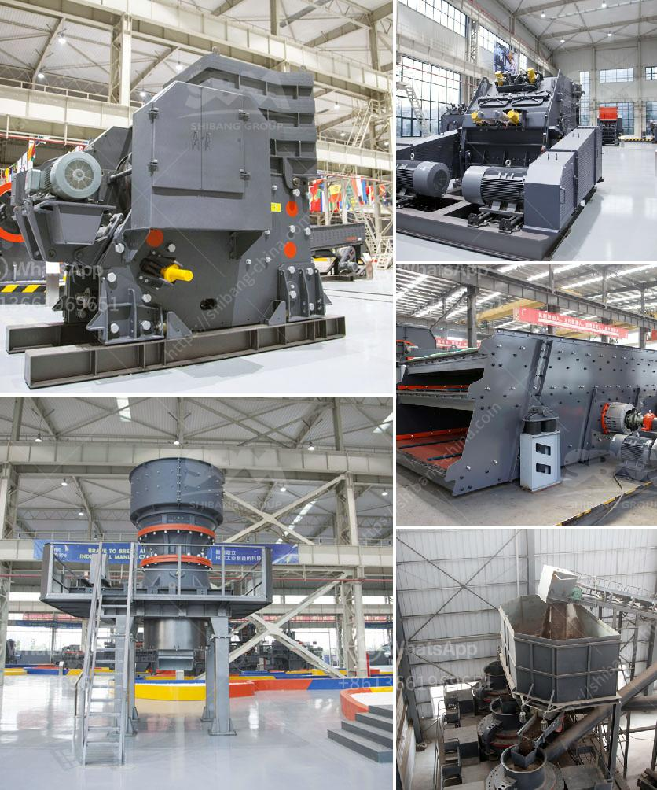

<h3>كسارات الحجر الرئيسية</h3>
تعتبر كسارات الحجر الرئيسية من أهم المنشآت التي تساهم في تلبية احتياجات قطاع البناء والتشييد في مختلف أنحاء العالم. تلعب هذه الكسارات دورًا حاسمًا في تكسير وفرز الصخور والحجارة لإنتاج الركام المستخدم في إنشاء وتعبيد الطرق والبناء وغيرها من المشاريع العمرانية.

تتميز كسارات الحجر الرئيسية بالقدرة العالية على معالجة الكميات الهائلة من الصخور والحجارة بكفاءة وسرعة، مما يجعلها الخيار الأمثل للمقاولين وشركات البناء. تعتمد هذه الكسارات على المحركات القوية والمعدات الثقيلة لتكسير الصخور وطحنها إلى جزيئات صغيرة تستخدم في المشاريع الإنشائية. وبفضل تصاميمها المتطورة والابتكارات التقنية، يمكن لهذه الكسارات تحقيق إنتاجية عالية وتخفيض تكاليف المشاريع.

تعتبر الكسارات الرئيسية من المعدات ضرورية في قطاع البناء حيث تساهم في تزويد السوق بالركام اللازم للمشاريع الكبيرة والصغيرة على حد سواء. يتم اختيار مكان الكسارة بعناية لتكون قريبة من مناطق البناء وتقليل تكاليف النقل، كما يتم تشغيل الكسارة بواسطة فريق من العمال المهرة والمدربين على ضمان أعلى مستوى من السلامة واحترام البيئة.

تتطلب عمليات تشغيل الكسارات الرئيسية الالتزام بمعايير الجودة والسلامة ، بما في ذلك تأمين المعدات المناسبة والتدريب المستمر للعاملين على تشغيل الكسارة بشكل آمن. بالإضافة إلى ذلك ، يجب الاهتمام بصيانة وإصلاح المعدات العاملة بأقصى قدر من الكفاءة لضمان استمرارية الإنتاج وتحقيق أعلى مستوى من الربحية.

تعتبر كسارة الحجر الرئيسية من العوامل الأساسية للتنمية الاقتصادية في القطاع العمراني وتساهم في خلق فرص عمل للعديد من الأفراد. يعتبر قطاع الكسارات واحدًا من القطاعات الهامة التي تدعم النمو الاقتصادي وتسهم في توفير فرص عمل محلية وتنمية البنية التحتية. يضطلع هؤلاء العمال بمهام صعبة ويعملون بجد لضمان مساهمتهم في تلبية احتياجات البنية التحتية والتنمية الاقتصادية.

في الختام، تعد كسارات الحجر الرئيسية عنصرًا حاسمًا في تلبية احتياجات قطاع البناء والتشييد حول العالم. يتميز هذا القطاع بتصاميمها المتقدمة والاهتمام بالجودة والسلامة والحفاظ على البيئة. تعتبر هذه الكسارات أيضًا محركًا للتنمية الاقتصادية وتوفير فرص عمل للعديد من الأفراد.
<h3>Contact us</h3><ul><li><strong>Whatsapp:&nbsp;<a href="https://wa.me/8613661969651">+8613661969651</a></strong></li><li><a href="https://swt.shibang-china.com/?git&amp;zhl&amp;كسارات الحجر الرئيسية"><strong>Online Service(chat now)</strong></a></li></ul><h3>Related</h3><ul><li><a href='قائمة الآليات لمصانع تجهيز الرخام.md'>قائمة الآليات لمصانع تجهيز الرخام</a></li><li><a href='مورد معدات فصل الوسط الكثيف.md'>مورد معدات فصل الوسط الكثيف</a></li><li><a href='آلات تكسير الحصى.md'>آلات تكسير الحصى</a></li><li><a href='كسارة الحجر وشاشة الاهتزاز للبيع.md'>كسارة الحجر وشاشة الاهتزاز للبيع</a></li><li><a href='تسعير حزام الناقل في ماليزيا.md'>تسعير حزام الناقل في ماليزيا</a></li></ul>