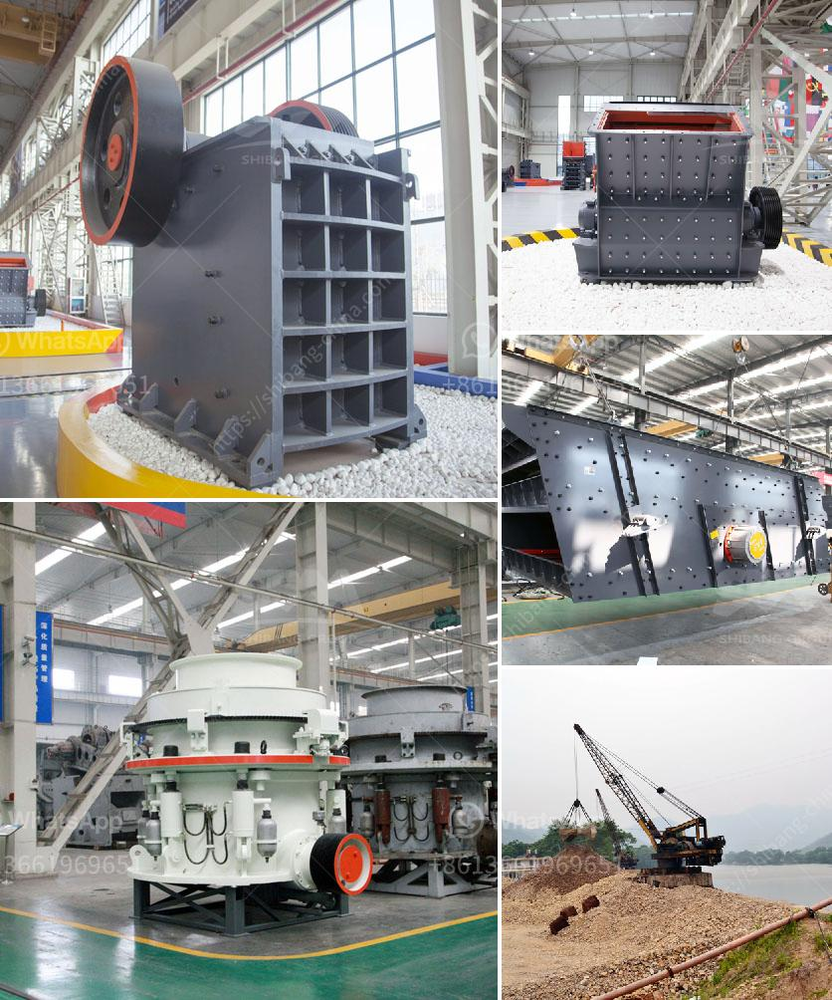

<h3>كسارات الحجر الرخيصة</h3>
تعد كسارات الحجر الرخيصة من أهم الأدوات والمعدات المستخدمة في صناعة البناء والتشييد. فهي تستخدم لسحق الحجارة الكبيرة إلى حجم أصغر يمكن استخدامه في الأعمال الإنشائية المختلفة مثل الطرق والمباني والجسور وغيرها. يرجع سبب اختيار الكسارات الرخيصة لامتلاكها تكلفة منخفضة، مما يساعد في توفير التكاليف للشركات والمقاولين.

تتميز الكسارات الرخيصة بكونها متاحة بأسعار تتراوح عادةً بين 200-400 دولار، مقارنة بالكسارات ذات الأسعار الأعلى التي تتجاوز هذا السعر بكثير. وعلى الرغم من أنها تكون أرخص من حيث السعر، إلا أنها تتمتع بقدرة على سحق الحجارة المتوسطة الصلابة بكفاءة عالية.

الكسارات الرخيصة تأتي عادة بحجم صغير، مما يجعلها سهلة الاستخدام والحمل والحركة من مكان إلى آخر، وهو ما يجعلها مثالية للاستخدام في المشاريع الصغيرة والمتوسطة الحجم. كما أنها تتميز بتصميم قوي ومتين يعزز عمرها الافتراضي، مما يقلل من حاجتها للصيانة المستمرة ويساعد في تحسين كفاءتها.

يجب أن يتم اختيار الكسارة المناسبة وفقًا لاحتياجات المشروع. فمن الضروري اختيار حجم الكسارة الذي يتناسب مع حجم الحجارة المطلوب سحقها والكمية المراد استخراجها. بالإضافة إلى ذلك، يجب أيضًا مراعاة المقام الهيكلي للموقع والاحتياجات المالية المتاحة.

ومع ذلك، يجب ألا ننسى أن الكسارات الرخيصة قد تعاني من بعض العيوب في الأداء مقارنة بالكسارات ذات الأسعار الأعلى. قد يكون لديها سعة إنتاج محدودة ولا تتميز بنفس سرعة وكفاءة الكسارات الأكثر تكلفة. قد تكون غير قادرة على سحق المواد الصعبة بنفس الكفاءة أيضًا.

في الختام، تؤكد الكسارات الرخيصة جدواها في تحقيق التوازن بين الجودة والتكلفة في مشاريع البناء والتشييد الصغيرة والمتوسطة الحجم. إنها توفر خياراً ميسرًا وقابلاً للتحمل للمقاولين والشركات الصغيرة التي تسعى لتقديم خدمات احترافية بتكاليف مناسبة. وبإدراك الميزات والعيوب المحتملة، يمكن للمستخدمين اختيار الكسارة المثلى والحصول على نتائج جيدة.
<h3>Contact us</h3><ul><li><strong>Whatsapp:&nbsp;<a href="https://wa.me/8613661969651">+8613661969651</a></strong></li><li><a href="https://swt.shibang-china.com/?git&amp;zhl&amp;كسارات الحجر الرخيصة"><strong>Online Service(chat now)</strong></a></li></ul><h3>Related</h3><ul><li><a href='محطة سحق ثابتة بسعة 200 طن في الساعة.md'>محطة سحق ثابتة بسعة 200 طن في الساعة</a></li><li><a href='آلة مسحوق الدولوميت.md'>آلة مسحوق الدولوميت</a></li><li><a href='سعر كسارة الحجر المحمولة في الفلبين.md'>سعر كسارة الحجر المحمولة في الفلبين</a></li><li><a href='حجم مدخلات ومخرجات مصنع تكسير الكوارتز.md'>حجم مدخلات ومخرجات مصنع تكسير الكوارتز</a></li><li><a href='آلة معالجة الرماد الطائر.md'>آلة معالجة الرماد الطائر</a></li></ul>