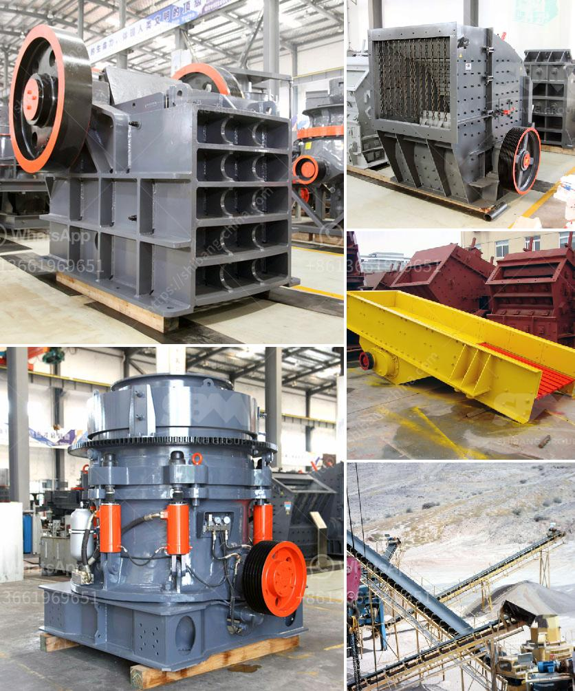

<h3>كسارات الحجر المحلية</h3>
تلعب كسارات الحجر المحلية دورًا هامًا في صناعة البناء والبنية التحتية في العديد من الدول. تساهم هذه الكسارات في توفير مواد البناء الأساسية مثل الزلط والرمل والحصى والحجارة المسحوقة، وتستخدم في إنشاء المباني والطرق والجسور والسدود والأرصفة والأراضي الزراعية والمزيد.

تمتاز كسارات الحجر المحلية بعدة مزايا. أحد هذه المزايا هو قرب المصدر الذي يقلل من تكاليف النقل ويزيد من الكفاءة. بالإضافة إلى ذلك، فإن استخدام مواد محلية يقلل من اعتماد الدولة على الواردات ويدعم الاقتصاد المحلي. ومن المعروف أن قطاع البناء يعد قطاعاً حيوياً للاقتصاد، حيث يعمل على خلق فرص عمل وتعزيز النمو الاقتصادي.

علاوة على ذلك، تُعتبر كسارات الحجر المحلية أيضًا صديقة للبيئة. حيث يتم استخراج المواد الأولية من المناطق المحلية، مما يقلل من تأثير التلوث الناجم عن عمليات النقل الطويلة الممتدة عبر البلاد. بالإضافة إلى ذلك، تمتلك تلك الكسارات عادةً تراخيص بيئية تضمن احترام القواعد واللوائح المحلية لحماية البيئة والارتقاء بمعايير الجودة العالية.

ومن الجوانب الاقتصادية والاستدامة، فإن كسارات الحجر المحلية توفر فرص عمل للعديد من العمال المحليين. يمكن أن تساهم هذه الصناعة في تحسين المستوى المعيشي للمجتمعات المحلية وزيادة فرص العمل وتطوير المهارات المهنية. علاوة على ذلك، قد تسهم هذه الكسارات في تطوير البنية التحتية نظرًا لاحتياجها إلى الطرق والمعدات اللازمة لنقل المواد الخام والمنتجات النهائية، وهذا يعزز التطور والتحسن في بنية البلاد بشكل عام.

في الختام، تعد كسارات الحجر المحلية أحد القطاعات الحيوية في صناعة البناء والبنية التحتية. توفر هذه الكسارات فرص عمل محلية، وتحسن المستوى المعيشي للمجتمعات المحلية، وتدعم الاقتصاد المحلي. ومن الجوانب البيئية والاستدامة، فإنها تحمي البيئة وتلتزم بالقوانين واللوائح المحلية. لذا، يجب تعزيز هذا القطاع وتشجيع الاستثمار في الكسارات المحلية لتحقيق التنمية الشاملة والاقتصاد المستدام.
<h3>Contact us</h3><ul><li><strong>Whatsapp:&nbsp;<a href="https://wa.me/8613661969651">+8613661969651</a></strong></li><li><a href="https://swt.shibang-china.com/?git&amp;zhl&amp;كسارات الحجر المحلية"><strong>Online Service(chat now)</strong></a></li></ul><h3>Related</h3><ul><li><a href='سعر كسارة الصخور في منجم بيرو.md'>سعر كسارة الصخور في منجم بيرو</a></li><li><a href='موردي خط إنتاج الحبر.md'>موردي خط إنتاج الحبر</a></li><li><a href='دراسة جدوى لإنشاء محجر.md'>دراسة جدوى لإنشاء محجر</a></li><li><a href='كسارة صخور محمولة مستعملة للبيع.md'>كسارة صخور محمولة مستعملة للبيع</a></li><li><a href='كسارة الحصى، سعر كسارة الحصى.md'>كسارة الحصى، سعر كسارة الحصى</a></li></ul>