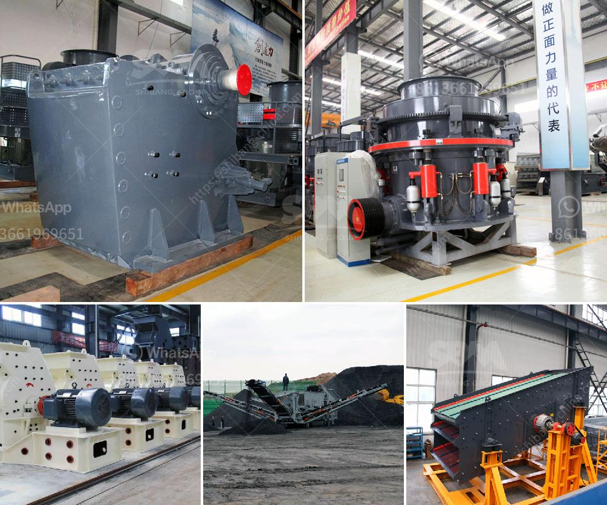

<h3>كسارات الحجر المحمولة في جنوب أفريقيا</h3>
كسارات الحجر المحمولة في جنوب أفريقيا: تكنولوجيا المستقبل لصناعة البناء

في جنوب أفريقيا، تمتلك صناعة البناء أهمية كبيرة في تطور الاقتصاد المحلي وتوفير فرص العمل للمواطنين. ومن بين أهم المعدات والآليات التي تستخدم في صناعة البناء هي كسارات الحجر المحمولة، حيث تمثل تقنية مستقبلية في مجال استخراج وتكسير الحجارة بطريقة فعالة ومرنة.

تعمل كسارات الحجر المحمولة على تحويل الحجارة الكبيرة إلى حصى صغيرة ورمل، وتعتبر أداة حاسمة في عمليات البناء والبنية التحتية. تمتاز هذه الكسارات بقدرتها على نقل وتركيبها بسهولة في مواقع العمل المختلفة، وهي تتيح للمقاولين والمهندسين المدنيين تحقيق الكفاءة العالية وتخفيض تكاليف الإنتاج بشكل كبير.

واحدة من أهم مزايا كسارات الحجر المحمولة هي قدرتها على تحطيم الصخور المختلفة مثل الجرانيت والرخام والحجر الجيري، وهي تتوفر في مجموعة من الأحجام وقوة التكسير لتناسب احتياجات العملاء المختلفين. تستخدم هذه الكسارات لإنتاج حصى مطابق للمواصفات المطلوبة لمواد البناء والتشييد، مما يسهم في تقليل تبعات التصنيع البيئي واستغلال الموارد بشكل أكثر فعالية.

تتميز كسارات الحجر المحمولة أيضًا بأنها تعمل بطاقة كهربائية وتعتبر صديقة للبيئة. يتم تشغيلها بواسطة محركات كهربائية عالية الجودة، مما يقلل من انبعاثات الغازات الضارة والضوضاء. كما أنها تقدم أداءً ممتازًا في إنتاج الحصى بجودة عالية وكفاءة عالية، وهي تقنية مثالية للاستخدام في المشاريع الكبيرة والصغيرة على حد سواء.

ولا تقتصر فوائد كسارات الحجر المحمولة فقط على القطاع البنائي، بل تمتد إلى القطاعات الأخرى مثل تعدين الفحم واستخراج المعادن. تسهم هذه التكنولوجيا في زيادة إنتاجية المناجم وتحسين عمليات التعدين، كما أنها تقلل من التكاليف وتحسن سلامة العمال.

في الختام، يمكن القول بأن كسارات الحجر المحمولة تعتبر تقنية مبتكرة وفعالة في صناعة البناء والتعدين، حيث تساهم في رفع كفاءة الإنتاج وتخفيض التكاليف وتحسين الجودة. ومن المتوقع أن يزداد الاعتماد على هذه التكنولوجيا في المستقبل، مما سيساهم في تطور قطاع البناء في جنوب أفريقيا وتعزيز الاقتصاد المحلي.
<h3>Contact us</h3><ul><li><strong>Whatsapp:&nbsp;<a href="https://wa.me/8613661969651">+8613661969651</a></strong></li><li><a href="https://swt.shibang-china.com/?git&amp;zhl&amp;كسارات الحجر المحمولة في جنوب أفريقيا"><strong>Online Service(chat now)</strong></a></li></ul><h3>Related</h3><ul><li><a href='تكلفة إنشاء مصنع خام الحديد.md'>تكلفة إنشاء مصنع خام الحديد</a></li><li><a href='مطحنة الهامر من إيديبيسا.md'>مطحنة الهامر من إيديبيسا</a></li><li><a href='مصنع تكسير الكروم.md'>مصنع تكسير الكروم</a></li><li><a href='مطاحن هامر زراعية مستعملة.md'>مطاحن هامر زراعية مستعملة</a></li><li><a href='مورد معدات كسارة الفك.md'>مورد معدات كسارة الفك</a></li></ul>