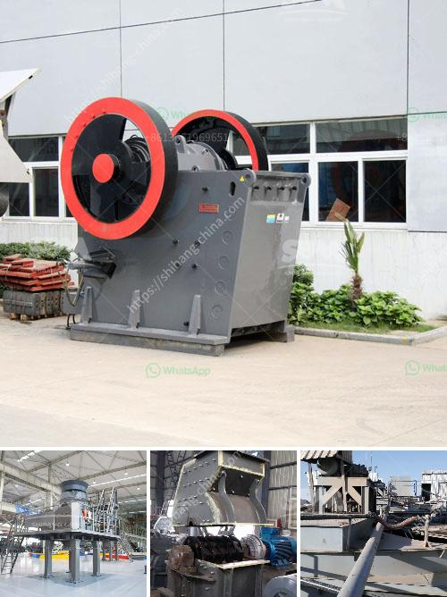

<h3>كسارات الحجر المستخدمة في ألمانيا</h3>
تعد كسارات الحجر من التجهيزات الهامة في صناعة البناء والإنشاء، حيث تستخدم لكسر الصخور والحصى إلى قطع صغيرة قابلة للاستخدام في إنشاء الطرق والمباني. وفي ألمانيا، تعد صناعة كسارات الحجر من الصناعات المهمة والمتقدمة، تلعب دوراً رئيسياً في تطور البنية التحتية للبلاد.

تتميز كسارات الحجر في ألمانيا بالتكنولوجيا المتقدمة والمعدات الحديثة، مما يسهم في زيادة الكفاءة وتحقيق أعلى جودة في الإنتاج. تستخدم العديد من الكسارات في البلاد أحدث التقنيات مثل الكسارات المخروطية والكسارات الصدمية والكسارات الفكية، التي تتميز بالقوة والمتانة في التعامل مع المواد الصخرية الصلبة.

تعد الكفاءة والجودة من العوامل المهمة في إنتاج الحجر المكسر في ألمانيا. حيث تقوم كسارات الحجر بتحويل الصخور والحصى إلى منتجات ذات حجم وشكل أكثر تجانساً وموثوقية. يتم فحص الحجر المكسر بعناية قبل إرساله للاستخدام، ويتم التأكد من جودته ومطابقته للمواصفات المطلوبة، مما يضمن الحصول على منتجات عالية الجودة ومتسقة.

تستخدم كسارات الحجر في العديد من مشاريع البنية التحتية في ألمانيا، مثل إنشاء الطرق والجسور والمباني السكنية والتجارية. حيث يتم استخدام الحجر المكسر كخامة أساسية للخرسانة والطرق، ويساهم في زيادة مقاومتها واستدامتها. كما يستخدم الحجر المكسر أيضاً كمادة أولية في صناعة الأسفلت، حيث يسهم في تعزيز قوة ومتانة الأسفلت المستخدم في إنشاء الطرق.

باختصار، تعد كسارات الحجر المستخدمة في ألمانيا أحدث الإضافات التقنية في صناعة البناء والإنشاء. فهي تتميز بالتكنولوجيا الحديثة والمعدات المتطورة، مما يساهم في زيادة الكفاءة وتحقيق أعلى جودة في الإنتاج. تلعب كسارات الحجر دوراً رئيسياً في تطور البنية التحتية في ألمانيا، وتعتبر جزءاً أساسياً في إنشاء الطرق والجسور والمباني السكنية والتجارية.
<h3>Contact us</h3><ul><li><strong>Whatsapp:&nbsp;<a href="https://wa.me/8613661969651">+8613661969651</a></strong></li><li><a href="https://swt.shibang-china.com/?git&amp;zhl&amp;كسارات الحجر المستخدمة في ألمانيا"><strong>Online Service(chat now)</strong></a></li></ul><h3>Related</h3><ul><li><a href='آلة معالجة النحاس.md'>آلة معالجة النحاس</a></li><li><a href='مصنعي مطحنة عمودية.md'>مصنعي مطحنة عمودية</a></li><li><a href='مصانع تجفيف رمل الفراك للبيع.md'>مصانع تجفيف رمل الفراك للبيع</a></li><li><a href='كسارة الحجر كسارة الحجر.md'>كسارة الحجر كسارة الحجر</a></li><li><a href='معدات تعدين الذهب الطبيعي في الصين.md'>معدات تعدين الذهب الطبيعي في الصين</a></li></ul>