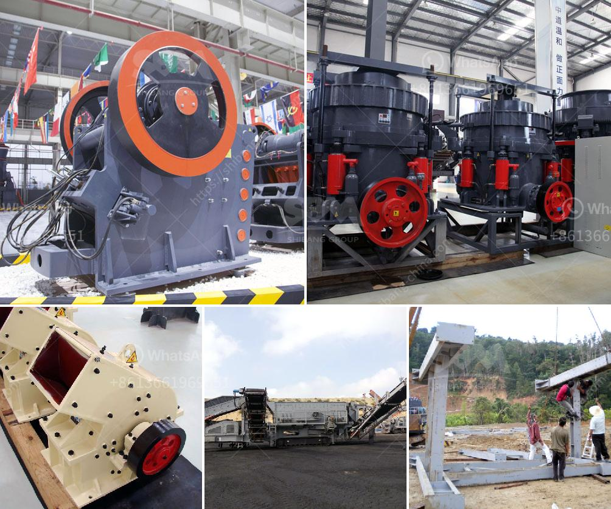

<h3>كسارات الحجر المستعملة في كوريا الجنوبية</h3>
تعد كسارات الحجر المستعملة في كوريا الجنوبية جزءًا أساسيًا من صناعة البناء والبنية التحتية في هذا البلد الذي يعاني من نقص في الموارد الطبيعية. تعمل هذه الكسارات على سحق الحجارة وتحويلها إلى مواد للبناء والتشييد.

إن استخدام كسارات الحجر المستعملة في كوريا الجنوبية يعود بالفوائد العديدة على البيئة والاقتصاد. فعندما يتم استخدام حجارة مستعملة بدلاً من حجارة جديدة، يتم توفير الكثير من الطاقة والموارد المالية التي يتطلبها استخراج ومعالجة الحجارة الجديدة. يسهم ذلك في تخفيض انبعاثات غازات الدفيئة والتلوث الناجم عن عمليات التعدين والمحاجر.

بالإضافة إلى ذلك، لديهذا النوع من الكسارات تأثير مباشر على صناعة البناء والبنية التحتية في كوريا الجنوبية. فعملية سحق الحجارة المستعملة يمكن أن تنتج مواد كسر خامسة الجودة ومناسبة لمجموعة متنوعة من التطبيقات. تستخدم هذه الحصى المستعملة في بناء الطرق، والأعمدة الخرسانية، والجسور، ومشاريع البناء الأخرى.

بالإضافة إلى ذلك، فإن استخدام كسارات الحجر المستعملة يمكن أن يحسن من استدامة صناعة البناء ويقلل من تأثيراتها البيئية السلبية. يمكن إعادة استخدام هذه المواد بشكل كبير، مما يقلل من كمية النفايات والكسارات التي تنتجها الصناعة. علاوة على ذلك، يمكن إعادة تصنيع الحجارة المستعملة في المستقبل، مما يزيد من فترة حياتها ويقلل من الحاجة إلى استخراج حجارة جديدة.

على الرغم من فوائدها، فإن هناك بعض التحديات التي تواجه صناعة كسارات الحجارة المستعملة في كوريا الجنوبية. فعلى سبيل المثال، قد تكون جودة الحجارة المستعملة متفاوتة، مما يؤدي إلى تأثيرات غير مرغوب فيها على المنتج النهائي. كما قد يكون من الصعب التعامل مع الحجارة المستعملة في حالة وجود صخور صلبة أو ملوثة بمواد ضارة.

وفي الختام، تعد كسارات الحجر المستعملة في كوريا الجنوبية خيارًا مثيرًا للاهتمام في صناعة البناء والبنية التحتية. يمكن لهذه الكسارات أن توفر الموارد وتعزز الاستدامة البيئية، كما يمكن أن تحسن من جودة وكفاءة الإنتاج. أثبتت هذه التقنية نجاحها وفعاليتها ويمكن استخدامها كنموذج لتوسيع استخدام الحجارة المستعملة في صناعة البناء في أنحاء العالم.
<h3>Contact us</h3><ul><li><strong>Whatsapp:&nbsp;<a href="https://wa.me/8613661969651">+8613661969651</a></strong></li><li><a href="https://swt.shibang-china.com/?git&amp;zhl&amp;كسارات الحجر المستعملة في كوريا الجنوبية"><strong>Online Service(chat now)</strong></a></li></ul><h3>Related</h3><ul><li><a href='آلة غسيل الرمال.md'>آلة غسيل الرمال</a></li><li><a href='موزعون للأحزمة والناقلات في إندونيسيا.md'>موزعون للأحزمة والناقلات في إندونيسيا</a></li><li><a href='كسارات مستعملة في نيجيريا.md'>كسارات مستعملة في نيجيريا</a></li><li><a href='محطة كسارة تلقائية من اليد الثانية.md'>محطة كسارة تلقائية من اليد الثانية</a></li><li><a href='سعر مصنع كسارة الحجر في الهند.md'>سعر مصنع كسارة الحجر في الهند</a></li></ul>