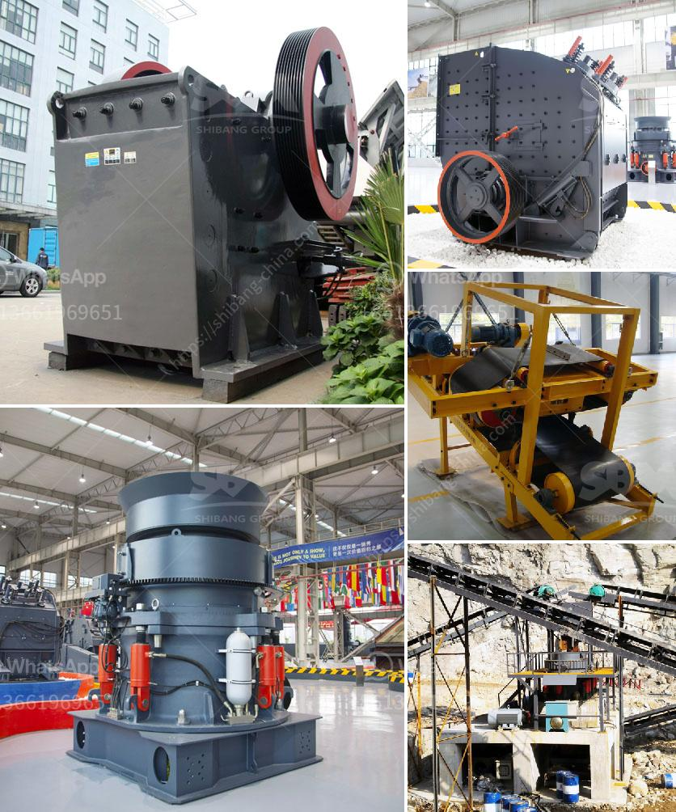

<h3>كسارات الحجر المهجورة</h3>
تُعد كسارات الحجر المهجورة ظاهرة شائعة في العديد من المناطق حول العالم، وتمثل تحديًا بيئيًا يستحق الاهتمام. تعود تلك الكسارات إلى فترات زمنية سابقة، حيث استُخدمت لاستخراج الحجر والصخور اللازمة في البناء والتشييد. وفيما بعد، توقفت عمليات الاستخراج فيها وتركت دون صيانة، مما أدى إلى تحويلها إلى هياكل مهجورة.

تعود أهمية كسارات الحجر المهجورة إلى الدور الذي لعبته في البناء وتطور المدن والمجتمعات على مر العصور. استُخدم الحجر في إنشاء العديد من الهياكل الأثرية، مثل الأهرامات والقصور والكنائس والجسور الضخمة. كما تم استخدامه في بناء الحصون الدفاعية والقلاع، وأضفى فخامة وجمالًا على المدن والقرى. وبالرغم من التطور التكنولوجي الحديث وظهور المواد البديلة، فإن احتياجًا مستمرًا للحجر الطبيعي لا يزال موجودًا في العديد من المشاريع البنائية.

ومع ذلك، فإن كسارات الحجر المهجورة تشكل تحديًا بيئيًا وجماليًا. فعند تركها دون صيانة، تصبح مشكلة بيئية حيث يتم احتجاز المياه في حفر المحاجر وتجمعها فيها. يمكن أن يفسد هذا التجمع الطبيعي للمياه الجوفية ويؤدي إلى زيادة خطر تكوين الحشرات والأمراض المنقولة عن طريق الحشرات. كما أن الحفر غير المستخدمة تشوه المناظر الطبيعية وتهدد التنوع البيولوجي.

إضافةً إلى الأثر البيئي، تشكل كسارات الحجر المهجورة أيضًا تحديًا جماليًا للمنطقة المحيطة بها. تدمُّر المشاهد الهادئة والجميلة، ويُعتبر تصويرها عادةً موضوعًا غير محبذ في الصور الفوتوغرافية. وبالإضافة إلى ذلك، فإن وجود كسارات الحجر المهجورة يمكن أن يؤدي إلى تراجع النشاط السياحي في المنطقة، مما يؤثر على الاقتصاد المحلي وفرص العمل.

من أجل التصدي لهذا التحدي البيئي والجمالي، يجب أن تولي الحكومات والجهات المعنية اهتمامًا خاصًا للتعامل مع كسارات الحجر المهجورة. قد تتضمن الخطوات المتخذة إعادة تجهيز هذه المناطق وتحويلها إلى مناطق عامة تستفيد منها المجتمعات المحلية، مثل الحدائق أو المنتزهات. من الممكن أيضًا استخدام تلك المناطق كمصادر للطاقة المتجددة، مثل توليد الطاقة الشمسية أو إقامة محطات رياح.

باختصار، كسارات الحجر المهجورة تمثل تحديًا بيئيًا وجماليًا يجب مواجهته. من خلال استغلال هذه المناطق بطرق إيجابية ومبدعة، يمكننا تحويلها إلى مساحات رائعة ومفيدة لتعزيز البيئة والاقتصاد المحلي.
<h3>Contact us</h3><ul><li><strong>Whatsapp:&nbsp;<a href="https://wa.me/8613661969651">+8613661969651</a></strong></li><li><a href="https://swt.shibang-china.com/?git&amp;zhl&amp;كسارات الحجر المهجورة"><strong>Online Service(chat now)</strong></a></li></ul><h3>Related</h3><ul><li><a href='كسارة حجر في العمود الفقري.md'>كسارة حجر في العمود الفقري</a></li><li><a href='عملية تحسين الحجر الجيري.md'>عملية تحسين الحجر الجيري</a></li><li><a href='مطحنة هامر للتركيز.md'>مطحنة هامر للتركيز</a></li><li><a href='كيفية حساب كفاءة الكسارة.md'>كيفية حساب كفاءة الكسارة</a></li><li><a href='معدات تعدين مستعملة للبيع في غانا.md'>معدات تعدين مستعملة للبيع في غانا</a></li></ul>