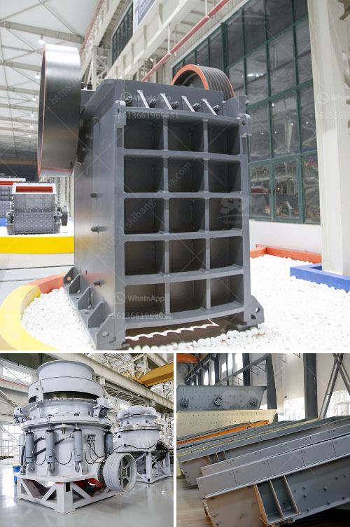

<h3>كسارات الحجر في اسكتلندا</h3>
تعد كسارات الحجر في اسكتلندا من الأماكن السياحية الرائعة التي تستحق الزيارة والاستكشاف. فهناك العديد من المواقع المذهلة التي توفر فرصة للاستمتاع بمناظر طبيعية خلابة والتعرف على التاريخ والثقافة المحلية.

تعود أهمية كسارات الحجر في اسكتلندا إلى مئات السنين، حيث تم استخدام الحجر المحلي لبناء القلاع والكنائس والقرى التقليدية. وعلى مر العصور، أصبحت هذه الكسارات الآن مواقع سياحية شهيرة تتميز بجمال الطبيعة المحيطة بها وحجم الصخور والصخور الجيرية المتواجدة فيها.

تعد جزيرة سكاي في اسكتلندا واحدة من أبرز الوجهات السياحية المعروفة بكسارات الحجر الشاهقة. تقع جزيرة سكاي في المحيط الأطلسي، وتتميز بتضاريسها البركانية الرائعة والمناظر الطبيعية الخلابة. من بين المعالم المهمة التي تجدر ذكرها هي "قلعة دونان"، وهي قلعة أثرية مطلة على البحر تم بناؤها في القرن الثامن عشر. يمكن للزوار استكشاف الكسارات الموجودة في الجزيرة والتمتع بالمناظر الطبيعية الخلابة والماء الفيروزي الصافي.

كما في شمال اسكتلندا، توجد مجموعة كبيرة من الكسارات التي تعود إلى العصور القديمة. يمكن للزوار زيارة "كسارات أديرابي"، وهي مجموعة من الكسارات تعود للقرون الوسطى والتي تقدم تجربة فريدة من نوعها في استكشاف التاريخ المحلي والتعرف على كيفية استخدام الحجر في البناء.

بالإضافة إلى ذلك، تعد "جزيرة مول" واحدة من الوجهات السياحية المعروفة بكسارات الحجر في اسكتلندا. تقع هذه الجزيرة في قلب ساحل المرتفعات في اسكتلندا، وتوفر مناظر طبيعية خلابة للزوار. يمكن للزوار استكشاف هذه الكسارات والتمتع بمشاهدة الصخور الشاهقة التي تمثل جزءًا من آثار جليدية تاريخية قديمة.

باختصار، كسارات الحجر في اسكتلندا تعتبر مواقع سياحية مذهلة تجمع بين الجمال الطبيعي والتاريخ المحلي. تتيح هذه الكسارات للزوار الاستمتاع بالمناظر الخلابة والتعرف على ثقافة اسكتلندا واستخدام الحجر في البناء على مر العصور. إذا كنت تخطط لزيارة اسكتلندا، فإن زيارة كسارات الحجر في البلاد تعد خيارًا رائعًا للاستمتاع بتجربة فريدة وممتعة.
<h3>Contact us</h3><ul><li><strong>Whatsapp:&nbsp;<a href="https://wa.me/8613661969651">+8613661969651</a></strong></li><li><a href="https://swt.shibang-china.com/?git&amp;zhl&amp;كسارات الحجر في اسكتلندا"><strong>Online Service(chat now)</strong></a></li></ul><h3>Related</h3><ul><li><a href='جهات اتصال ووكلاء شاشات الرمل والغرابيل.md'>جهات اتصال ووكلاء شاشات الرمل والغرابيل</a></li><li><a href='مطحنة الكرة للذهب في إندونيسيا.md'>مطحنة الكرة للذهب في إندونيسيا</a></li><li><a href='مصنع معالجة أكسيد النحاس.md'>مصنع معالجة أكسيد النحاس</a></li><li><a href='عملية تصنيع السلاغ.md'>عملية تصنيع السلاغ</a></li><li><a href='مصنع المحجر في قوانغدونغ.md'>مصنع المحجر في قوانغدونغ</a></li></ul>