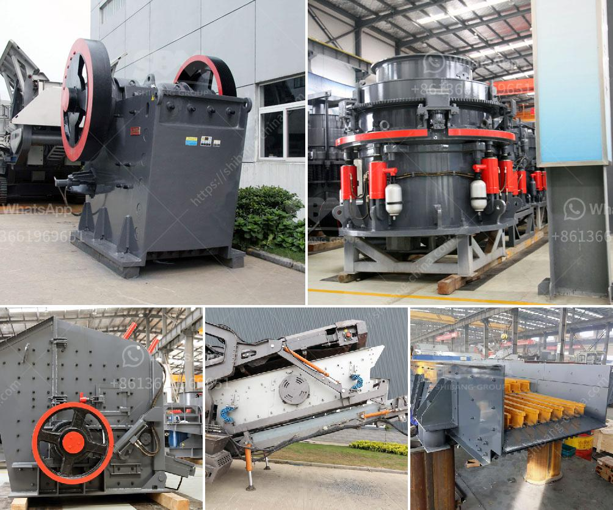

<h3>كسارات الحجر في المحجر</h3>
تعتبر كسارات الحجر في المحاجر أحد الصناعات الهامة التي تلعب دورًا حيويًا في العديد من القطاعات المختلفة. تستخدم كسارات الحجر لتحطيم وطحن الصخور والحجارة الكبيرة للحصول على مواد بناء قابلة للاستخدام في العديد من الإنشاءات المختلفة.

تعمل كسارات الحجر بواسطة تغذية الصخور الكبيرة إلى الآلة، حيث يتم تحطيمها بواسطة الصخور المتحركة. يتم إزالة الغبار والشوائب عن طريق استخدام الماء والأنظمة الواقية من الغبار. يمكن استخدام المواد المحطمة في العديد من التطبيقات مثل صناعات البناء والطرق والسدود واستخراج المعادن.

تتسم الكسارات بالكفاءة العالية والقدرة على التحمل لفترات طويلة من الاستخدام المستمر، مما يجعلها اختيارًا مثلى للمشروعات الكبيرة. تتميز بأنها سهلة التشغيل والصيانة، كما أنها قابلة للتصنيع والتثبيت حسب الاحتياجات الخاصة بالمشروع.

يوفر استخدام كسارات الحجر العديد من المزايا، منها تقليل التكاليف والوقت المستغرق في جمع المواد ونقلها من مكان إلى آخر. كما يتم تحقيق كفاءة أعلى في استخدام الموارد والمواد الخام. بالإضافة إلى ذلك، تتمتع كسارات الحجر بالقدرة على إعادة تدوير وإعادة استخدام المواد المحطمة، مما يحسن من استدامة البيئة ويقلل من النفايات.

مع تطور التكنولوجيا وتقدمها، زادت قدرة الكسارات على استخدام مصادر الطاقة المتجددة، مما يجعلها خيارًا مستدامًا أيضًا. تعتبر كسارات الحجر في المحاجر الحل المثلى للاستفادة من المواد الطبيعية المتاحة في المناطق المحلية، مما يقلل من اعتماد الدول على الاستيراد.

في الختام، تعد كسارات الحجر في المحاجر صناعة حيوية تلبي احتياجات العديد من القطاعات. توفر الكسارات مواد بناء عالية الجودة بتكلفة منخفضة وتعزز من استدامة البيئة والاعتماد على الموارد المحلية. تلعب دورًا هامًا في دفع عجلة التنمية وتعزيز الاقتصاد الوطني.
<h3>Contact us</h3><ul><li><strong>Whatsapp:&nbsp;<a href="https://wa.me/8613661969651">+8613661969651</a></strong></li><li><a href="https://swt.shibang-china.com/?git&amp;zhl&amp;كسارات الحجر في المحجر"><strong>Online Service(chat now)</strong></a></li></ul><h3>Related</h3><ul><li><a href='مصنع معالجة ملح الصخور.md'>مصنع معالجة ملح الصخور</a></li><li><a href='معدات سحق الجرانيت.md'>معدات سحق الجرانيت</a></li><li><a href='مطاحن تعدين الذهب المحمولة.md'>مطاحن تعدين الذهب المحمولة</a></li><li><a href='كسارة مخروطية الصين.md'>كسارة مخروطية الصين</a></li><li><a href='مواصفات كسارة المخروط.md'>مواصفات كسارة المخروط</a></li></ul>