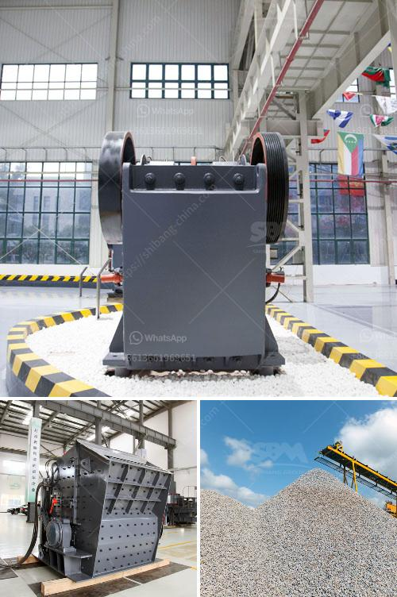

<h3>كسارات الحجر في بوكارامانجا</h3>
تعتبر كسارات الحجر في بوكارامانجا أحد القطاعات الهامة في صناعة البناء في هذه المنطقة. تتميز هذه الكسارات بموقعها الاستراتيجي القريب من مصادر الحجر، مما يسهل عملية استخلاص وتكسير الحجر واستخدامه في البناء.

تعد صناعة البناء من أهم القطاعات الاقتصادية في بوكارامانجا، حيث يتم استخدام الحجر بشكل واسع في بناء المنازل والمباني التجارية والمنشآت العامة. وبفضل تواجد كسارات الحجر في المنطقة، يتمكن المقاولون والمطورون من الحصول على مواد بناء عالية الجودة بأسعار معقولة وفي وقت قصير.

تتميز كسارات الحجر في بوكارامانجا بأنها تعمل بأحدث التقنيات والمعدات الحديثة لاستخلاص وتحضير الحجر. توفر هذه الكسارات مجموعة واسعة من المنتجات المختلفة، بما في ذلك الحصى والركام والرمل والحجر المكسر، وتلبي احتياجات العديد من القطاعات مثل البناء والطرق والعمارة.

تعتبر هذه الكسارات مصدرًا رئيسيًا للعمالة وفرص العمل في المنطقة، حيث يعمل العديد من الأشخاص في صناعة الكسارات، سواء كانوا فنيين أو عمالًا. وبالإضافة إلى ذلك، تسهم هذه الكسارات في توفير العديد من فرص العمل المتعلقة بالتوزيع والنقل والصيانة.

ومع ذلك، يجب أن نأخذ في الاعتبار أيضًا بعض التحديات التي تواجه هذه الصناعة. من بين التحديات الرئيسية هو التأثير البيئي الناتج عن العمليات المعدنية واستخراج الحجر. يجب على الكسارات اتباع ممارسات حسنة للحفاظ على البيئة المحيطة، مثل إعادة التدوير وترشيد استهلاك المياه والطاقة.

بصفة عامة، تلعب كسارات الحجر في بوكارامانجا دورًا حيويًا في تلبية الاحتياجات البناء في المنطقة. توفر هذه الصناعة فرص عمل مهمة وتساهم في تطور البنية التحتية ونمو الاقتصاد المحلي. ومع الحفاظ على المعايير البيئية، يمكن أن تكون كسارات الحجر في بوكارامانجا عاملًا رئيسيًا في النمو المستدام للمنطقة.
<h3>Contact us</h3><ul><li><strong>Whatsapp:&nbsp;<a href="https://wa.me/8613661969651">+8613661969651</a></strong></li><li><a href="https://swt.shibang-china.com/?git&amp;zhl&amp;كسارات الحجر في بوكارامانجا"><strong>Online Service(chat now)</strong></a></li></ul><h3>Related</h3><ul><li><a href='معدات المحجر للسكك الحديدية.md'>معدات المحجر للسكك الحديدية</a></li><li><a href='سعر كسارة الطين.md'>سعر كسارة الطين</a></li><li><a href='آلات صنع الحصى الكوارتز في الهند.md'>آلات صنع الحصى الكوارتز في الهند</a></li><li><a href='أصغر كسارة فك محمولة للبيع في جنوب أفريقيا.md'>أصغر كسارة فك محمولة للبيع في جنوب أفريقيا</a></li><li><a href='مكونات مطحنة الأسطوانة.md'>مكونات مطحنة الأسطوانة</a></li></ul>