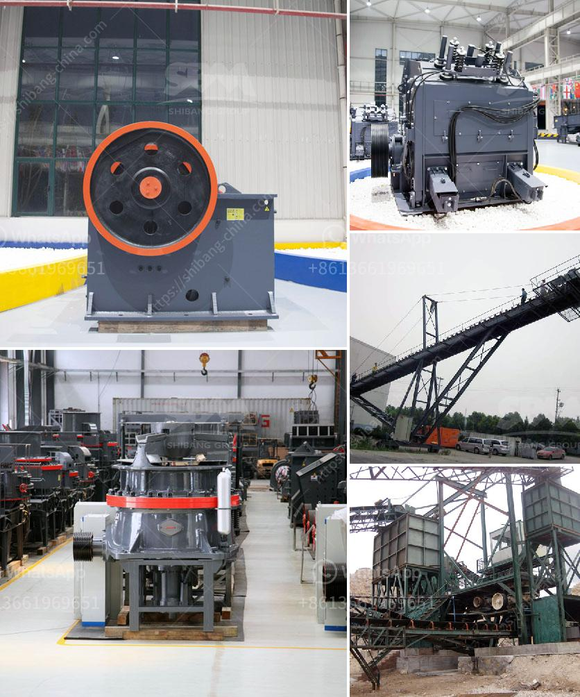

<h3>كسارات الحجر في بيلين</h3>
تعد كسارات الحجر في بيلين من أهم الصناعات التعدينية في المنطقة. توجد العديد من هذه الكسارات في بيلين؛ وتقوم بإنتاج الحجر الرملي والحصى والأحجار الأخرى المستخدمة في البناء والإنشاءات.

تشهد كسارات الحجر في بيلين نموًا مستمرًا، حيث يتزايد الطلب على المواد الكسارية من قبل الشركات والمقاولين. ويعود ذلك إلى زيادة الإنشاءات والمشاريع العقارية في المنطقة.

تقدم كسارات الحجر في بيلين مجموعة واسعة من المنتجات المختلفة، مثل الرمل والحصى بأحجام وأشكال مختلفة، والأحجار الكريمة، والأحجار المستخدمة في صناعة الطرق والفنادق والمشاريع العامة الأخرى. وتضمن هذه المنتجات جودة عالية ومواصفات فنية تتوافق مع معايير الجودة المحلية والعالمية.

تعمل كسارات الحجر بأحدث التقنيات والمعدات. وتوفر الكسارات مجموعة متنوعة من الآلات والماكينات اللازمة لعملية التكسير والغربلة والتصنيف. ويتم رصد ومراقبة العمليات الإنتاجية وفقًا لمعايير الجودة والأمان.

تُعَد كسارات الحجر في بيلين من أكبر مصادر العمل في المنطقة، حيث يوجد بها العديد من العمال المهرة والفنيين. وتُعَد هذه الصناعة مصدرًا هامًا للدخل وتعزز الاقتصاد المحلي.

تُعد كسارات الحجر في بيلين أيضًا مسؤولة تجاه البيئة، حيث تتبع تعليمات وضوابط صارمة للحفاظ على البيئة المحيطة. فهي تعمل على التحكم في الغبار والضوضاء وتقليل تأثيرها على المجتمع والطبيعة.

تعتبر كسارات الحجر في بيلين أماكن مهمة لشراء المواد الكسارية عالية الجودة. وتقوم بتلبية احتياجات الشركات والمقاولين في المنطقة وحتى خارجها.

باختصار، تُعَد كسارات الحجر في بيلين صناعة رئيسية ومهمة في المنطقة، حيث تلبي احتياجات البناء والإنشاءات. وتُعَد هذه الصناعة مصدرًا للعمل وتساهم في تنمية الاقتصاد المحلي. بالإضافة لذلك، تحرص على الالتزام بالمعايير البيئية والجودة.
<h3>Contact us</h3><ul><li><strong>Whatsapp:&nbsp;<a href="https://wa.me/8613661969651">+8613661969651</a></strong></li><li><a href="https://swt.shibang-china.com/?git&amp;zhl&amp;كسارات الحجر في بيلين"><strong>Online Service(chat now)</strong></a></li></ul><h3>Related</h3><ul><li><a href='مطحنة صناعية.md'>مطحنة صناعية</a></li><li><a href='مطحنة طحن فائقة الدقة.md'>مطحنة طحن فائقة الدقة</a></li><li><a href='مصنع الإسمنت بسعة 100 طن في الهند.md'>مصنع الإسمنت بسعة 100 طن في الهند</a></li><li><a href='مصانع إعادة تدوير النحاس في الصين.md'>مصانع إعادة تدوير النحاس في الصين</a></li><li><a href='عملية تنشيط الكالسيوم.md'>عملية تنشيط الكالسيوم</a></li></ul>