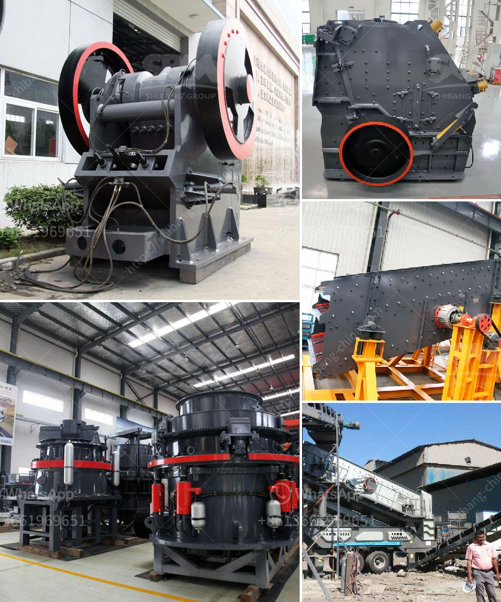

<h3>كسارات الحجر في جوتنغ</h3>
تعتبر كسارات الحجر في جوتنغ من أبرز المصانع التي تعمل في صناعة البناء والبنية التحتية في هذه المنطقة. تعد هذه الكسارات من أهم الموردين للحجر المسحوق والركام في المنطقة، حيث تتمتع بسمعة جيدة وذات جودة عالية.

الحجر المسحوق الذي ينتج في كسارات جوتنغ يستخدم بشكل رئيسي في صناعة البناء والبنية التحتية، مثل الخرسانة والأسفلت والطرق. كما يستخدم أيضًا في بعض الصناعات الأخرى مثل صناعة الأخشاب والزجاج والبلاط.

تتميز كسارات جوتنغ بتكنولوجيا متقدمة ومعدات حديثة. يتم استخدام معدات التنقل المرنة والكسارات الفكية ومجموعات الغربلة الاهتزازية لضمان جودة المنتج النهائي وتحقيق الإنتاجية العالية.

بالإضافة إلى ذلك، تلتزم كسارات جوتنغ بمعايير الجودة الصارمة والحفاظ على البيئة. يتم مراقبة العمليات بدقة لضمان عدم وجود تلوث بيئي وللحفاظ على الحياة البرية المحلية والمدن القريبة.

وبفضل تلك المميزات، تحظى كسارات جوتنغ بشعبية كبيرة بين المقاولين والمطورين في المنطقة. فهي تعتبر مصدرًا موثوقًا للمواد اللازمة لإكمال المشاريع الكبيرة والصغيرة على حد سواء.

علاوة على ذلك، تساهم كسارات جوتنغ في تعزيز الاقتصاد المحلي من خلال توفير فرص العمل للمجتمع المحلي ودعم الأعمال المرتبطة بصناعة البناء. وبذلك تسهم في تنمية المنطقة ورفع مستوى معيشة سكانها.

باختصار، تعد كسارات جوتنغ من أهم المؤسسات في صناعة الحجر في المنطقة، حيث توفر مواد بناء عالية الجودة وتلتزم بالمعايير البيئية. ومن خلال دورها الاقتصادي والاجتماعي، تعزز تنمية المنطقة وتعمل على تحسين حياة الناس في جوتنغ.
<h3>Contact us</h3><ul><li><strong>Whatsapp:&nbsp;<a href="https://wa.me/8613661969651">+8613661969651</a></strong></li><li><a href="https://swt.shibang-china.com/?git&amp;zhl&amp;كسارات الحجر في جوتنغ"><strong>Online Service(chat now)</strong></a></li></ul><h3>Related</h3><ul><li><a href='عملية الحجر الجيري.md'>عملية الحجر الجيري</a></li><li><a href='التكلفة الرأسمالية لمصنع تحسين خام الكروم.md'>التكلفة الرأسمالية لمصنع تحسين خام الكروم</a></li><li><a href='مصنع أسمنت للبيع في ألمانيا.md'>مصنع أسمنت للبيع في ألمانيا</a></li><li><a href='تكلفة مشروع مصنع طحن الكلنكر الصغير.md'>تكلفة مشروع مصنع طحن الكلنكر الصغير</a></li><li><a href='مصنع تكسير في ماليزيا.md'>مصنع تكسير في ماليزيا</a></li></ul>