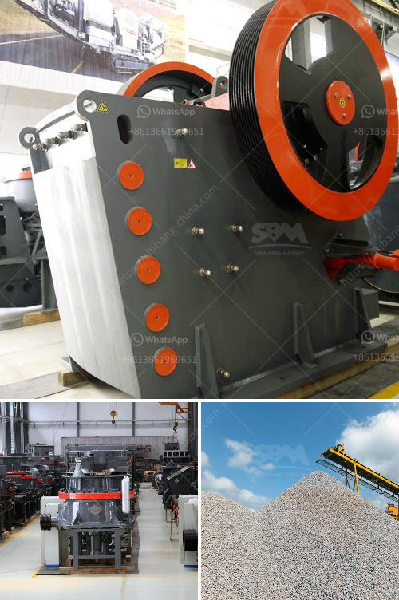

<h3>كسارات الحجر في غانا</h3>
تعد كسارات الحجر من المحطات الرئيسية لصناعة البناء والتشييد في غانا. تعمل هذه الكسارات على طحن الصخور الصلبة وتحويلها إلى مواد بناء قابلة للاستخدام في الإنشاءات المختلفة.

تلعب كسارات الحجر في غانا دورًا هامًا في تلبية الاحتياجات المتزايدة لمواد البناء في البلاد. يتم استخدام المواد الخام المحلية مثل الحجر الجيري والجرانيت والرخام والحصى والرمل لإنتاج مواد البناء. تُعد صناعة التعدين وتجهيز الحجر مصدرًا رئيسيًا للعمل والاقتصاد في غانا. يوفر قطاع المقالع والكسارات فرص عمل للعديد من السكان المحليين ويساهم في تحقيق التنمية الاقتصادية.

ومع ذلك، تتعرض كسارات الحجر في غانا للعديد من التحديات والمشاكل. أحد التحديات الرئيسية هو التأثير البيئي الناتج عن عمليات التعدين والتجهيز. قد يؤدي استخدام المعدات الثقيلة وتفجير الصخور إلى تلوث الهواء والتربة والمياه. يمكن أن تسبب حشوات الغبار والضباب المتولدة من عمليات التكسير والطحن خطرًا صحيًا على العاملين والمجتمع المحيط.

من جانب آخر، يعتبر التشغيل غير القانوني لبعض كسارات الحجر في غانا مشكلة كبيرة. بعض المنقبين يستخدمون طرقًا غير مشروعة وغير مراقبة لاستخراج المواد الخام، مما يؤدي إلى تدهور البيئة وانخفاض الجودة والفعالية في الإنتاج.

يجب على الحكومة أن تتخذ خطوات فعالة للتعامل مع هذه التحديات والمشاكل المتعلقة بكسارات الحجر في غانا. يجب على المشغلين أن يلتزموا بمعايير السلامة والبيئة لتقليل التأثير السلبي على المجتمعات المحلية والبيئة. يجب على الحكومة أيضًا تحسين الرقابة وتنفيذ القوانين واللوائح المتعلقة بالتعدين والتجهيز.

علاوة على ذلك، يمكن للحكومة أن تعزز عمليات التعدين المستدامة والاستفادة الأمثل من الموارد المعدنية. يمكن توجيه الاستثمارات في بنية التعدين وتحسين التكنولوجيا لزيادة الإنتاجية وتقليل التلوث. بالإضافة إلى ذلك، يجب أن تعزز الحكومة التوعية بأهمية الممارسات المستدامة في صناعة الكسارات وتشجيع استخدام المواد البديلة وتدوير المواد للحد من النفايات واستغلال الموارد بشكل أفضل.

باختصار، تلعب كسارات الحجر دورًا حيويًا في صناعة البناء والتشييد في غانا وتساهم في التنمية الاقتصادية. ومع ذلك، فإن التحديات المتعلقة بالتأثير البيئي والتشغيل غير القانوني يجب أن تتم مواجهتها وحلها بشكل فوري وفعال. يجب أن يتعاون المشغلون والحكومة معًا لتعزيز إجراءات السلامة والبيئة، وتحسين الرقابة، وتشجيع التعدين المستدام والاستفادة الأمثل من الموارد المعدنية. بذلك، يمكن لصناعة الكسارات أن تتطور بشكل أفضل وتكون مستدامة في غانا.
<h3>Contact us</h3><ul><li><strong>Whatsapp:&nbsp;<a href="https://wa.me/8613661969651">+8613661969651</a></strong></li><li><a href="https://swt.shibang-china.com/?git&amp;zhl&amp;كسارات الحجر في غانا"><strong>Online Service(chat now)</strong></a></li></ul><h3>Related</h3><ul><li><a href='مطحنة الكرة الثقيلة الوزن في الهند.md'>مطحنة الكرة الثقيلة الوزن في الهند</a></li><li><a href='كسارة الحجر الصخري في الفلبين.md'>كسارة الحجر الصخري في الفلبين</a></li><li><a href='كسارة حجرية مستعملة للبيع.md'>كسارة حجرية مستعملة للبيع</a></li><li><a href='مصنع معالجة الجبس.md'>مصنع معالجة الجبس</a></li><li><a href='طريقة التعويم لتحليل رمل السيليكا.md'>طريقة التعويم لتحليل رمل السيليكا</a></li></ul>