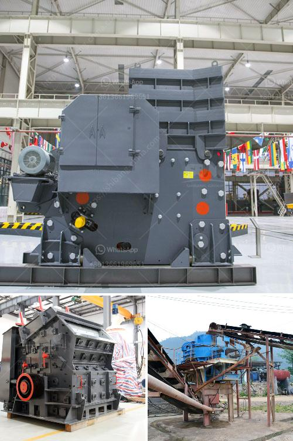

<h3>كسارات الحجر في فرنسا</h3>
تعتبر فرنسا واحدة من البلدان الأوروبية التي تتمتع بثروات طبيعية غنية، ومن بين هذه الثروات يأتي الحجر الطبيعي الذي يتم استخراجه من العديد من المناطق في البلاد. وتعتبر كسارات الحجر في فرنسا مصادر مهمة لتلبية الطلب المحلي والعالمي على المواد الإنشائية والبنائية.

تعد صناعة الحجر واحدة من الصناعات الرائدة في فرنسا، حيث تتواجد العديد من المناجم والكسارات في مناطق مختلفة في البلاد مثل بورغندي وسيميزي وفوتوربودي والبيرينيه وبروفانس وغيرها. تتميز كسارات الحجر في فرنسا بتنوع أنواع الحجر المستخرجة، حيث يتم استخدامها في البناء والديكور والمشاريع العامة والخاصة.

تلعب كسارات الحجر دورًا حاسمًا في توفير المواد الأساسية لصناعة البناء، فهي تنتج الأحجار الطبيعية المستخدمة في الهندسة المعمارية والتشييد مثل الرخام والجرانيت والحجر الجيري والصوان وغيرها. تتميز هذه الأحجار بجمالها الطبيعي وتنوعها اللوني وأنماطها المختلفة، وتستخدم لتجميل وتزيين المنازل والمباني والمساجد والكاتدرائيات والمنحوتات الفنية.

وبالإضافة إلى الجمالية، تتمتع كسارات الحجر في فرنسا بمزايا عديدة، فهي تحترم معايير الجودة العالمية وتضمن توفير منتجات متينة ومتناسبة مع احتياجات العملاء. كما تسهم هذه الصناعة في توفير فرص العمل للعديد من العمال، وتعزز الاقتصاد المحلي في المناطق المحيطة.

يجب أن نذكر أن صناعة الحجر في فرنسا تلتزم بمعايير الاستدامة البيئية، حيث يتم اتخاذ التدابير اللازمة للحفاظ على البيئة المحلية وتقليل التأثير البيئي لعمليات التعدين والاستخراج. وتعمل الحكومة الفرنسية على تنفيذ سياسات خضراء واستدامة وتشجيع الابتكار في هذا القطاع.

باختصار، تعتبر كسارات الحجر في فرنسا موردًا مهمًا للحجر الطبيعي، حيث تلبي الطلب المحلي والدولي على المواد البنائية. تقدم هذه الكسارات حلولًا متميزة ومتنوعة من الأحجار الطبيعية التي تضيف لمسة فنية وجمالية للمنشآت والمشاريع. كما تساهم في توفير فرص العمل وتعزز الاقتصاد المحلي، في حين تلتزم بمعايير الاستدامة البيئية للحفاظ على البيئة المحيطة.
<h3>Contact us</h3><ul><li><strong>Whatsapp:&nbsp;<a href="https://wa.me/8613661969651">+8613661969651</a></strong></li><li><a href="https://swt.shibang-china.com/?git&amp;zhl&amp;كسارات الحجر في فرنسا"><strong>Online Service(chat now)</strong></a></li></ul><h3>Related</h3><ul><li><a href='مطحنة طحن الحجر من ألمانيا.md'>مطحنة طحن الحجر من ألمانيا</a></li><li><a href='سحق مصنع لخام الحديد.md'>سحق مصنع لخام الحديد</a></li><li><a href='كسارات محمولة في محجر جنوب أفريقيا.md'>كسارات محمولة في محجر جنوب أفريقيا</a></li><li><a href='بيع كسارة مخروطية صنعت في الصين.md'>بيع كسارة مخروطية صنعت في الصين</a></li><li><a href='آلة فصل خام النحاس.md'>آلة فصل خام النحاس</a></li></ul>