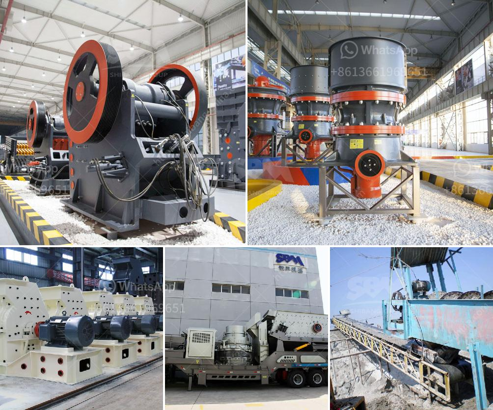

<h3>كسارات الحجر في كاليفورنيا</h3>
تعتبر كسارات الحجر في ولاية كاليفورنيا من أهم الصناعات التعدينية في المنطقة. وتشهد الولاية استغلالًا متواصلًا للموارد الطبيعية المتاحة بها، حيث يتم استخراج الأحجار الصخرية وتكسيرها لإنتاج الركام القابل للاستخدام في مجموعة متنوعة من التطبيقات الإنشائية.

إن وجود العديد من المحاجر في كاليفورنيا يمثل مصدرًا هامًا للأحجار الطبيعية المستخدمة في مشاريع البناء والطرق. وتعبر كسارات الحجر في الولاية عن نظام دورة اقتصادية، حيث يتم استخراج الصخور الناتجة من المحاجر ثم تكسيرها وتجهيزها للاستخدام.

تتعدد استخدامات الأحجار الصخرية المستخرجة من كسارات كاليفورنيا، فهي تستخدم في مجموعة متنوعة من المشاريع الإنشائية، بدءًا من الطرق والجسور وصولًا إلى مشاريع البناء السكني والتجاري. يمكن استخدام الأحجار الناتجة من هذه الكسارات في صنع الخرسانة والأسفلت والمخلفات البناء، وتأثيرها على قطاع البناء والبنية التحتية في الولاية لا يمكن تجاهله.

تتميز كسارات الحجر في كاليفورنيا بتوفر تقنيات ومعدات حديثة تستخدم لتكسير الصخور بكفاءة عالية وبطرق بيئية. تعتبر هذه العمليات مطابقة للمعايير البيئية المحلية والوطنية وتعطي أولوية لأمور السلامة والحماية البيئية. تم اعتماد معايير صارمة للحفاظ على استدامة البيئة المحيطة بمواقع الكسارات ومراقبتها بشكل مستمر من قِبل الهيئات البيئية المعنية والجهات التنظيمية المختصة.

ومع ذلك، تثير كسارات الحجر العديد من المخاوف بين سكان الولاية، مثل الضوضاء والغبار وتأثيرها على البيئة المحلية والحياة البرية. لذا، يتعين على أصحاب الكسارات الالتزام بتنفيذ إجراءات رش المياه، وتثبيت الحواجز الصوتية، والمحافظة على تلك الممارسات البيئية الجيدة للتقليل من التأثيرات السلبية.

باختصار، كسارات الحجر في كاليفورنيا تمثل صناعة رئيسية مع تأثير اقتصادي هام، حيث توفر الركام اللازم للمشاريع الانشائية. في حين يجب أن تستمر الكسارات في اتخاذ تدابير الحفاظ على البيئة وتحسين التوازن بين تلبية احتياجات البناء والحفاظ على جمال وسلامة البيئة المحيطة بها.
<h3>Contact us</h3><ul><li><strong>Whatsapp:&nbsp;<a href="https://wa.me/8613661969651">+8613661969651</a></strong></li><li><a href="https://swt.shibang-china.com/?git&amp;zhl&amp;كسارات الحجر في كاليفورنيا"><strong>Online Service(chat now)</strong></a></li></ul><h3>Related</h3><ul><li><a href='كسارات الحجر في فرنسا.md'>كسارات الحجر في فرنسا</a></li><li><a href='ضواغط الديزل للبيع في جنوب أفريقيا.md'>ضواغط الديزل للبيع في جنوب أفريقيا</a></li><li><a href='سعر آلة كسارة الفك.md'>سعر آلة كسارة الفك</a></li><li><a href='كسارات الحجر الرئيسية.md'>كسارات الحجر الرئيسية</a></li><li><a href='سعر آلة المحجر.md'>سعر آلة المحجر</a></li></ul>