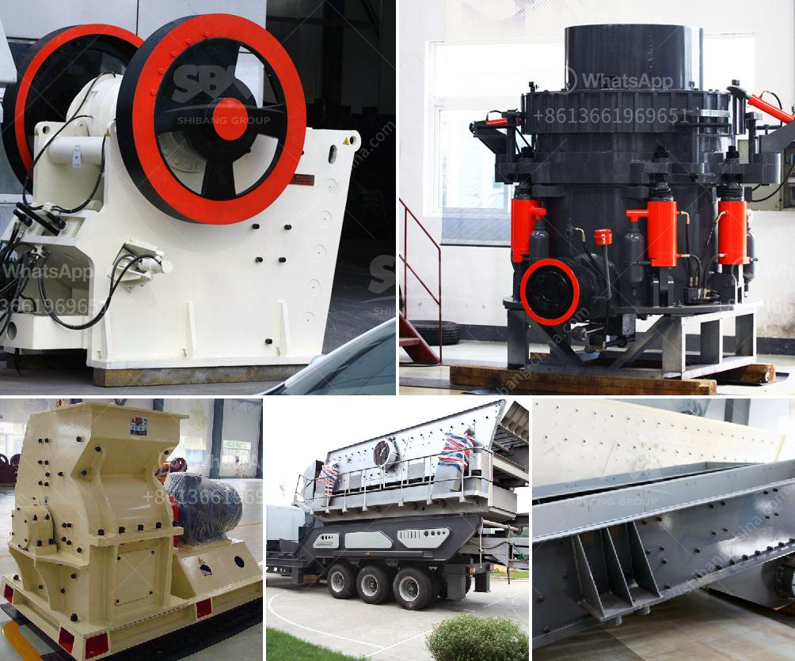

<h3>كسارات الحجر في كينيا للبيع</h3>
تعتبر كينيا دولة ذات طبيعة خلابة في شرق أفريقيا، وتشتهر بأنها واحدة من أبرز الوجهات السياحية في المنطقة. ولكن إلى جانب الجمال الطبيعي، هناك العديد من الأنشطة الاقتصادية التي تجري في البلاد، بما في ذلك صناعة كسارات الحجر.

تعد كسارات الحجر من الصناعات الهامة في كينيا، حيث تستخدم لاستخراج وتكسير الصخور والحجارة لاستخدامها في مختلف الأغراض البناءية. وتستخدم هذه الحجارة في بناء الطرق والمباني والجسور والمشاريع العامة الأخرى. وتتواجد العديد من كسارات الحجر في جميع أنحاء البلاد، وتباع هذه الحجارة بأسعار مختلفة تتراوح من 200 إلى 400 دولار.

إن الحاجة إلى كسارات الحجر في كينيا مرتفعة، نظراً للزيادة المستمرة في الإنشاءات والتطور الحضري في البلاد. ولذلك، فإن صناعة كسارات الحجر تعتبر مجالًا رابحًا لتمويل المشاريع البناءية وتوفير وظائف جديدة للسكان المحليين.

توجد العديد من الشركات والمقاولات الصغيرة والكبيرة التي تعمل في صناعة كسارات الحجر في كينيا. وتعمل هذه الشركات على استخراج الحجارة من المحاجر، وتكسيرها وفرزها وبيعها للعملاء. وتختلف أحجام الحجارة وأنواعها وفقًا لاحتياجات العملاء، حيث تتوفر حجارة صغيرة للاستخدام في الأغراض البناءية العامة وحجارة أكبر للاستخدام في الطرق والجسور.

بالإضافة إلى ذلك، تهتم صناعة كسارات الحجر في كينيا بالتنمية المستدامة وحماية البيئة. فعند استخراج الحجارة، يتم اتخاذ التدابير اللازمة للحفاظ على النظام البيئي والحفاظ على الحياة البرية المحلية. كما تلتزم الشركات بتطبيق ممارسات عمل آمنة من أجل صحة وسلامة العمال.

في النهاية، تلعب صناعة كسارات الحجر في كينيا دورًا هامًا في تلبية الاحتياجات البناءية وتوفير فرص عمل للسكان المحليين. كما أنها تحظى بدعم واهتمام الحكومة والمستثمرين، الذين يرون في هذا القطاع فرصة رائعة للنمو والتنمية.
<h3>Contact us</h3><ul><li><strong>Whatsapp:&nbsp;<a href="https://wa.me/8613661969651">+8613661969651</a></strong></li><li><a href="https://swt.shibang-china.com/?git&amp;zhl&amp;كسارات الحجر في كينيا للبيع"><strong>Online Service(chat now)</strong></a></li></ul><h3>Related</h3><ul><li><a href='محطات الكسارات في الكويت.md'>محطات الكسارات في الكويت</a></li><li><a href='معدات كسارة الفك للبيع في الفلبين.md'>معدات كسارة الفك للبيع في الفلبين</a></li><li><a href='سعر كسارة مخروطية هيدروليكية بتغذية 20 مم.md'>سعر كسارة مخروطية هيدروليكية بتغذية 20 مم</a></li><li><a href='أسطوانات لكسارات في بوغوتا.md'>أسطوانات لكسارات في بوغوتا</a></li><li><a href='مصنعي آلات المحجر.md'>مصنعي آلات المحجر</a></li></ul>