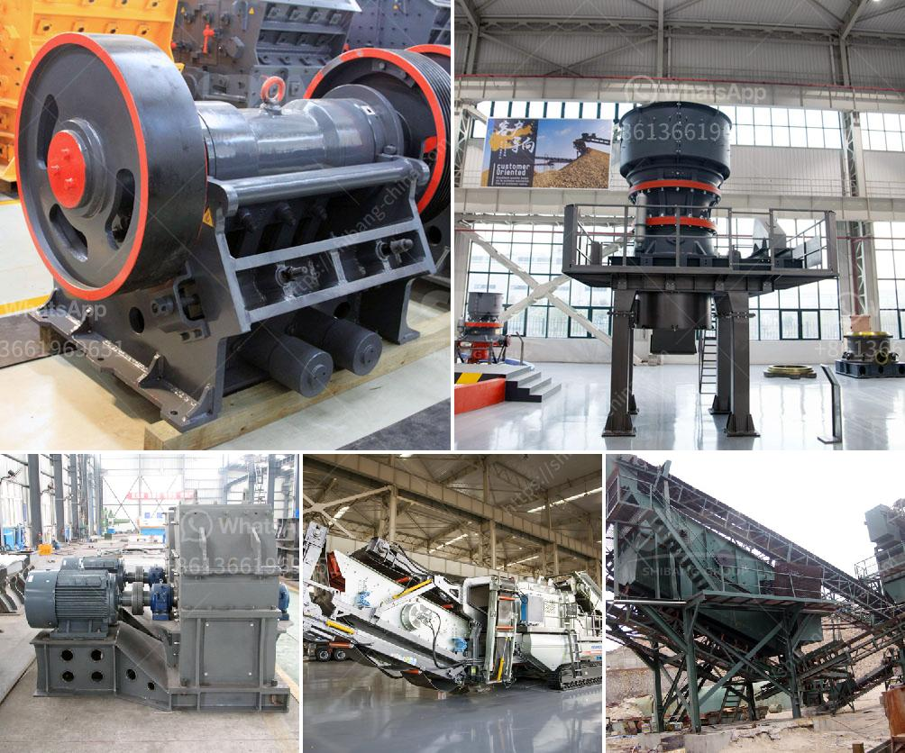

<h3>كسارات الحجر في ماليزيا</h3>
يعد قطاع البناء والإنشاءات من القطاعات الحيوية في اقتصاد ماليزيا، حيث يحظى بالكثير من الاهتمام والاستثمارات. ودور كسارات الحجر في هذا القطاع يعتبر أساسياً لتزويد البناء بالمواد اللازمة، فهي تعتبر مصدراً هامًا للرمل والحصى والصخور المكسرة.

تتميز ماليزيا بوجود العديد من كسارات الحجر الموجودة في مختلف مناطقها، مثل سيلانجور وبيراك وساباه وكيداه، وتعتبر هذه المناطق من المناطق البارزة في صناعة البناء في ماليزيا. وتعد ماليزيا من الدول الرائدة في إنتاج الحجر المكسر والغبار حيث يتم استخدامها على نطاق واسع في مشاريع البناء والطرق والمدن.

تعمل كسارات الحجر على سحق الصخور الكبيرة إلى قطع صغيرة بحجم محدد يستخدم في مشاريع البناء المختلفة. تعتمد عملية سحق الحجر على استخدام المعدات الثقيلة مثل الكسارة الفكية والكسارة المخروطية وكسارة الصدم.

توفر كسارات الحجر في ماليزيا مجموعة واسعة من المنتجات التي تستخدم في مختلف مشاريع البناء. يتم استخدام الرمل المكسر والحصى في صناعة الخرسانة والبناء العام، في حين يتم استخدام الصخور المكسرة في صناعة الأسفلت والطرق والجسور.

يعتبر قطاع كسارات الحجر في ماليزيا قطاعًا منافسًا حيث توجد العديد من الشركات والمصانع التي تعمل في هذا القطاع. وتسعى هذه الشركات إلى تقديم أعلى جودة لمنتجاتها، بالإضافة إلى توفيرها لأفضل الخدمات لعملائها.

وبالإضافة إلى دورها الحيوي في صناعة البناء، تسهم كسارات الحجر في ماليزيا في تعزيز الاقتصاد المحلي وخلق فرص عمل للعديد من العمال المحليين. كما تساهم في تحسين البنية التحتية والتنمية العمرانية في مناطقها، وبالتالي تعزز التنمية الشاملة في البلاد.

في الختام، يمكن القول إن كسارات الحجر في ماليزيا تلعب دوراً أساسياً في صناعة البناء والإنشاءات، وتعمل على تزويد المشاريع بالمواد الضرورية. ومع استمرار النمو الاقتصادي والتطور العمراني في ماليزيا، فمن المتوقع أن يستمر الطلب على منتجات كسارات الحجر وعمليات البناء في الزيادة.
<h3>Contact us</h3><ul><li><strong>Whatsapp:&nbsp;<a href="https://wa.me/8613661969651">+8613661969651</a></strong></li><li><a href="https://swt.shibang-china.com/?git&amp;zhl&amp;كسارات الحجر في ماليزيا"><strong>Online Service(chat now)</strong></a></li></ul><h3>Related</h3><ul><li><a href='آلة حبيبات الجبس في الهند.md'>آلة حبيبات الجبس في الهند</a></li><li><a href='كسارة تأثير الكلي.md'>كسارة تأثير الكلي</a></li><li><a href='وزير التعدين في غانا.md'>وزير التعدين في غانا</a></li><li><a href='مواصفات كسارة الفك.md'>مواصفات كسارة الفك</a></li><li><a href='سعر الكسارة من الصين.md'>سعر الكسارة من الصين</a></li></ul>