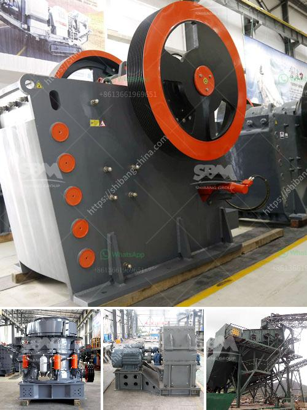

<h3>كسارات الحجر في نيجيريا</h3>
تعد كسارات الحجر من الصناعات الحيوية في نيجيريا، فهي توفر المواد الخام اللازمة للعديد من القطاعات الاقتصادية مثل البناء والبنية التحتية. وتعد نيجيريا واحدة من أكبر دول إفريقيا من حيث السكان، وبالتالي فهي بحاجة ماسة للتطور العمراني والبنية التحتية. وفي هذا السياق، تلعب كسارات الحجر دورًا حاسمًا في تلبية احتياجات البناء في البلاد.

تعتبر نيجيريا من بين أكبر المنتجين للحجر والرمل في قارة إفريقيا. يتم استخراج الحجر والرمل من محاجر مستخدمة في إعداد مختلف المواد الانشائية، مثل الخرسانة والأسفلت و الرصف الحجري. إلى جانب ذلك، فهي تستخدم أيضًا في مشاريع الأنفاق والجسور والمباني التجارية والسكنية.

يواجه قطاع كسارات الحجر في نيجيريا العديد من التحديات التي تؤثر على أداء الصناعة بشكل عام. أحد أهم هذه التحديات هو عدم تفعيل السياسات الحكومية وتطبيقها بشكل فعال. فعلى الرغم من توفر الموارد الطبيعية والموقع الاستراتيجي للمحاجر، فإن بعض المشاكل مثل تأخر منح التراخيص وتعقيدات في الإجراءات الإدارية، تثقل كاهل صناعة الحجر في البلاد وتعوق نموها.

بالإضافة إلى ذلك، تشكل التساؤلات البيئية تحديًا آخر لكسارات الحجر في نيجيريا. فعمليات التعدين قد تتسبب في انبعاثات ضارة وتلوث الهواء والمياه، مما يؤثر سلبًا على البيئة وصحة المجتمعات المحلية. تواجه الصناعة ضغوطًا للتحسين المستمر لمعايير السلامة البيئية وتقديم خطط للتخفيف من تأثيراتها السلبية.

ومع ذلك، فإن كسارات الحجر في نيجيريا تلعب دورًا حيويًا في دعم التنمية العمرانية وتلبية احتياجات البناء. وباستثمار المزيد في تحقيق السياسات الحكومية الفاعلة وتحسين معايير السلامة البيئية، يمكن لصناعة كسارات الحجر أن تصبح عاملًا حاسمًا في تعزيز الاقتصاد النيجيري وتحسين جودة الحياة للسكان. إلى جانب ذلك، يمكن أن توفر فرص عمل أفضل للشباب وتسهم في تقليل نسبة البطالة.

في النهاية، من الضروري أن يعمل الحكومة والشركات المعنية بكسارات الحجر في نيجيريا سويًا لتعزيز هذا القطاع الحيوي والحفاظ على التوازن المثالي بين التنمية الاقتصادية والحفاظ على البيئة. تحقيق هذا الاستقرار سيوفر فرصًا جديدة للنمو والازدهار في قطاع الحجر في نيجيريا وتحقيق تنمية مستدامة في المستقبل.
<h3>Contact us</h3><ul><li><strong>Whatsapp:&nbsp;<a href="https://wa.me/8613661969651">+8613661969651</a></strong></li><li><a href="https://swt.shibang-china.com/?git&amp;zhl&amp;كسارات الحجر في نيجيريا"><strong>Online Service(chat now)</strong></a></li></ul><h3>Related</h3><ul><li><a href='إنتاج مصنع الإسمنت في الجزائر.md'>إنتاج مصنع الإسمنت في الجزائر</a></li><li><a href='آلة مطحنة الدولوميت.md'>آلة مطحنة الدولوميت</a></li><li><a href='مصنع المعادن سحق خام البوكسيت.md'>مصنع المعادن سحق خام البوكسيت</a></li><li><a href='تجار في محطم الفحم وآلة طحن في الهند.md'>تجار في محطم الفحم وآلة طحن في الهند</a></li><li><a href='بائع معدات الطحن.md'>بائع معدات الطحن</a></li></ul>