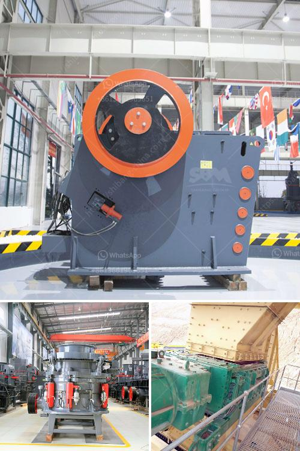

<h3>كسارات الحجر للبيع في المملكة المتحدة</h3>
تتمتع المملكة المتحدة بصناعة البناء القوية والمتقدمة، وتعتبر الأحجار الطبيعية أحد عوامل الأساسية في عمليات البناء والتشييد. ولذلك، فإن وجود كسارات الحجر للبيع في المملكة المتحدة يعتبر أمراً ضرورياً لتلبية احتياجات صناعة البناء.

تتميز كسارات الحجر في المملكة المتحدة بالتفوق والجودة العالية، حيث يتم استخدام أحدث التقنيات والمعدات المتطورة في عمليات التكسير والغربلة. تعمل هذه الكسارات على تفتيت الصخور الكبيرة إلى قطع صغيرة يمكن استخدامها في مجموعة متنوعة من التطبيقات. وتتيح هذه التقنيات للعملاء الحصول على مواد بناء عالية الجودة.

توفر معظم كسارات الحجر في المملكة المتحدة مجموعة واسعة من المنتجات، بدءًا من الرمال والحصى الأساسية وصولاً إلى الأحجار المكسورة المختلفة الأحجام. وبالإضافة إلى ذلك، فإن بعضها يقدم خدمات النقل والتوصيل، لتسهيل عمليات البناء والتشييد.

توفر كسارات الحجر في المملكة المتحدة أيضًا مجموعة متنوعة من الخدمات، منها خدمات تأجير المعدات والآلات المستخدمة في عملية البناء، وتوفير الاستشارات والدعم الفني للعملاء. يمكن للعملاء الاعتماد على فرق عمل محترفة ومدربة تعرف جيدًا على متطلبات صناعة البناء وتلبي احتياجات العملاء بطريقة فعالة وفي الوقت المناسب.

تعتبر ميزة كبيرة أخرى لشراء كسارات الحجر في المملكة المتحدة هي قوانين الحماية البيئية المشددة. فبفضل هذه القوانين، تعتبر عمليات التكسير والغربلة صديقة للبيئة، حيث يتم تدوير وإعادة استخدام المواد الناتجة عن هذه العمليات والالتزام بمعايير السلامة والبيئة الموضوعة.

بشكل مثير للاهتمام، يتم تصدير العديد من المنتجات الحجرية المنتجة في المملكة المتحدة إلى دول أخرى، مما يعزز الاقتصاد المحلي ويدعم صناعة البناء. ولذلك، يعتبر شراء كسارات الحجر في المملكة المتحدة ليس فقط اختيارًا جيدًا للعملاء المحليين ولكن أيضًا لأولئك الذين يبحثون عن منتجات عالية الجودة من مصدر موثوق به.

في الختام، فإن كسارات الحجر للبيع في المملكة المتحدة تعد حجر الزاوية في صناعة البناء والتشييد. توفر تلك الكسارات منتجات عالية الجودة وخدمات متنوعة لتلبية احتياجات العملاء وتوفير بيئة بناء صديقة للبيئة. إذا كنت تبحث عن حلول بناء موثوقة في المملكة المتحدة، فإن البحث عن كسارات الحجر سيكون اختيارًا حكيمًا.
<h3>Contact us</h3><ul><li><strong>Whatsapp:&nbsp;<a href="https://wa.me/8613661969651">+8613661969651</a></strong></li><li><a href="https://swt.shibang-china.com/?git&amp;zhl&amp;كسارات الحجر للبيع في المملكة المتحدة"><strong>Online Service(chat now)</strong></a></li></ul><h3>Related</h3><ul><li><a href='تصنيع محطم المحمولة في ألمانيا.md'>تصنيع محطم المحمولة في ألمانيا</a></li><li><a href='مطحنة محمولة في أستراليا بيرث.md'>مطحنة محمولة في أستراليا بيرث</a></li><li><a href='خط تكسير الحجر الجرانيت.md'>خط تكسير الحجر الجرانيت</a></li><li><a href='أسعار كسارات الفك في جنوب أفريقيا.md'>أسعار كسارات الفك في جنوب أفريقيا</a></li><li><a href='سعر مطحنة المطرقة للطين.md'>سعر مطحنة المطرقة للطين</a></li></ul>