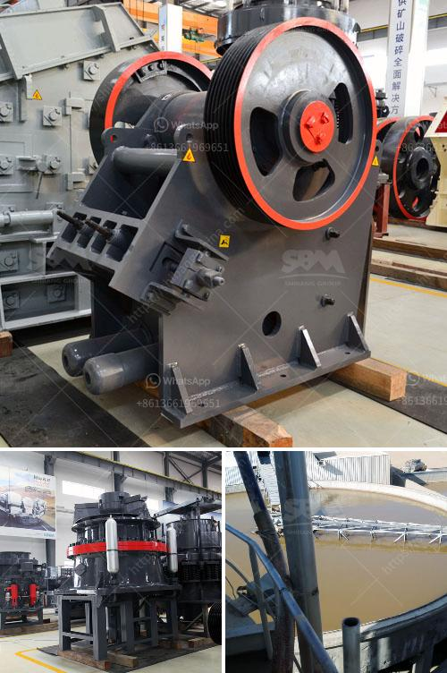

<h3>كسارات الحجر للبيع في كينيا</h3>
تعتبر كسارات الحجر أحد الصناعات الرئيسية في كينيا، حيث تلعب دورًا حاسمًا في تلبية احتياجات قطاع البناء والتشييد. تقدم كسارات الحجر المستخدمة للبيع في كينيا حلاً مربحًا وفعالًا للمشترين الذين يبحثون عن طرق اقتصادية وفعالة للحصول على مواد البناء.

تشتهر كينيا بتنوعها الجغرافي الكبير الذي يتيح العديد من الفرص التجارية لصناعة البناء. هناك العديد من المشاريع الكبيرة والصغيرة التي تتطلب الكثير من الموارد من حيث الحجارة والركام. يُستخدم الحجر المكسور من الكسارات لإنشاء الطرق والجسور والمباني والمنشآت الأخرى. لذا، يعتبر البحث عن كسارات الحجر للبيع في كينيا خطوة ضرورية لمشاريع البناء الناجحة.

تتوافر في كينيا العديد من كسارات الحجارة المستخدمة للبيع بتشكيلة واسعة من الأحجام والأشكال والألوان. تتراوح أحجام الأحجار بين الأحجار الكبيرة التي يتم استخدامها للمشاريع الكبيرة مثل الطرق والجسور، والأحجار الأصغر التي يمكن استخدامها لبناء الأسوار وتعبيد الطرق الصغيرة. هذا يعني أنه يمكن للمشترين العثور بسهولة على الحجارة التي تتناسب مع متطلباتهم المحددة.

تعمل كسارات الحجر في كينيا بشكل مثلى لتوفير جودة عالية من الحجارة المكسورة. تستخدم تقنيات حديثة لتكسير الحجارة وفرزها وفقًا للأحجام المطلوبة. تتمتع هذه الكسارات بآلات متطورة ومزودة بأنظمة للرقابة على الجودة لضمان تلبية المعايير الصناعية وتقديم الحجارة ذات الجودة العالية.

من بين المزايا الرئيسية لشراء كسارات الحجر المستخدمة في كينيا هو السعر المنخفض. فبالمقارنة مع شراء الحجارة الطبيعية الجديدة، فإن شراء الحجارة المكسورة وإعادة استخدامها يكون أقل تكلفة وأكثر اقتصادية. كما أن شراء الحجارة المستخدمة يُساهم في صيانة البيئة، حيث يمنع استخراج الموارد الطبيعية الجديدة ويقلل من كمية النفايات المرتبطة بهذه الصناعة.

في النهاية، يمكن القول بأن كسارات الحجر المستخدمة للبيع في كينيا تعتبر خيارًا جيدًا وفعّالًا للمشترين الذين يبحثون عن مواد البناء ذات الجودة العالية والأسعار المعقولة. توفر هذه الكسارات الحجارة المكسورة بمختلف الأحجام والأشكال، مما يتيح للمشترين إمكانية اختيار الأنسب لمشاريعهم. كما يساهم استخدام الحجارة المستخدمة في حفظ البيئة وتقليل النفايات. لذا، يجب على المهتمين بالبناء في كينيا دراسة واختيار مصادر الحجارة المستخدمة بعناية لضمان الحصول على المواد المناسبة لاحتياجاتهم المحددة.
<h3>Contact us</h3><ul><li><strong>Whatsapp:&nbsp;<a href="https://wa.me/8613661969651">+8613661969651</a></strong></li><li><a href="https://swt.shibang-china.com/?git&amp;zhl&amp;كسارات الحجر للبيع في كينيا"><strong>Online Service(chat now)</strong></a></li></ul><h3>Related</h3><ul><li><a href='البحث عن مطحنة الهامر.md'>البحث عن مطحنة الهامر</a></li><li><a href='خط إنتاج مسحوق الحجر الجيري في الهند.md'>خط إنتاج مسحوق الحجر الجيري في الهند</a></li><li><a href='مصنع تكسير الحصى في جنوب أفريقيا.md'>مصنع تكسير الحصى في جنوب أفريقيا</a></li><li><a href='كسارات تأثير للبيع في الولايات المتحدة.md'>كسارات تأثير للبيع في الولايات المتحدة</a></li><li><a href='كسارة الصدم PF لآلة تكسير الحجر للبيع.md'>كسارة الصدم PF لآلة تكسير الحجر للبيع</a></li></ul>