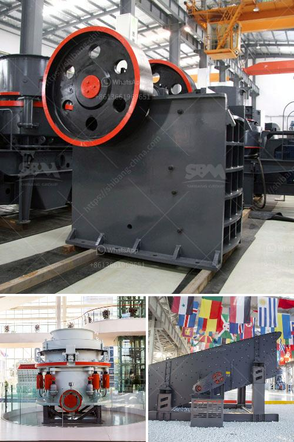

<h3>كسارات الحجر من السويد</h3>
تُعدّ كسارات الحجر من السويد أحد أبرز الصناعات المتطورة والمهمة في هذا البلد الاسكندنافي. وتعود أهمية هذه الكسارات إلى وجود كميات كبيرة جدًا من الصخور والحجارة في السويد، حيث تمتلك البلاد ثروة طبيعية ضخمة تجعلها مصدرا رئيسيًا للكسارات ومستلزمات البناء في أنحاء العالم.

تتميز كسارات الحجر في السويد بالجودة العالية والتكنولوجيا المتقدمة، حيث يتم استخدام أحدث المعدات والآلات لاستخراج وتصنيع الصخور والحجارة بشكل متميز. كما تتمتع هذه الكسارات بالكفاءة العالية في عمليات الانتاج والتصنيع المختلفة، وذلك بفضل الاستخدام الفعال للطاقة والموارد المتاحة.

تتكون كسارات الحجر في السويد من عدة أقسام، تبدأ من مرحلة الاستخراج الأولية للصخور والحجارة وتنتهي بعمليات التكسير والفرز والتغليف النهائي. ويجري العمل في هذه الكسارات وفقًا لمعايير صارمة للجودة والسلامة، حيث يتم تطبيق إجراءات الحماية المهنية على نطاق واسع، وذلك لضمان سلامة العاملين وسلامة البيئة المحيطة.

ومن الملفت للنظر أن السويد تولي اهتمامًا كبيرًا للانتقال إلى الطاقة المستدامة في صناعة استخراج الحجر، حيث تسعى للحد من انبعاثات الكربون وتدعم استخدام التكنولوجيا المستدامة والبيئية في هذا القطاع. وهذا يتماشى مع الجهود العالمية للحفاظ على البيئة وتعزيز التنمية المستدامة.

وتعدّ كسارات الحجر في السويد منتجات لا غنى عنها في مجالات البناء والهندسة المدنية والبنية التحتية. فالحجر المستخدم في البناء يتميز بالمتانة والقوة، كما أنه يخضع لعمليات معالجة تجعله قابلاً للاستخدام في العديد من التطبيقات المختلفة، بدءًا من الأرصفة وصولاً إلى الطرق والجسور.

وبشكل عام، تشهد صناعة كسارات الحجر في السويد نموًا مستدامًا ومستقرًا، وذلك بفضل الطلب المتزايد على هذه المنتجات ذات الجودة العالية والتكنولوجيا المتقدمة. وتعتبر كسارات الحجر من السويد مصدر ثابت للتوريد في السوق العالمية، حيث تستخدم في مشاريع البناء الكبرى والمشاريع البنية التحتية والتطوير العمراني في العديد من الدول حول العالم.

بشكل ختامي، يمكن القول بأن كسارات الحجر في السويد تمثل صناعة حيوية ومهمة في البلاد، حيث تعتمد عليها العديد من القطاعات الاقتصادية وتمثل مصدرًا رئيسيًا للتوريد في السوق العالمية. وبفضل الجودة العالية والتكنولوجيا المتقدمة، فإن كسارات الحجر في السويد تتمتع بمكانة متميزة في هذا القطاع الحيوي.
<h3>Contact us</h3><ul><li><strong>Whatsapp:&nbsp;<a href="https://wa.me/8613661969651">+8613661969651</a></strong></li><li><a href="https://swt.shibang-china.com/?git&amp;zhl&amp;كسارات الحجر من السويد"><strong>Online Service(chat now)</strong></a></li></ul><h3>Related</h3><ul><li><a href='سعر كسارة الفك PE 400.md'>سعر كسارة الفك PE 400</a></li><li><a href='شاشة هزازة صينية.md'>شاشة هزازة صينية</a></li><li><a href='مصنع كسارة الفك في ولاية جوجارات الهند.md'>مصنع كسارة الفك في ولاية جوجارات الهند</a></li><li><a href='سعر كسارة حجر الركام في جنوب أفريقيا.md'>سعر كسارة حجر الركام في جنوب أفريقيا</a></li><li><a href='مصنع كسارة الحجر والجرانيت.md'>مصنع كسارة الحجر والجرانيت</a></li></ul>