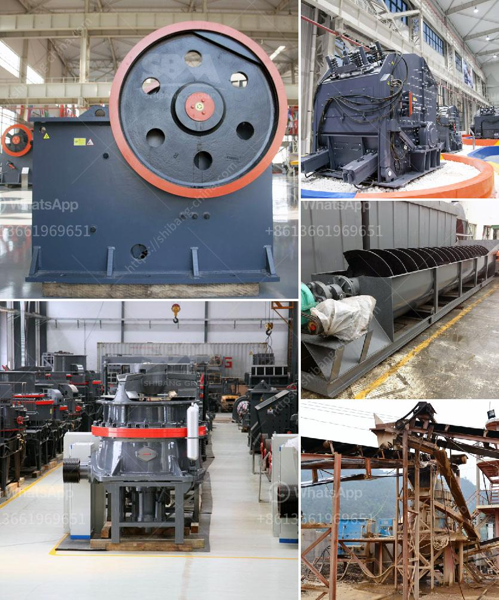

<h3>كسارات الحجر والرمل المحمولة على نطاق صغير</h3>
تعد كسارات الحجر والرمل المحمولة على نطاق صغير من الأدوات المهمة في صناعة البناء. فهي تستخدم لسحق الحجارة والصخور وتحويلها إلى أحجام أصغر لاستخدامها في عمليات البناء والإنشاء.

تتميز كسارات الحجر والرمل المحمولة بمرونة وملائمة عالية، حيث يمكن نقلها وتركيبها بسهولة في موقع العمل. فهذه الكسارات تأتي عادةً على هيئة معدات متنقلة تحتوي على محرك وأجزاء ميكانيكية ونقالة تستخدم لنقل المواد الخام والنتاج النهائي. وبفضل هذه الميزة، يمكن استخدامها في مواقع البناء المختلفة وفي المناطق النائية وحتى المناطق ذات الوصول المحدود.

يمكن استخدام كسارات الحجر المحمولة على نطاق صغير في سحق مجموعة متنوعة من المواد الصلبة مثل الحجر والرمل والفحم والخامات الأخرى. تعتبر فعالةً من حيث التكلفة وحجمها الصغير، مما يعني أنها تساهم في تقليل تكلفة نقل وشحن المواد الخام من موقع إلى آخر.

بالإضافة إلى ذلك، فإن كسارات الحجر المحمولة يمكنها توفير المرونة في عملية الإنتاج وتحسين الكفاءة. فهي لا تحتاج إلى تجهيزات خاصة أو أساسات ثابتة، بل يمكن تشغيلها بسرعة وبدء عملية السحق على الفور. يمكن أيضًا استخدامها بشكل مستمر في عمليات الإنتاج لتلبية الطلب المتزايد على المواد الخام.

كما يمكن أن تساهم هذه الكسارات في تقليل تأثيرات التلوث البيئي، حيث تستخدم تقنيات حديثة للتحكم في الغبار والضوضاء. وبفضل تقنيات السحق المتقدمة، يمكن أن تنتج الكسارات الحجرية المحمولة على نطاق صغير مواد ذات جودة عالية وتلبي احتياجات البناء المختلفة.

باختصار، تعد كسارات الحجر والرمل المحمولة على نطاق صغير أدوات فعالة ومهمة في صناعة البناء. فهي توفر الكثير من المرونة والراحة في عمليات الإنتاج وتحسن الكفاءة، بالإضافة إلى انخفاض التكلفة والتأثير البيئي. ومن المتوقع أن تستمر في تطويرها وتحسينها لتلبية الاحتياجات المتزايدة في صناعة البناء في المستقبل.
<h3>Contact us</h3><ul><li><strong>Whatsapp:&nbsp;<a href="https://wa.me/8613661969651">+8613661969651</a></strong></li><li><a href="https://swt.shibang-china.com/?git&amp;zhl&amp;كسارات الحجر والرمل المحمولة على نطاق صغير"><strong>Online Service(chat now)</strong></a></li></ul><h3>Related</h3><ul><li><a href='كسارة الهامر العمودية.md'>كسارة الهامر العمودية</a></li><li><a href='نماذج كسارات الحجر في ماليزيا.md'>نماذج كسارات الحجر في ماليزيا</a></li><li><a href='تأجير كسارة إعادة تدوير الخرسانة.md'>تأجير كسارة إعادة تدوير الخرسانة</a></li><li><a href='مطحنة المطرقة للبيع على إيباي.md'>مطحنة المطرقة للبيع على إيباي</a></li><li><a href='كسارة الصدم من نوع مانسبرجر.md'>كسارة الصدم من نوع مانسبرجر</a></li></ul>