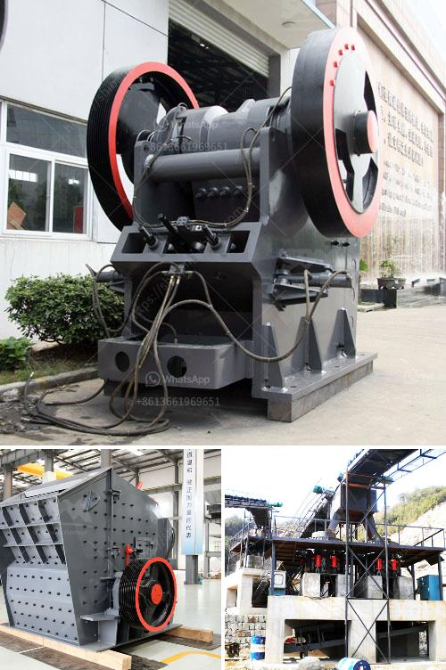

<h3>كسارات الحصى للبيع</h3>
تعتبر كسارات الحصى من الآلات الهامة في صناعة البناء والإنشاءات، حيث تقوم بطحن وسحق الصخور الكبيرة وتحويلها إلى الحصى الصغيرة المستخدمة في الخرسانة والطرق والمباني ومشاريع أخرى. ويمكن العثور على العديد من كسارات الحصى المستخدمة للبيع في السوق حاليًا.

تتميز كسارات الحصى للبيع بأنها جديدة أو مستعملة، وتتراوح قدرة الكسارات المتاحة بين 200 إلى 400 طن يوميًا، وهذا يعتمد على حجم الكسارة واحتياجات المشروع. وعادةً ما تستخدم هذه الآلات في كبار المشاريع التجارية التي تتطلب إنتاجًا كبيرًا من الحصى.

يمكن شراء كسارات الحصى المستعملة من الشركات المتخصصة التي تقوم ببيع وتأجير المعدات الثقيلة. كما يمكن العثور على كسارات الحصى للبيع في العديد من الصحف والمجلات المتخصصة في مجال البناء والإنشاءات. وبالإضافة إلى ذلك، يمكنك البحث عنها على الإنترنت، حيث يتم عرض الكسارات المتاحة للبيع مع تفاصيلها وأسعارها.

عند شراء كسارة حصى، يُنصح بالاهتمام بعدة عوامل مهمة. أولاً، يجب التأكد من جودة وكفاءة الكسارة وأنها تعمل بشكل صحيح قبل الشراء. كما يجب أيضًا مراعاة الصيانة المستقبلية وتكاليف التشغيل. علاوة على ذلك، ينبغي الانتباه إلى نوعية الحصى المنتج وقوة الفرز، حيث يمكن لذلك أن يؤثر على جودة المنتج النهائي.

بالإضافة إلى ذلك، يجب أيضًا النظر في سعر الكسارة وتناسبه مع الميزانية المتاحة. قد تتفاوت أسعار الكسارات الحصى المستعملة بناءً على حالتها وعمرها وسعتها. ولذا، ينصح بمقارنة العروض المتاحة واختيار الأفضل من حيث الجودة والسعر.

بصفة عامة، تعد كسارات الحصى للبيع فرصة جيدة لتوفير النفقات والتكاليف عند القيام بمشروع بناء كبير، حيث يمكن الاعتماد على الكسارات المستعملة المتاحة بأسعار منخفضة. ومع توفر العديد من الخيارات في السوق، ينبغي على المشتري أن يقوم بدراسة السوق واختيار الكسارة المناسبة التي تلبي احتياجات المشروع وتكون ذات جودة عالية وبسعر مناسب.
<h3>Contact us</h3><ul><li><strong>Whatsapp:&nbsp;<a href="https://wa.me/8613661969651">+8613661969651</a></strong></li><li><a href="https://swt.shibang-china.com/?git&amp;zhl&amp;كسارات الحصى للبيع"><strong>Online Service(chat now)</strong></a></li></ul><h3>Related</h3><ul><li><a href='كسارة مطرقية متعددة.md'>كسارة مطرقية متعددة</a></li><li><a href='كرات المطحنة للتعدين.md'>كرات المطحنة للتعدين</a></li><li><a href='كسارة الحجر بالمطرقة.md'>كسارة الحجر بالمطرقة</a></li><li><a href='آلة سحق الدولوميت للبيع في دبي.md'>آلة سحق الدولوميت للبيع في دبي</a></li><li><a href='كسارة الحجر وأسعارها.md'>كسارة الحجر وأسعارها</a></li></ul>