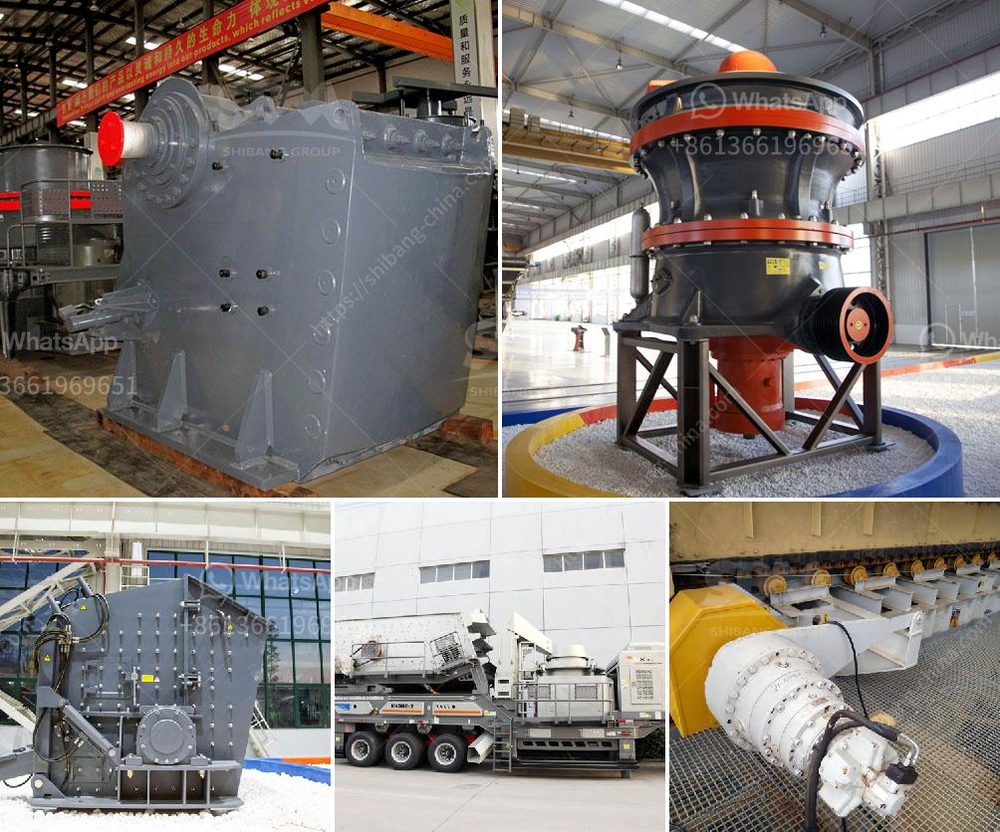

<h3>كسارات الحطام للبيع</h3>
تعد كسارات الحطام أحد الأدوات الهامة في صناعة البناء والهدم. فهي تستخدم لتكسير وتفتيت الحجارة والصخور الكبيرة إلى قطع صغيرة يمكن التعامل معها بسهولة. تعتبر كسارات الحطام من الآلات الضرورية في عمليات البناء والهدم، حيث تسهل عملية إزالة الحطام وتوفر وقتًا وجهدًا.

تتوفر كسارات الحطام بمجموعة واسعة من الأحجام والأنواع والموديلات المختلفة، وتتنوع في العديد من الخصائص والأداء المختلفة. بعضها مصمم للعمل في الهواء الطلق، بينما يمكن أن تتواجد أنواع أخرى بداخل مصانع أو مواقع البناء. تعمل كسارات الحطام عادة بواسطة محرك كهربائي أو ديزل، وتشتمل على أسطوانات كبيرة تستخدم للتكسير.

تعتبر كسارات الحطام من المعدات المهمة في صناعة البناء والهدم، حيث تستخدم لتكسير الصخور والحجارة وإعادة تدوير المواد الخرسانية المتبقية من الهدم. يتم استخدام الحجارة المكسرة في العديد من التطبيقات مثل إنشاء الطرق والأساسات والصناعات الأخرى. بالإضافة إلى ذلك، فإن إعادة تدوير المواد الخرسانية المكسورة يساهم في الحفاظ على الموارد والبيئة.

توجد كسارات الحطام للبيع بأسعار مختلفة تتراوح بين 200 إلى 400 دولار، ويعتمد سعر الكسارة على الحجم والطاقة والمواصفات الفنية. يمكن العثور على هذه الكسارات في العديد من محلات بيع المعدات الثقيلة أو أسواق البناء المختلفة. إذا كنت تفكر في شراء كسارة حطام، فمن المهم أن تقوم بالبحث واختيار النوع المناسب الذي يتناسب مع احتياجاتك ومتطلباتك.

بشكل عام، تعتبر كسارات الحطام أداة هامة في صناعة البناء والهدم، حيث تساعد على توفير الوقت والجهد في عمليات التكسير وإعادة التدوير. إذا كنت تنوي استخدام كسارة الحطام، فمن الضروري التأكد من اختيار النوع المناسب والوفاء بالمعايير الفنية والأمان. كما يجب الحرص على الصيانة الدورية للكسارة واتباع التعليمات الصحيحة لاستخدامها لضمان الأداء الجيد والاستفادة القصوى منها.
<h3>Contact us</h3><ul><li><strong>Whatsapp:&nbsp;<a href="https://wa.me/8613661969651">+8613661969651</a></strong></li><li><a href="https://swt.shibang-china.com/?git&amp;zhl&amp;كسارات الحطام للبيع"><strong>Online Service(chat now)</strong></a></li></ul><h3>Related</h3><ul><li><a href='معدات طحن رفيعة جداً رطبة.md'>معدات طحن رفيعة جداً رطبة</a></li><li><a href='مصنعو الكرات في بنغالور.md'>مصنعو الكرات في بنغالور</a></li><li><a href='معدات كسارة المحجر للبيع.md'>معدات كسارة المحجر للبيع</a></li><li><a href='شركات تصنيع مصانع المحاجر في المملكة المتحدة.md'>شركات تصنيع مصانع المحاجر في المملكة المتحدة</a></li><li><a href='عمل كسارة الفك.md'>عمل كسارة الفك</a></li></ul>