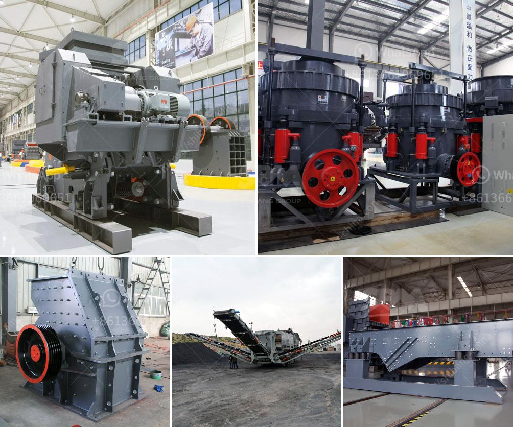

<h3>كسارات الخرسانة الصغيرة للسعة المنخفضة</h3>
يعد استخدام الخرسانة في وقتنا الحالي أمرًا ضروريًا لأعمال البناء المختلفة، سواء كانت لأغراض تجارية أو سكنية. وفي عملية البناء، تلعب كسارات الخرسانة الصغيرة للسعة المنخفضة دورًا حيويًا في تحطيم وطحن الخرسانة الحجرية إلى جزيئات صغيرة ومناسبة للاستخدام النهائي.

تتميز هذه الكسارات الصغيرة بسعة منخفضة ما بين 200 إلى 400 كغم، مما يجعلها مناسبة للاستخدام في المشاريع الصغيرة أو المناطق المحدودة المساحة حيث يكون الوصول صعبًا للمعدات الكبيرة. فهي تأتي بحجم صغير ومحمولة، مما يسهل تحريكها وتركيبها في الموقع المطلوب لتنفيذ عملية تكسير الخرسانة.

من أهم الفوائد التي يقدمها استخدام كسارات الخرسانة الصغيرة للسعة المنخفضة، فإنها تزيد من كفاءة وسرعة العمل. إذ يُمكن للعمال تكسير الخرسانة على الفور مباشرة في موقع العمل، دون الحاجة إلى نقل الخرسانة إلى موقع آخر مما يوفر الوقت والجهد. كما يسهل تحريك هذه الكسارات إلى أماكن متعددة في الموقع، مما يساهم في تنفيذ المشروع بفعالية وسهولة.

بالإضافة إلى ذلك، تقلل هذه الكسارات من تكاليف النقل والتخلص من المخلفات. فبدلاً من التخلص من الخرسانة القديمة في مكان آخر، يُمكن تجريدها واستخدامها في مشروعات البناء الجديدة أو إعادة تدويرها لأغراض أخرى كالأساسات الطرقية، مما يحقق توفيرًا في الأموال ويحافظ على البيئة.

كما تسمح كسارات الخرسانة الصغيرة للسعة المنخفضة بزيادة معدلات إعادة التدوير والاستفادة من المواد في الأعمال الإنشائية. فالخرسانة المتكسرة يمكن استخدامها في إعادة تجديد المسارات الرصفية، أو إعداد القواعد الأساسية للبناء. وهذا يُعزز الاستدامة ويقلل من استهلاك الموارد الطبيعية.

باختصار، تعد كسارات الخرسانة الصغيرة للسعة المنخفضة أداة مهمة في عملية البناء. إنها توفر وسيلة فعالة ومرنة لتحطيم الخرسانة في الموقع نفسه، بتكاليف منخفضة وزمن تنفيذ سريع، مما يساهم في زيادة الإنتاجية وتحسين جودة الأعمال الإنشائية. كما تحقق الاستدامة البيئية من خلال إعادة استخدام المواد وتدويرها في عمليات البناء.
<h3>Contact us</h3><ul><li><strong>Whatsapp:&nbsp;<a href="https://wa.me/8613661969651">+8613661969651</a></strong></li><li><a href="https://swt.shibang-china.com/?git&amp;zhl&amp;كسارات الخرسانة الصغيرة للسعة المنخفضة"><strong>Online Service(chat now)</strong></a></li></ul><h3>Related</h3><ul><li><a href='آلة تكسير الصخور في الفلبين.md'>آلة تكسير الصخور في الفلبين</a></li><li><a href='مصنعين لمصانع الأسمنت في الهند.md'>مصنعين لمصانع الأسمنت في الهند</a></li><li><a href='قائمة الآليات لمصانع تجهيز الرخام.md'>قائمة الآليات لمصانع تجهيز الرخام</a></li><li><a href='تكلفة معدات سحق الجرانيت.md'>تكلفة معدات سحق الجرانيت</a></li><li><a href='مخطط تخطيطي لمطحنة الأسطوانات.md'>مخطط تخطيطي لمطحنة الأسطوانات</a></li></ul>