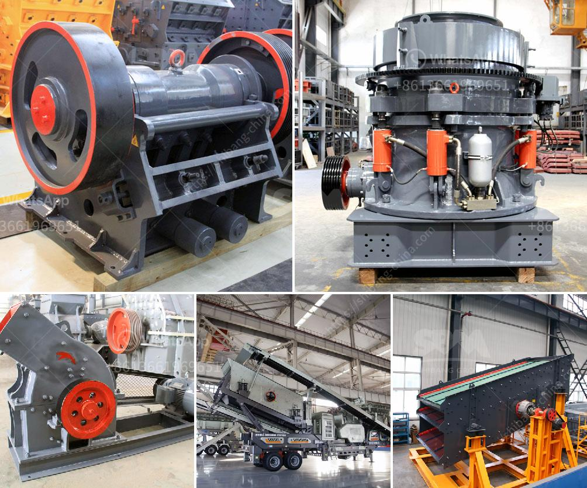

<h3>كسارات الخرسانة المصغرة</h3>
تعتبر كسارات الخرسانة المصغرة أدوات أساسية في صناعة البناء والإنشاءات. فهي تستخدم لتكسير الخرسانة وإعادة تدويرها للحصول على ركام صغير يمكن استخدامه في ترميم المباني وإعادة استخدامه في الأعمال الإنشائية الجديدة. تتميز هذه الكسارات بحجمها الصغير وقدرتها على العمل في المساحات الضيقة، وهي تستخدم بشكل كبير في المشاريع الصغيرة والمتوسطة.

إحدى أهم مزايا كسارات الخرسانة المصغرة هي تقليل التكاليف والوقت المستغرق في إزالة ونقل الخرسانة المتضررة. فعوضًا عن إزالة الخرسانة ونقلها إلى الموقع الخارجي لتفتيتها وإعادة استخدامها، يتم استخدام الكسارة المصغرة في نفس الموقع. هذا يسهم في توفير كميات كبيرة من الوقت والجهد في عملية الهدم والترميم.

كما أن استخدام كسارات الخرسانة المصغرة يحسن من جودة العمل والمنتج النهائي. فعملية التكسير المباشر في الموقع يحافظ على جودة الركام المنتج ويضمن عدم تلوثه أو امتزاجه بمواد أخرى غير مرغوب فيها. بالإضافة إلى ذلك، تعمل الكسارات المصغرة بكفاءة عالية وبسرعة لتحويل الخرسانة إلى ركام صغير في فترة زمنية قصيرة، مما يزيد من إنتاجية العمل ويقلل من الجهد البشري المطلوب.

وتشتهر كسارات الخرسانة المصغرة بقدرتها على التكيف مع مختلف أنواع الخرسانة المختلفة. فهي قادرة على تفتيت الخرسانة المسلحة والغير مسلحة على حد سواء. وبفضل مجموعة متنوعة من الأدوات والشفرات المتوفرة لهذه الكسارات، يمكن تخصيصها وفقًا لاحتياجات المشروع ومتطلبات تفتيت الخرسانة بطريقة فعالة.

لذا، يمكن القول بأن كسارات الخرسانة المصغرة هي أدوات ضرورية في صناعة البناء وإعادة التدوير. فهي تساهم في تحسين كفاءة العمل وتوفير التكاليف وتحسين جودة العمل المنجز. ستستمر استخدام هذه الكسارات بشكل متزايد في المستقبل، حيث يتزايد الاهتمام بالتنمية المستدامة والاستدامة البيئية في صناعة البناء.
<h3>Contact us</h3><ul><li><strong>Whatsapp:&nbsp;<a href="https://wa.me/8613661969651">+8613661969651</a></strong></li><li><a href="https://swt.shibang-china.com/?git&amp;zhl&amp;كسارات الخرسانة المصغرة"><strong>Online Service(chat now)</strong></a></li></ul><h3>Related</h3><ul><li><a href='كسارة الحجر والمضافة.md'>كسارة الحجر والمضافة</a></li><li><a href='آلات كسارة المحجر.md'>آلات كسارة المحجر</a></li><li><a href='المعدات المطلوبة لإنشاء محجر الجرانيت.md'>المعدات المطلوبة لإنشاء محجر الجرانيت</a></li><li><a href='دراسة جدوى لإنشاء محجر.md'>دراسة جدوى لإنشاء محجر</a></li><li><a href='مصنع الإسمنت الصغير المصنوع في الصين.md'>مصنع الإسمنت الصغير المصنوع في الصين</a></li></ul>