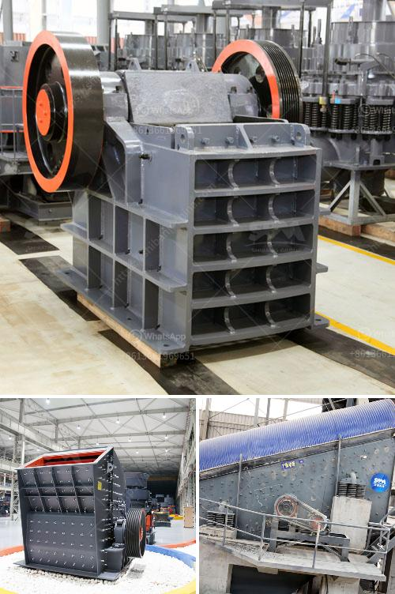

<h3>كسارات الصخور للبيع</h3>
تعد كسارات الصخور للبيع جزءًا أساسيًا من عملية التعدين والبناء. تُستخدم هذه الكسارات لتحويل الصخور الضخمة إلى قطع صغيرة تستخدم في العديد من التطبيقات المختلفة. يمكن استخدام كسارات الصخور في إنتاج المواد الخام للبناء مثل الحصى والرمال، وكذلك في صناعة المنتجات الأخرى مثل الأسمنت والخرسانة.

تتنوع مثيلات كسارات الصخور للبيع في الحجم والأداء والسعر. تتوفر الكسارات بمختلف الأحجام والموديلات، مثل كسارات الفك وكسارات الصدم. تُستخدم كسارات الفك لتكسير الصخور الكبيرة إلى قطع صغيرة، بينما تستخدم كسارات الصدم بشكل أساسي لتفتيت الصخور وتحويلها إلى حجارة أصغر.

تعد كسارات الصخور للبيع بأسعار مختلفة، وهذا يعتمد على عدة عوامل مثل الحجم والقدرة والملحقات المرفقة بها. عند شراء كسارة صخور، يجب أخذ العديد من العوامل في الاعتبار مثل القدرة التشغيلية للكسارة، ومستوى الضوضاء الذي تنتجه الكسارة، والاستهلاك العالي للطاقة، وصيانة الكسارة.

تعد صناعة كسارات الصخور من الصناعات الرئيسية في مجال المعدات الثقيلة. تقدم الشركات المصنعة للكسارات خيارات متنوعة ومختلفة للمشترين لتلبية الاحتياجات المحددة. يمكن للمشترين اختيار الكسارة المناسبة وفقًا للغرض المطلوب، مثل استخدامها في صناعة البناء أو استخدامها في الاستخراج الصخري.

من المهم أيضًا أن يتم شراء كسارات الصخور من بائعين موثوقين ومصنعين يعتمدون على جودة المنتج وموثوقيته. يجب على المشترين أيضًا النظر في خدمة ما بعد البيع المقدمة من قبل الشركة المصنعة، بما في ذلك الصيانة الروتينية وقطع الغيار.

في النهاية، تعد كسارات الصخور للبيع أداة أساسية للعديد من الصناعات. يساعد استخدام الكسارات في تحطيم وتحويل الصخور على توفير المواد الأساسية للبناء والبنية التحتية، بالإضافة إلى العديد من المنتجات الأخرى. تشتهر الشركات المصنعة بابتكار وتوفير تشكيلة واسعة من الكسارات للبيع لتلبية احتياجات السوق والعملاء.
<h3>Contact us</h3><ul><li><strong>Whatsapp:&nbsp;<a href="https://wa.me/8613661969651">+8613661969651</a></strong></li><li><a href="https://swt.shibang-china.com/?git&amp;zhl&amp;كسارات الصخور للبيع"><strong>Online Service(chat now)</strong></a></li></ul><h3>Related</h3><ul><li><a href='تجار الكسارات المحمولة في جنوب أفريقيا.md'>تجار الكسارات المحمولة في جنوب أفريقيا</a></li><li><a href='مصنع تكسير وفحص الكسارة.md'>مصنع تكسير وفحص الكسارة</a></li><li><a href='شركة تصنيع كسارة الطحن في راجكوت، الهند.md'>شركة تصنيع كسارة الطحن في راجكوت، الهند</a></li><li><a href='كسارة محمولة في ماليزيا.md'>كسارة محمولة في ماليزيا</a></li><li><a href='مصنع كسارة الفك في ولاية جوجارات الهند.md'>مصنع كسارة الفك في ولاية جوجارات الهند</a></li></ul>