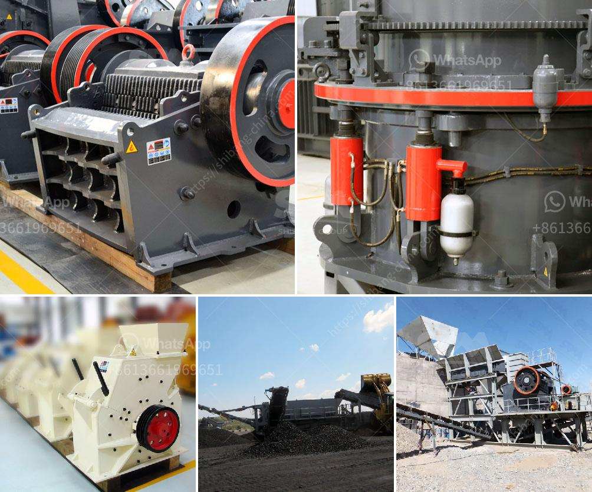

<h3>كسارات الطوب للبيع في أستراليا</h3>
تعد كسارات الطوب من أهم الأدوات التي تستخدم في صناعة البناء وتشكيل الطوب لإنشاء المباني. وفي أستراليا، يوجد العديد من كسارات الطوب المتاحة للبيع والتي تلبي احتياجات السوق المحلية.

تتوفر كسارات الطوب في مجموعة واسعة من الأحجام والموديلات، وتختلف في القدرة والقوة والتكنولوجيا المستخدمة. تستخدم هذه الكسارات في تكسير الطوب المستعمل وتحويله إلى حجم صغير يمكن استخدامه لإعادة تشكيل الطوب أو إنتاج مواد البناء الأخرى.

واحدة من أهم العوامل التي يجب مراعاتها عند اختيار كسارة الطوب هي القدرة على توفير كميات كبيرة من الطوب بكفاءة عالية وبأعلى جودة ممكنة. تعتبر كسارات الطوب عالية الجودة ذات السعة الكبيرة مناسبة للاستخدام في المشاريع الكبيرة مثل البناء الكبير والمشاريع التجارية.

بجانب القدرة والجودة، ينبغي أيضًا أن تكون كسارات الطوب سهلة الاستخدام ولديها تصميم فعال يمكن التحكم به. يجب أن تكون هذه الكسارات سهلة التنقل والتركيب والتشغيل، بحيث لا يلزم وجود فنيين متخصصين للتعامل معها. يفضل أيضًا أن تكون الكسارات مزودة بأنظمة أمان متقدمة لتجنب الحوادث وضمان سلامة العمال.

بالنسبة للأسعار، فهي تتفاوت بشكل كبير وتعتمد على الحجم والقوة والعلامة التجارية للكسارة. يتوجب تحديد الميزانية المتاحة واختيار الكسارة التي تلبي احتياجاتك وتتناسب مع متطلباتك المحددة.

وفي النهاية، يجب أن يتم شراء كسارة الطوب من مورد موثوق وذو سمعة جيدة، حيث يمكنك الحصول على منتجات عالية الجودة ودعم فني متميز. يمكن العثور على كسارات الطوب للبيع في أستراليا عبر البحث على الإنترنت، من خلال الاستعانة بالوسطاء، أو من خلال الاتصال بالمصانع المحلية للحصول على المعلومات اللازمة.

باختيارك لكسارة الطوب المناسبة، يمكنك تحقيق فوائد كبيرة في صناعة البناء وتوفير الوقت والجهد والموارد المالية. لذا، ينبغي أن تضع في الاعتبار العوامل المذكورة وتقوم بدراسة السوق بعناية لاختيار الكسارة التي تلبي احتياجاتك وتعطيك أفضل النتائج الممكنة.
<h3>Contact us</h3><ul><li><strong>Whatsapp:&nbsp;<a href="https://wa.me/8613661969651">+8613661969651</a></strong></li><li><a href="https://swt.shibang-china.com/?git&amp;zhl&amp;كسارات الطوب للبيع في أستراليا"><strong>Online Service(chat now)</strong></a></li></ul><h3>Related</h3><ul><li><a href='مطحنة الكرة لمسحوق الألمنيوم.md'>مطحنة الكرة لمسحوق الألمنيوم</a></li><li><a href='محطات تكسير محمولة.md'>محطات تكسير محمولة</a></li><li><a href='سعر مصنع كسارة الحجر في الهند.md'>سعر مصنع كسارة الحجر في الهند</a></li><li><a href='تطبيق كسارة الصدم.md'>تطبيق كسارة الصدم</a></li><li><a href='آلة كسارة لصنع الرمل من الحجر.md'>آلة كسارة لصنع الرمل من الحجر</a></li></ul>