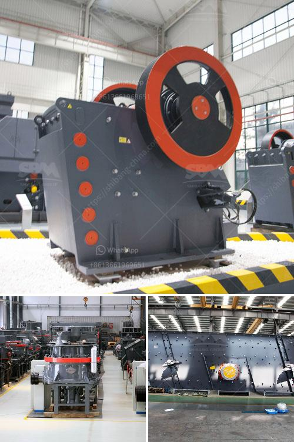

<h3>كسارات الفحم المتنقلة للإيجار</h3>
إن كسارات الفحم المتنقلة هي معدات حديثة ومبتكرة تستخدم في صناعة استخراج الفحم. تم تصميمها خصيصًا للعمل في المواقع البعيدة والمتنقلة حيث لا توجد كسارات ثابتة.

تعتبر كسارات الفحم المتنقلة مريحة ومرنة للاستخدام. فهي تتميز بقدرتها على التحرك بسهولة من مكان لآخر وتركيبها السريع. هذا يجعلها خيارًا رائعًا للمقاولين الذين يعملون في مجال استخراج الفحم في الأماكن التي لا يتوفر فيها محجر ثابت.

توفر كسارات الفحم المتنقلة أيضًا العديد من المزايا الأخرى. فهي تتميز بأحجامها المختلفة وقدرتها العالية على سحق الفحم بفعالية. يمكن لهذه الكسارات أن تقوم بسحق الفحم بأحجام وتجانس مختلفة حسب متطلبات الجودة في الموقع.

بالإضافة إلى ذلك، فإن كسارات الفحم المتنقلة قابلة للتشخيص والتحكم بواسطة أجهزة الكمبيوتر المضمنة فيها. هذا يعني أنه يمكن ضبط عمل الكسارة وبرامجها لتحقيق أداء مثالي وفعالية أعلى. يتم تتبع بيانات العمل بدقة أثناء عملية السحق ، ويمكن تحليلها لتحسين عملية سحق الفحم.

توفر كسارات الفحم المتنقلة أيضًا توفيرًا في تكاليف الطاقة والوقود والصيانة. فبدلاً من استخدام الشاحنات الكبيرة والمكلفة لنقل الفحم من المحجر إلى الموقع، يمكن نقل الكسارة بسهولة إلى الموقع بمحركها الخاص. يعد هذا أمرًا فعالًا من حيث التكلفة والوقت والجهد.

بالنظر إلى المزايا المذكورة أعلاه، يمكننا الاستنتاج أن كسارات الفحم المتنقلة هي حلاً مثاليًا لصناعة استخراج الفحم. فهي مرنة وقابلة للتعديل وتوفر العديد من المزايا الاقتصادية والعملية. إذا كنت مهتمًا بتأجير كسارة فحم متنقلة، فإنه يمكنك العثور على العديد من الشركات التي توفر هذه الخدمة. قم بالبحث عن الشركات المشهورة وقم بالتواصل معهم للحصول على الاستفسارات وطلب عروض الأسعار.

في الختام، يمثل استخدام كسارات الفحم المتنقلة نقلة نوعية في صناعة استخراج الفحم. تعتبر هذه الأدوات ملائمة وفعالة واقتصادية وتساهم في زيادة الإنتاجية وتقليل التكاليف في هذا القطاع.
<h3>Contact us</h3><ul><li><strong>Whatsapp:&nbsp;<a href="https://wa.me/8613661969651">+8613661969651</a></strong></li><li><a href="https://swt.shibang-china.com/?git&amp;zhl&amp;كسارات الفحم المتنقلة للإيجار"><strong>Online Service(chat now)</strong></a></li></ul><h3>Related</h3><ul><li><a href='آلة طحن الرخام.md'>آلة طحن الرخام</a></li><li><a href='أعمال تكسير الصخور في باكستان.md'>أعمال تكسير الصخور في باكستان</a></li><li><a href='سعر مصنع الجبس.md'>سعر مصنع الجبس</a></li><li><a href='كسارة مخروطية.md'>كسارة مخروطية</a></li><li><a href='كسارات الفك المستعملة في إسبانيا.md'>كسارات الفك المستعملة في إسبانيا</a></li></ul>