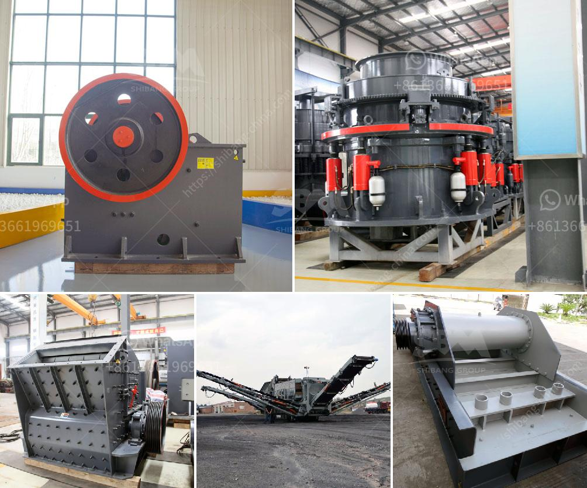

<h3>كسارات الفك الصناعية</h3>
تعد كسارات الفك الصناعية من الأدوات الهامة في صناعة التكسير والطحن، حيث تستخدم لتكسير المواد الخام وتحويلها إلى حجم مقبول للاستخدام في العديد من الصناعات. تعتبر هذه الكسارات جزءًا أساسيًا في صناعات مثل التعدين والبناء والمواد الكيميائية والصناعات المعدنية الأخرى.

توفر كسارات الفك الصناعية أداءً عاليًا في عملية التكسير والطحن. فهي قادرة على تكسير المواد الصلبة بفعالية وموثوقية، بفضل هيكلها الصلب الذي يعمل على تحمل الضغوط العالية والعمل في ظروف قاسية. تعمل الكسارات الفكية عن طريق وجود فكين موازيين يقومان بالتحرك في اتجاهين متضادين. عند تشغيل الكسارة، يتم سحق المادة بين الفكين المتحركين وتحويلها إلى حجم أصغر حسب المطلوب.

إحدى فوائد استخدام كسارات الفك الصناعية هي تحسين كفاءة عملية التكسير والطحن. حيث يتمكن المُشغلون من ضبط حجم الفتحة بين الفكين ، مما يتيح لهم تحديد الحجم المطلوب للمنتج النهائي. بالإضافة إلى ذلك، توفر هذه الكسارات توفيرًا كبيرًا في استهلاك الطاقة، حيث أنها تستخدم محركات قوية وفعالة في استخدام الطاقة.

توفر كسارات الفك الصناعية أيضًا مرونة ومناورة عالية في عملية التكسير والطحن. فهي قابلة للتعديل وفقًا لاحتياجات الصناعات المختلفة وتوفر قدرة عالية على تغيير حجم الإنتاج وفقًا للطلب. هذه المرونة تجعلها مثالية للاستخدام في صناعات مثل البناء وإعادة تدوير المواد والتعدين.

غالبًا ما يتم استخدام كسارات الفك الصناعية في تكسير الصخور الصلبة والخامات الكبيرة لتحويلها إلى حجم مناسب. ومع ذلك، فإن استخدامها ليس محصورًا في هذه الصناعات فقط. بل يمكن أيضًا استخدامها لتكسير المواد الأولية المختلفة مثل الفحم والحصى والحجر الجيري.

استخدام كسارات الفك الصناعية في العمليات الصناعية يتيح للشركات تحسين كفاءة الإنتاج وتقليل تكاليف التشغيل. إذ توفر هذه الكسارات قدرة عالية على التكسير والطحن بطريقة سريعة وفعالة، مما يؤدي إلى زيادة الإنتاجية وتحقيق أقصى استفادة من المواد.

في النهاية، كسارات الفك الصناعية تعد أداة حاسمة في صناعة التكسير والطحن، حيث توفر أداءً عاليًا ومرونة وفوائد استخدام تساهم في تحسين كفاءة العمليات الصناعية وتحقيق أقصى استفادة من المواد الخام والتقليل من التكاليف.
<h3>Contact us</h3><ul><li><strong>Whatsapp:&nbsp;<a href="https://wa.me/8613661969651">+8613661969651</a></strong></li><li><a href="https://swt.shibang-china.com/?git&amp;zhl&amp;كسارات الفك الصناعية"><strong>Online Service(chat now)</strong></a></li></ul><h3>Related</h3><ul><li><a href='شركة تصنيع مقياس ضغط النحاس.md'>شركة تصنيع مقياس ضغط النحاس</a></li><li><a href='سعر كسارة الخرسانة.md'>سعر كسارة الخرسانة</a></li><li><a href='غربال الحصى للبيع كريغزليست.md'>غربال الحصى للبيع كريغزليست</a></li><li><a href='كسارة مطرقية متعددة.md'>كسارة مطرقية متعددة</a></li><li><a href='مطاحن الكرة في إندونيسيا.md'>مطاحن الكرة في إندونيسيا</a></li></ul>