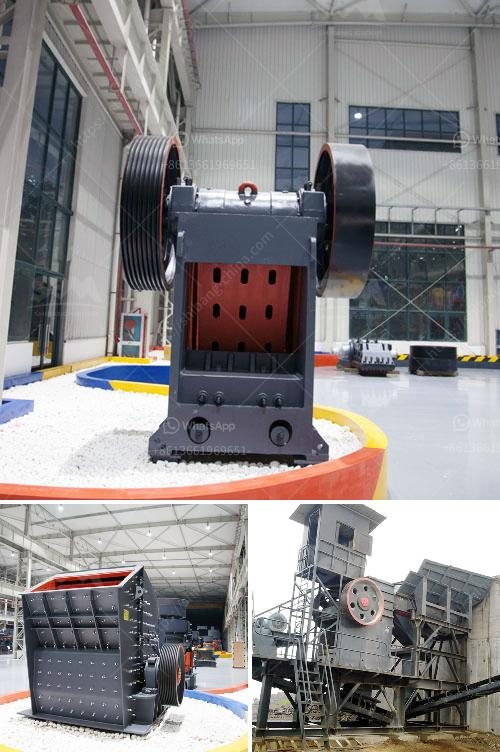

<h3>كسارات الفك المستخدمة في الفلبين</h3>
تُستخدم كسارات الفك في الفلبين بشكل واسع في صناعة التعدين وبناء البنية التحتية وصناعة البناء. تُستخدم هذه الكسارات لسحق مجموعة متنوعة من المواد مثل الصخور الصلبة والخامات المعدنية والحجارة الكبيرة في قطع صغيرة قابلة للتعامل والنقل.

تتمتع كسارات الفك المستخدمة في الفلبين بعدة مزايا رئيسية. أولاً، فإنها تُعد فعالة من حيث التكلفة، حيث تقدم كفاءة عالية في عمليات سحق المواد مع تكاليف تشغيل منخفضة نسبياً. ثانياً، فإن استخدامها سهل وبسيط، وهي تتطلب صيانة بسيطة وتوفر موثوقية عالية في الأداء.

توجد في الفلبين العديد من الشركات التي تنتج وتوزع كسارات الفك. تتوفر هذه الكسارات بمختلف الأحجام والسعات، مما يتيح للعملاء اختيار الجهاز الذي يناسب احتياجاتهم الخاصة. بالإضافة إلى ذلك، توفر بعض الشركات خدمات ما بعد البيع مثل التثبيت والتدريب على الاستخدام لضمان أفضل استخدام للكسارات وصيانتها بشكل صحيح.

بالنظر إلى أهمية كسارات الفك في صناعة البناء والتعدين في الفلبين، من المتوقع أن يستمر الطلب على هذه الأجهزة في الارتفاع في السنوات القادمة. وبالتالي، فإن الشركات المصنعة لهذه الكسارات ملزمة بتحسين أداء الجهاز وتوفير ميزات جديدة وتقنيات متقدمة لتلبية المتطلبات المتغيرة للعملاء.

بالختام، يمكن القول إن كسارات الفك المستخدمة في الفلبين تلعب دوراً حيوياً في تلبية الطلب على مواد البناء والمواد المعدنية في البلاد. تأتي هذه الكسارات بمزايا متعددة مثل الكفاءة العالية وسهولة الاستخدام والصيانة المنخفضة، مما يجعلها خياراً مثالياً للمشاريع الكبيرة والصغيرة على حد سواء.
<h3>Contact us</h3><ul><li><strong>Whatsapp:&nbsp;<a href="https://wa.me/8613661969651">+8613661969651</a></strong></li><li><a href="https://swt.shibang-china.com/?git&amp;zhl&amp;كسارات الفك المستخدمة في الفلبين"><strong>Online Service(chat now)</strong></a></li></ul><h3>Related</h3><ul><li><a href='تكلفة كسارة الفك 24x36.md'>تكلفة كسارة الفك 24x36</a></li><li><a href='مصنع تكسير الحجر في كوريا.md'>مصنع تكسير الحجر في كوريا</a></li><li><a href='كسارة صخور صغيرة.md'>كسارة صخور صغيرة</a></li><li><a href='آلة طحن الكالسايت للبيع.md'>آلة طحن الكالسايت للبيع</a></li><li><a href='مصنع تكسير السلاغ في تاميل نادو.md'>مصنع تكسير السلاغ في تاميل نادو</a></li></ul>