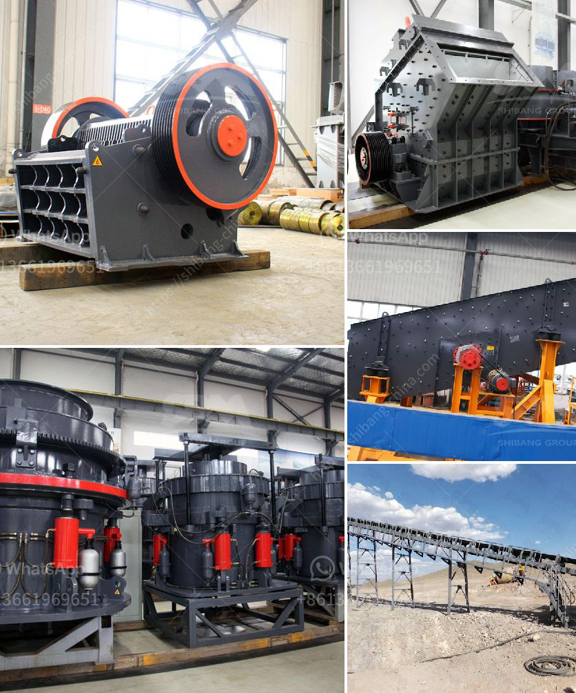

<h3>كسارات الفك المستعملة في إسبانيا</h3>
تُعدّ كسارات الفك من أبرز أنواع آلات التكسير المستخدمة في صناعة التعدين والبناء. تستخدم هذه الكسارات لتكسير المواد الصلبة والقاسية مثل الصخور والأحجار الكبيرة إلى قطع صغيرة وسهلة التجهيز والتخزين. وفي السنوات الأخيرة، شهدت إسبانيا زيادة ملحوظة في الطلب على كسارات الفك المستعملة، وسنتناول في هذه المقالة العوامل التي تجعلها خيارًا شائعًا.

أحد العوامل الرئيسية وراء زيادة الطلب على الكسارات الفك المستعملة في إسبانيا هو الاقتصاد. فبدلاً من شراء كسارة فكية جديدة، يمكن للكثير من الشركات والمشاريع توفير النفقات عن طريق اختيار الكسّارة المستعملة التي تكون متاحة بأسعار أقل. بالإضافة إلى ذلك، فإن الكسارات الفك المستعملة يمكن تجديدها وإصلاحها لتلبية المعايير والاحتياجات الحالية للعملاء، مما يعزز اقتصاديتها ويؤدي إلى تحقيق الأداء المطلوب.

وتعتبر إسبانيا سوقًا رئيسية للكسارات الفك المستعملة، حيث يتوفر هناك عدد كبير من الشركات والموردين المتخصصين في بيع وشراء الكسارات المستعملة. يقدم هؤلاء الموردين مجموعة واسعة من الكسارات الفكية المستعملة بمختلف الموديلات والماركات والحجم. وبالتالي، يمكن للعملاء اختيار الكسارة التي تناسب احتياجاتهم الخاصة بناءً على حجم المواد التي ستتم معالجتها.

بالإضافة إلى الجانب الاقتصادي، فإن الكسارات الفك المستعملة تعتبر أيضًا خيارًا قابلاً للتحسين البيئي. فعندما يتم إعادة استخدام هذه الكسارات، يتم تجنب إنتاج النفايات والتخلص منها بطرق غير ملائمة. إن إعادة استخدام المعدات بدلاً من التخلص منها تقلل من التأثير البيئي للصناعة وتساهم في الحفاظ على الموارد الطبيعية.

ومن المهم أن نشير إلى أن الاختيار الصحيح للكسارة الفكية المستعملة يتطلب القليل من البحث والتحقق. يجب التأكد من حالة الكسارة وتقييم أدائها السابق وجودتها، ويفضل الحصول على تقرير فحص مستقل قبل الشراء. بالإضافة إلى ذلك، يجب مراعاة ضمان الصيانة والدعم الفني المتاح من المورد.

في النهاية، يمكن القول إن الكسارات الفك المستعملة تعد خياراً موفراً للتكاليف وقابلًا للتحسين البيئي في صناعة التعدين والبناء في إسبانيا. بفضل توفر العديد من الموردين المتخصصين وتنوع الموديلات المتاحة، يمكن للعملاء اختيار الكسارة المستعملة التي تناسب احتياجاتهم وتوفر الأداء والجودة المطلوبة. إن الاستثمار في الكسارات الفك المستعملة يعد استثمارًا ذكيًا يمكن أن يؤدي إلى تحقيق النجاح والربحية في العمل.
<h3>Contact us</h3><ul><li><strong>Whatsapp:&nbsp;<a href="https://wa.me/8613661969651">+8613661969651</a></strong></li><li><a href="https://swt.shibang-china.com/?git&amp;zhl&amp;كسارات الفك المستعملة في إسبانيا"><strong>Online Service(chat now)</strong></a></li></ul><h3>Related</h3><ul><li><a href='شراء وبيع حجر الكسارة في ماليزيا.md'>شراء وبيع حجر الكسارة في ماليزيا</a></li><li><a href='قائمة أسعار آلة سحق البنتونيت.md'>قائمة أسعار آلة سحق البنتونيت</a></li><li><a href='إعداد وحدة طحن الأسمنت بسعة 100 طن يوميًا.md'>إعداد وحدة طحن الأسمنت بسعة 100 طن يوميًا</a></li><li><a href='تكلفة ناقل الحزام لصناعة التعدين.md'>تكلفة ناقل الحزام لصناعة التعدين</a></li><li><a href='كيفية بدء عمل في مجال صناعة الكتل الخرسانية.md'>كيفية بدء عمل في مجال صناعة الكتل الخرسانية</a></li></ul>