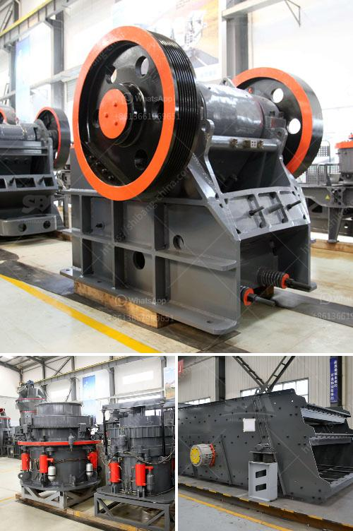

<h3>كسارات الفك بسعة 120 طن في الساعة</h3>
تعد كسارات الفك بسعة 120 طن في الساعة من أهم الأدوات التي تستخدم في عمليات تكسير الصخور والمواد الصلبة الأخرى. تمتاز هذه الكسارات بقدرتها العالية على تحويل الصخور الكبيرة إلى مواد أصغر الحجم بشكل سريع وفعال، مما يجعلها مناسبة للاستخدام في صناعات متعددة مثل صناعة البناء والتعدين والتشييد.

تتمتع كسارات الفك بسعة 120 طن في الساعة بالعديد من المميزات، بدءًا من الأداء العالي وقدرة التحمل القوية. تم تصميم هذه الكسارات بشكل يسمح لها بالتعامل مع مختلف أنواع المواد بكفاءة عالية وبأداء مستقر. إن تصميم الفك القوي والمتين يتيح للكسارة تحمل الصدمات والقوى العالية التي تتعرض لها أثناء عملية التكسير.

بفضل السعة العالية لهذه الكسارات، يمكنها تحقيق إنتاجية عالية وزيادة الأرباح بشكل ملحوظ. سعة 120 طن في الساعة تعني أن الكسارة قادرة على تكسير حتى 120 طن من الصخور في ساعة واحدة، مما يعني أنه يمكن الحصول على كمية كبيرة من المواد المكسرة بكل سرعة وفعالية.

تقدم هذه الكسارات تشكيلة واسعة من حجم الإخراج المنتج، حيث يمكن تعديل الفتحة بين الفكين للحصول على مواد ذات أحجام مختلفة. يتيح ذلك للمستخدمين استخدامها في مجموعة متنوعة من التطبيقات، بدءًا من البناء وانتهاءً بصناعة الطرق والجسور.

تعتبر ميزة أخرى لكسارات الفك بسعة 120 طن في الساعة، قابلية الصيانة السهلة والتكاليف المنخفضة للصيانة. يتم تصميم هذه الكسارات بطريقة تسهل الوصول إلى الأجزاء الداخلية الرئيسية للصيانة، مما يقلل من الوقت والجهد اللازمين للحفاظ على أداء الكسارة على المدى الطويل.

باختصار، تعتبر كسارات الفك بسعة 120 طن في الساعة أداة مهمة لأي عملية تكسير صخور تتطلب كميات كبيرة من المواد المكسورة. إن قدرتها العالية، وأدائها الممتاز، والتكلفة المنخفضة للصيانة جعلتها اختيارًا شائعًا في العديد من الصناعات. بالإضافة إلى ذلك، فإن قابليتها للتعديل تجعلها ملائمة لمجموعة متنوعة من التطبيقات، مما يوسع نطاق استخدامها ويرفع من قيمتها.
<h3>Contact us</h3><ul><li><strong>Whatsapp:&nbsp;<a href="https://wa.me/8613661969651">+8613661969651</a></strong></li><li><a href="https://swt.shibang-china.com/?git&amp;zhl&amp;كسارات الفك بسعة 120 طن في الساعة"><strong>Online Service(chat now)</strong></a></li></ul><h3>Related</h3><ul><li><a href='حفارات مستعملة للبيع في نيجيريا.md'>حفارات مستعملة للبيع في نيجيريا</a></li><li><a href='كسارات الحجر للبيع في كينيا.md'>كسارات الحجر للبيع في كينيا</a></li><li><a href='مطحنة طحن الكرةستخدم لطحن الكرات.md'>مطحنة طحن الكرةستخدم لطحن الكرات</a></li><li><a href='كسارة الحجر للبيع في سريلانكا.md'>كسارة الحجر للبيع في سريلانكا</a></li><li><a href='كم تكلفة كسارة الفك.md'>كم تكلفة كسارة الفك</a></li></ul>