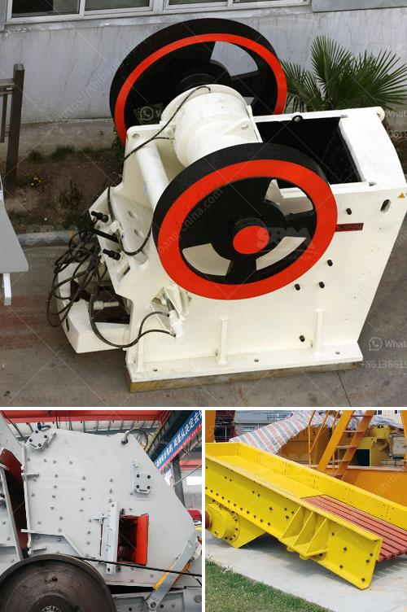

<h3>كسارات الفك في تنزانيا</h3>
تعتبر كسارات الفك من أحدث التكنولوجيات المستخدمة في صناعة البناء في تنزانيا. تلعب هذه الكسارات دورًا حاسمًا في تكسير الصخور الصلبة والحصى والخرسانة لإنتاج مواد البناء الجاهزة، مما يساهم في تسهيل وتسريع العمليات الإنشائية. هذه المقالة ستسلط الضوء على تطور كسارات الفك في تنزانيا وأهميتها في صناعة البناء.

مؤخرًا، شهدت تنزانيا طفرة كبيرة في صناعة البناء، بفضل الاستثمارات المتواصلة في تحسين البنية التحتية وتطوير البنية العمرانية في المدن الكبرى. هذا النمو السريع دفع الشركات والمقاولين إلى البحث عن أفضل التكنولوجيات لتسهيل عمليات البناء. ومن هنا جاءت أهمية كسارات الفك في تنزانيا.

تتميز كسارات الفك بالقدرة العالية على تكسير الصخور الصلبة والخرسانة إلى حجم صغير ومناسب لإعادة استخدامها في عمليات البناء. لا تعتبر هذه الكسارات فقط فعالة من حيث التكلفة، بل توفر أيضًا الوقت والجهود المبذولة في التجهيزات اليدوية الأخرى. بالإضافة إلى ذلك، يعتبر استخدام الكسارات الفكية في تنزانيا أكثر استدامة للبيئة، حيث يتم إعادة استخدام المواد المكسورة بشكل فعال، وتحافظ على الموارد الطبيعية.

تم اعتماد تكنولوجيا المعالجة الفعالة والموثوقة لكسارات الفك في تنزانيا وفقًا للمعايير الدولية. يتم تزويد الكسارات بتصميمات فريدة للتشغيل الفعال والآمن. وبالإضافة إلى ذلك، يتم تجهيز الكسارات بالأجهزة والأنظمة الأمنية المبتكرة لضمان سلامة العمال والمشغلين.

وتعتبر الكسارات الفكية في تنزانيا ضرورية لأنشطة البناء المتنوعة مثل بناء الطرق، والجسور، والمباني السكنية والتجارية. بفضل الأداء العالي والقدرات المتعددة لهذه الكسارات، تساهم في توفير مواد البناء ذات الجودة العالية وبسرعة أكبر. كما أن استخدام الكسارات الفكية يساهم في تقليل التكاليف العامة للمشروع وزيادة الكفاءة العامة.

في الختام، تعتبر كسارات الفك في تنزانيا جزءًا أساسيًا في صناعة البناء الحديثة. تطور هذه التكنولوجيا واستخدامها الواسع في تنزانيا يعكس التزام البلاد بالتحسين المستمر لقطاع البناء ودعم التقنيات الحديثة. بالنظر إلى النمو المستقبلي المتوقع في القطاع، من المتوقع أن تلعب كسارات الفك دورًا أكبر في تعزيز صناعة البناء في تنزانيا وتسهيل عمليات البناء بشكل عام.
<h3>Contact us</h3><ul><li><strong>Whatsapp:&nbsp;<a href="https://wa.me/8613661969651">+8613661969651</a></strong></li><li><a href="https://swt.shibang-china.com/?git&amp;zhl&amp;كسارات الفك في تنزانيا"><strong>Online Service(chat now)</strong></a></li></ul><h3>Related</h3><ul><li><a href='مصنع معالجة الحجر الجيري.md'>مصنع معالجة الحجر الجيري</a></li><li><a href='آلة غسيل الفحم طن.md'>آلة غسيل الفحم طن</a></li><li><a href='سعر كسارة المختبر المستخدمة.md'>سعر كسارة المختبر المستخدمة</a></li><li><a href='كسارة الفك bb 50 من ريتش.md'>كسارة الفك bb 50 من ريتش</a></li><li><a href='كسارة مستعملة في الولايات المتحدة من طراز SSI 34.md'>كسارة مستعملة في الولايات المتحدة من طراز SSI 34</a></li></ul>